# Species Data Table

  Unnamed: 0   AOU     n_rutas   first_year   last_year   timeseries length   English_Common_Name                                   French_Common_Name                                   Order               Family              Genus                     Species                                        Image
  ------------ ------- --------- ------------ ----------- ------------------- ----------------------------------------------------- ---------------------------------------------------- ------------------- ------------------- ------------------------- ---------------------------------------------- ---------------------------------------------------------------------------------------------------------------------------------------------------------------------------------------
  0            10      1053      1991         2023        32                  Western Grebe                                         Grèbe élégant                                        Podicipediformes    Podicipedidae       Aechmophorus              occidentalis                                   {.thumbnail full-src="https://placehold.co/600x400/cccccc/000000?text=No+Image+Available"}
  1            11      275       1995         2023        28                  Clark\'s Grebe                                        Grèbe à face blanche                                 Podicipediformes    Podicipedidae       Aechmophorus              clarkii                                        {.thumbnail full-src="https://placehold.co/600x400/cccccc/000000?text=No+Image+Available"}
  2            12      41        1997         2023        26                  unid. Western Grebe / Clark\'s Grebe                  unid Grèbe élégant / Grèbe à face blanche            Podicipediformes    Podicipedidae       Aechmophorus              occidentalis / clarkii                         {.thumbnail full-src="https://placehold.co/600x400/cccccc/000000?text=No+Image+Available"}
  3            20      1308      1993         2023        30                  Red-necked Grebe                                      Grèbe jougris                                        Podicipediformes    Podicipedidae       Podiceps                  grisegena                                      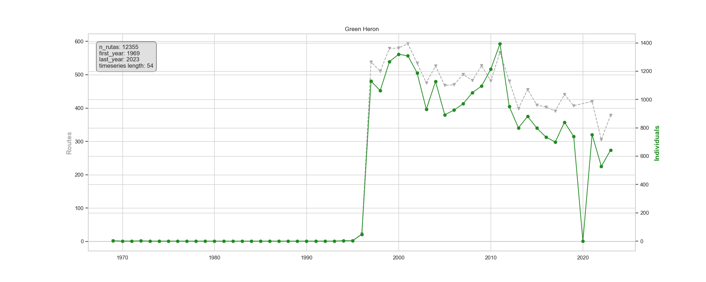{.thumbnail full-src="figs/2010_routes+tts.png"}
  4            30      683       1993         2023        30                  Horned Grebe                                          Grèbe esclavon                                       Podicipediformes    Podicipedidae       Podiceps                  auritus                                        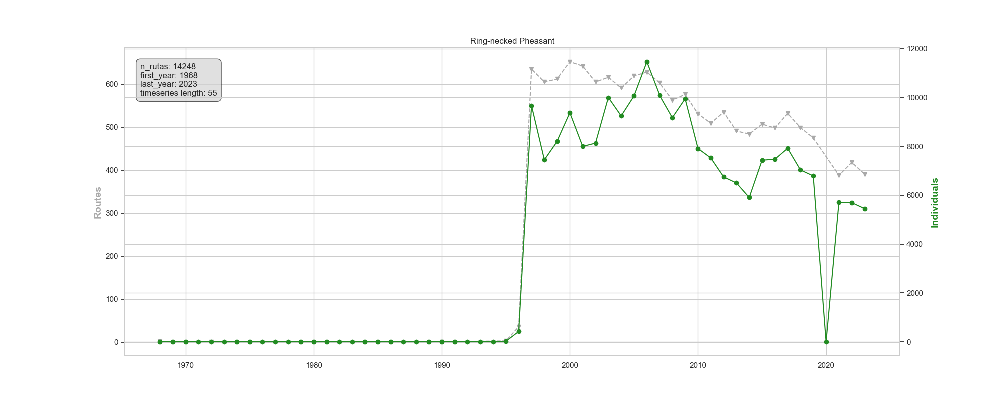{.thumbnail full-src="figs/3091_routes+tts.png"}
  5            40      1140      1982         2023        41                  Eared Grebe                                           Grèbe à cou noir                                     Podicipediformes    Podicipedidae       Podiceps                  nigricollis                                    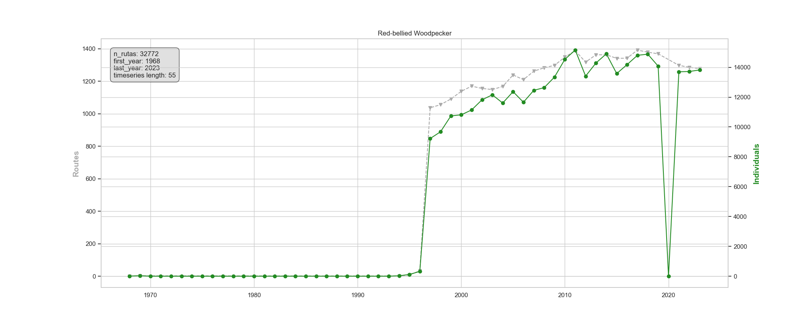{.thumbnail full-src="figs/4090_routes+tts.png"}
  6            50      37        1996         2023        27                  Least Grebe                                           Grèbe minime                                         Podicipediformes    Podicipedidae       Tachybaptus               dominicus                                      {.thumbnail full-src="figs/5080_routes+tts.png"}
  7            60      3842      1967         2023        56                  Pied-billed Grebe                                     Grèbe à bec bigarré                                  Podicipediformes    Podicipedidae       Podilymbus                podiceps                                       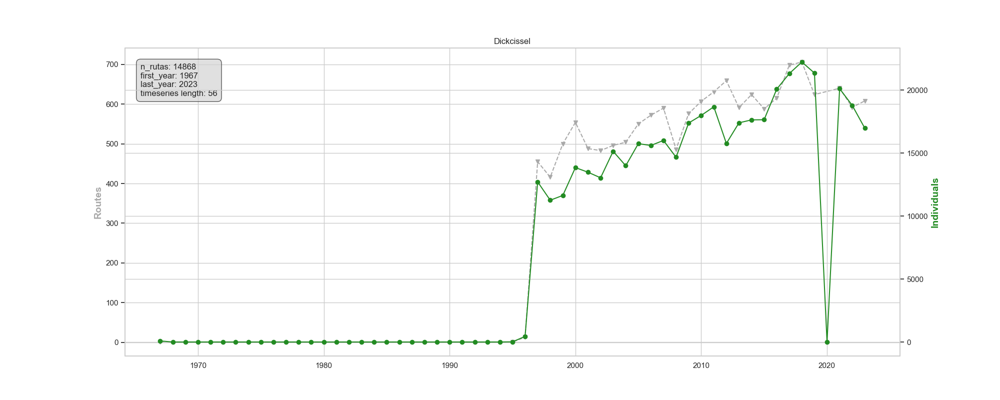{.thumbnail full-src="figs/6040_routes+tts.png"}
  8            70      5475      1977         2023        46                  Common Loon                                           Plongeon huard                                       Gaviiformes         Gaviidae            Gavia                     immer                                          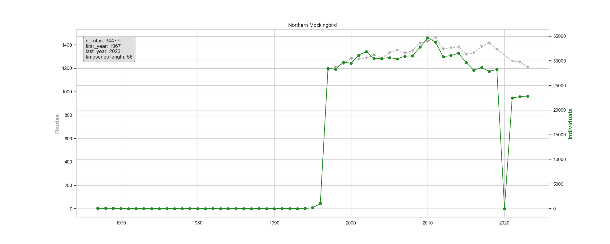{.thumbnail full-src="figs/7030_routes+tts.png"}
  9            77      30        1998         2023        25                  unid. loon                                            plongeon sp.                                         Gaviiformes         Gaviidae            Gavia                     sp.                                            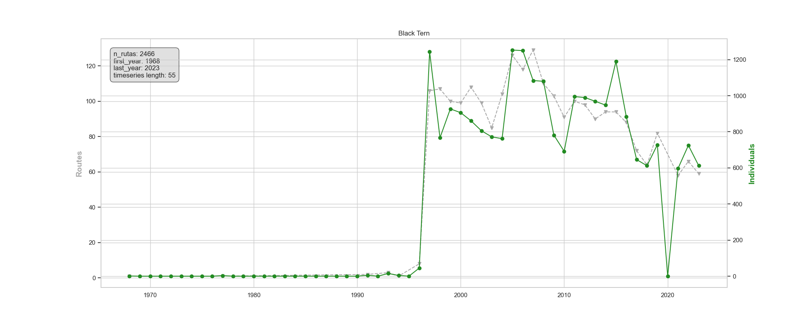{.thumbnail full-src="figs/770_routes+tts.png"}
  10           80      15        2005         2023        18                  Yellow-billed Loon                                    Plongeon à bec blanc                                 Gaviiformes         Gaviidae            Gavia                     adamsii                                        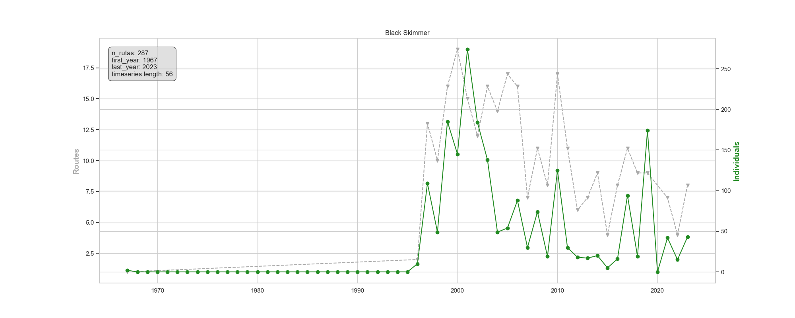{.thumbnail full-src="figs/800_routes+tts.png"}
  11           90      1         2011         2011        0                   Arctic Loon                                           Plongeon arctique                                    Gaviiformes         Gaviidae            Gavia                     arctica                                        {.thumbnail full-src="https://placehold.co/600x400/cccccc/000000?text=No+Image+Available"}
  12           100     425       1997         2023        26                  Pacific Loon                                          Plongeon du Pacifique                                Gaviiformes         Gaviidae            Gavia                     pacifica                                       {.thumbnail full-src="https://placehold.co/600x400/cccccc/000000?text=No+Image+Available"}
  13           110     455       1997         2023        26                  Red-throated Loon                                     Plongeon catmarin                                    Gaviiformes         Gaviidae            Gavia                     stellata                                       {.thumbnail full-src="https://placehold.co/600x400/cccccc/000000?text=No+Image+Available"}
  14           120     1         2007         2007        0                   Tufted Puffin                                         Macareux huppé                                       Charadriiformes     Alcidae             Fratercula                cirrhata                                       {.thumbnail full-src="https://placehold.co/600x400/cccccc/000000?text=No+Image+Available"}
  15           140     3         2005         2011        6                   Horned Puffin                                         Macareux cornu                                       Charadriiformes     Alcidae             Fratercula                corniculata                                    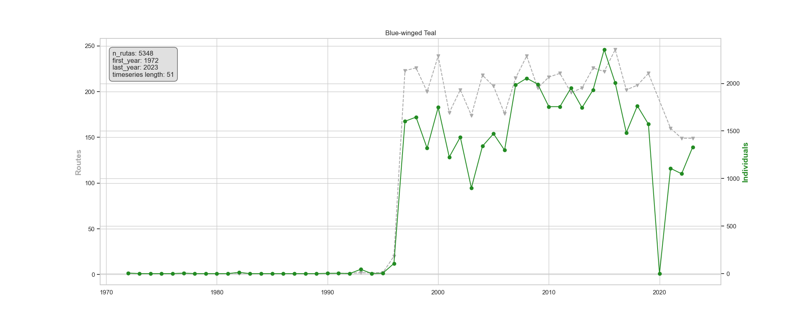{.thumbnail full-src="figs/1400_routes+tts.png"}
  16           150     27        1997         2023        26                  Rhinoceros Auklet                                     Macareux rhinocéros                                  Charadriiformes     Alcidae             Cerorhinca                monocerata                                     {.thumbnail full-src="https://placehold.co/600x400/cccccc/000000?text=No+Image+Available"}
  17           210     1         1997         1997        0                   Ancient Murrelet                                      Guillemot à cou blanc                                Charadriiformes     Alcidae             Synthliboramphus          antiquus                                       {.thumbnail full-src="https://placehold.co/600x400/cccccc/000000?text=No+Image+Available"}
  18           230     435       1997         2023        26                  Marbled Murrelet                                      Guillemot marbré                                     Charadriiformes     Alcidae             Brachyramphus             marmoratus                                     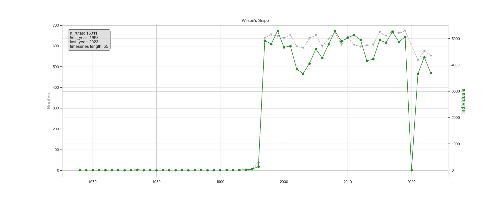{.thumbnail full-src="figs/2300_routes+tts.png"}
  19           240     2         1997         2001        4                   Kittlitz\'s Murrelet                                  Guillemot de Kittlitz                                Charadriiformes     Alcidae             Brachyramphus             brevirostris                                   {.thumbnail full-src="https://placehold.co/600x400/cccccc/000000?text=No+Image+Available"}
  20           270     53        1995         2023        28                  Black Guillemot                                       Guillemot à miroir                                   Charadriiformes     Alcidae             Cepphus                   grylle                                         {.thumbnail full-src="https://placehold.co/600x400/cccccc/000000?text=No+Image+Available"}
  21           290     164       1991         2023        32                  Pigeon Guillemot                                      Guillemot colombin                                   Charadriiformes     Alcidae             Cepphus                   columba                                        {.thumbnail full-src="https://placehold.co/600x400/cccccc/000000?text=No+Image+Available"}
  22           300     38        1997         2019        22                  Common Murre                                          Guillemot marmette                                   Charadriiformes     Alcidae             Uria                      aalge                                          {.thumbnail full-src="https://placehold.co/600x400/cccccc/000000?text=No+Image+Available"}
  23           310     3         2004         2011        7                   Thick-billed Murre                                    Guillemot de Brünnich                                Charadriiformes     Alcidae             Uria                      lomvia                                         {.thumbnail full-src="https://placehold.co/600x400/cccccc/000000?text=No+Image+Available"}
  24           315     8         2007         2015        8                   unid. Common Murre / Thick-billed Murre               unid Guillemot marmette / Guillemot de Brünnich      Charadriiformes     Laridae             Uria                      aalge / lomvia                                 {.thumbnail full-src="https://placehold.co/600x400/cccccc/000000?text=No+Image+Available"}
  25           320     28        1999         2023        24                  Razorbill                                             Petit Pingouin                                       Charadriiformes     Alcidae             Alca                      torda                                          {.thumbnail full-src="https://placehold.co/600x400/cccccc/000000?text=No+Image+Available"}
  26           360     11        2007         2023        16                  Pomarine Jaeger                                       Labbe pomarin                                        Charadriiformes     Stercorariidae      Stercorarius              pomarinus                                      {.thumbnail full-src="figs/3600_routes+tts.png"}
  27           370     90        1997         2023        26                  Parasitic Jaeger                                      Labbe parasite                                       Charadriiformes     Stercorariidae      Stercorarius              parasiticus                                    {.thumbnail full-src="https://placehold.co/600x400/cccccc/000000?text=No+Image+Available"}
  28           380     302       1997         2023        26                  Long-tailed Jaeger                                    Labbe à longue queue                                 Charadriiformes     Stercorariidae      Stercorarius              longicaudus                                    {.thumbnail full-src="https://placehold.co/600x400/cccccc/000000?text=No+Image+Available"}
  29           400     155       1997         2023        26                  Black-legged Kittiwake                                Mouette tridactyle                                   Charadriiformes     Laridae             Rissa                     tridactyla                                     {.thumbnail full-src="https://placehold.co/600x400/cccccc/000000?text=No+Image+Available"}
  30           420     255       1997         2023        26                  Glaucous Gull                                         Goéland bourgmestre                                  Charadriiformes     Laridae             Larus                     hyperboreus                                    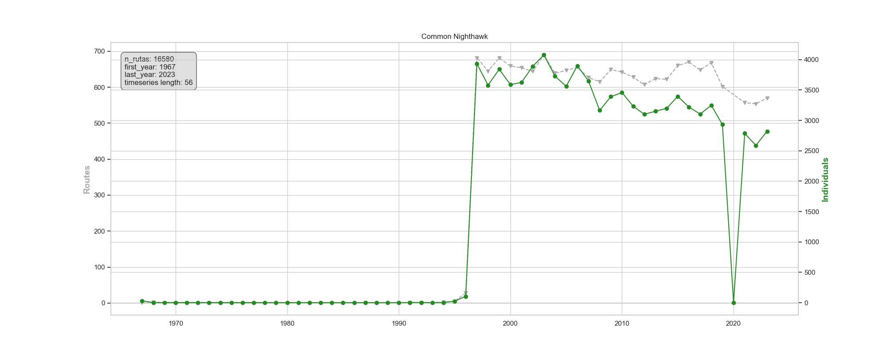{.thumbnail full-src="figs/4200_routes+tts.png"}
  31           440     924       1972         2023        51                  Glaucous-winged Gull                                  Goéland à ailes grises                               Charadriiformes     Laridae             Larus                     glaucescens                                    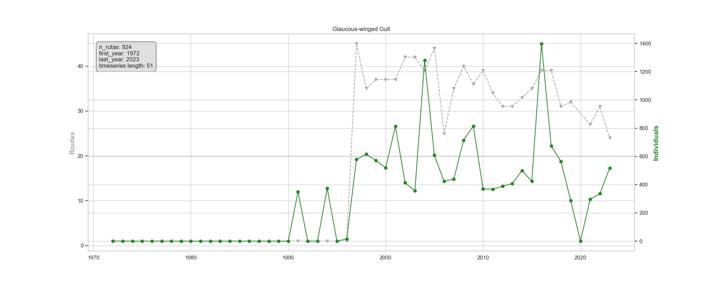{.thumbnail full-src="figs/440_routes+tts.png"}
  32           470     800       1987         2023        36                  Great Black-backed Gull                               Goéland marin                                        Charadriiformes     Laridae             Larus                     marinus                                        {.thumbnail full-src="https://placehold.co/600x400/cccccc/000000?text=No+Image+Available"}
  33           480     8         2005         2018        13                  Slaty-backed Gull                                     Goéland à manteau ardoisé                            Charadriiformes     Laridae             Larus                     schistisagus                                   {.thumbnail full-src="https://placehold.co/600x400/cccccc/000000?text=No+Image+Available"}
  34           490     208       1997         2023        26                  Western Gull                                          Goéland d\'Audubon                                   Charadriiformes     Laridae             Larus                     occidentalis                                   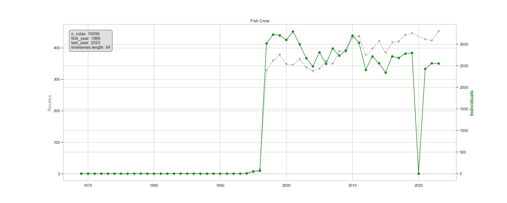{.thumbnail full-src="figs/4900_routes+tts.png"}
  35           495     9         1999         2018        19                  hybrid Western Gull x Glaucous-winged Gull            hybride Goéland à ailes grises x d\'Audubon          Charadriiformes     Laridae             Larus                     occidentalis x glaucescens                     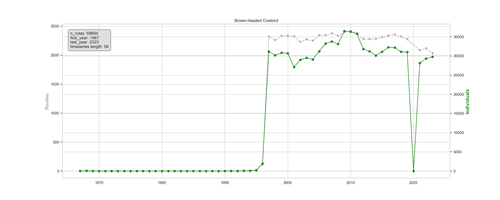{.thumbnail full-src="figs/4950_routes+tts.png"}
  36           510     2898      1987         2023        36                  Herring Gull                                          Goéland argenté                                      Charadriiformes     Laridae             Larus                     argentatus                                     {.thumbnail full-src="figs/5100_routes+tts.png"}
  37           530     1927      1990         2023        33                  California Gull                                       Goéland de Californie                                Charadriiformes     Laridae             Larus                     californicus                                   {.thumbnail full-src="figs/5300_routes+tts.png"}
  38           534     989       1990         2023        33                  unid. gull                                            unid Goéland sp.                                     Charadriiformes     Laridae             Gull                      sp.                                            {.thumbnail full-src="https://placehold.co/600x400/cccccc/000000?text=No+Image+Available"}
  39           540     6314      1991         2023        32                  Ring-billed Gull                                      Goéland à bec cerclé                                 Charadriiformes     Laridae             Larus                     delawarensis                                   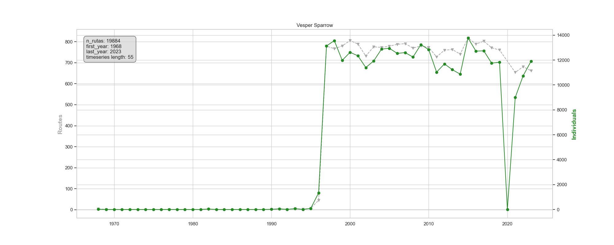{.thumbnail full-src="figs/5400_routes+tts.png"}
  40           550     1471      1995         2023        28                  Short-billed Gull                                     Goéland à bec court                                  Charadriiformes     Laridae             Larus                     brachyrhynchus                                 {.thumbnail full-src="https://placehold.co/600x400/cccccc/000000?text=No+Image+Available"}
  41           551     10        1997         2019        22                  Black-headed Gull                                     Mouette rieuse                                       Charadriiformes     Laridae             Chroicocephalus           ridibundus                                     {.thumbnail full-src="https://placehold.co/600x400/cccccc/000000?text=No+Image+Available"}
  42           570     17        1998         2019        21                  Heermann\'s Gull                                      Goéland de Heermann                                  Charadriiformes     Laridae             Larus                     heermanni                                      {.thumbnail full-src="https://placehold.co/600x400/cccccc/000000?text=No+Image+Available"}
  43           580     1998      1967         2023        56                  Laughing Gull                                         Mouette atricille                                    Charadriiformes     Laridae             Leucophaeus               atricilla                                      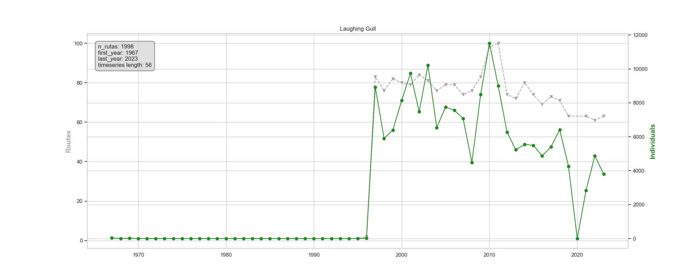{.thumbnail full-src="figs/580_routes+tts.png"}
  44           590     1980      1982         2023        41                  Franklin\'s Gull                                      Mouette de Franklin                                  Charadriiformes     Laridae             Leucophaeus               pipixcan                                       {.thumbnail full-src="https://placehold.co/600x400/cccccc/000000?text=No+Image+Available"}
  45           600     561       1977         2023        46                  Bonaparte\'s Gull                                     Mouette de Bonaparte                                 Charadriiformes     Laridae             Chroicocephalus           philadelphia                                   {.thumbnail full-src="https://placehold.co/600x400/cccccc/000000?text=No+Image+Available"}
  46           620     8         2006         2023        17                  Sabine\'s Gull                                        Mouette de Sabine                                    Charadriiformes     Laridae             Xema                      sabini                                         {.thumbnail full-src="https://placehold.co/600x400/cccccc/000000?text=No+Image+Available"}
  47           630     246       1967         2023        56                  Gull-billed Tern                                      Sterne hansel                                        Charadriiformes     Laridae             Gelochelidon              nilotica                                       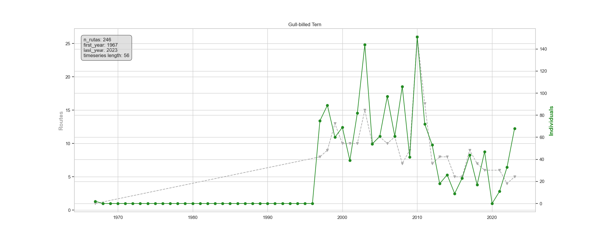{.thumbnail full-src="figs/630_routes+tts.png"}
  48           634     107       1997         2023        26                  unid. tern                                            unid Sterne sp.                                      Charadriiformes     Laridae             Tern                      sp.                                            {.thumbnail full-src="https://placehold.co/600x400/cccccc/000000?text=No+Image+Available"}
  49           640     823       1996         2023        27                  Caspian Tern                                          Sterne caspienne                                     Charadriiformes     Laridae             Hydroprogne               caspia                                         {.thumbnail full-src="https://placehold.co/600x400/cccccc/000000?text=No+Image+Available"}
  50           650     440       1997         2023        26                  Royal Tern                                            Sterne royale                                        Charadriiformes     Laridae             Thalasseus                maximus                                        {.thumbnail full-src="https://placehold.co/600x400/cccccc/000000?text=No+Image+Available"}
  51           660     2         2014         2015        1                   Elegant Tern                                          Sterne élégante                                      Charadriiformes     Laridae             Thalasseus                elegans                                        {.thumbnail full-src="https://placehold.co/600x400/cccccc/000000?text=No+Image+Available"}
  52           670     44        1997         2023        26                  Sandwich Tern                                         Sterne caugek                                        Charadriiformes     Laridae             Thalasseus                sandvicensis                                   {.thumbnail full-src="https://placehold.co/600x400/cccccc/000000?text=No+Image+Available"}
  53           690     1082      1967         2023        56                  Forster\'s Tern                                       Sterne de Forster                                    Charadriiformes     Laridae             Sterna                    forsteri                                       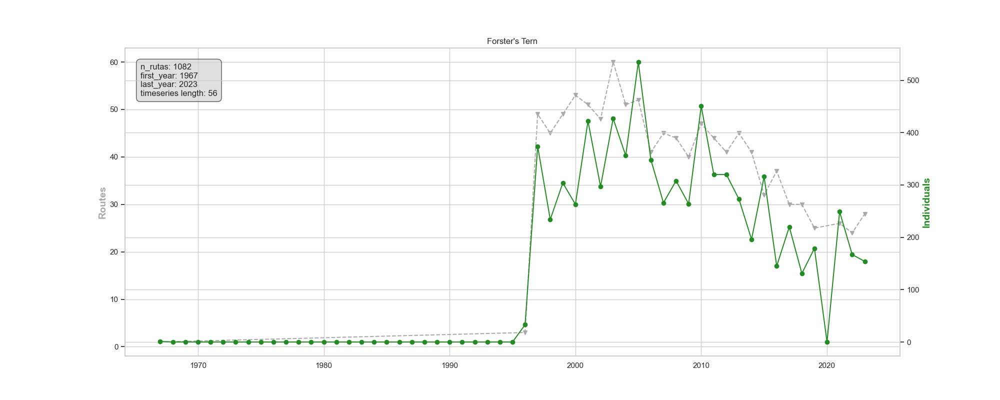{.thumbnail full-src="figs/690_routes+tts.png"}
  54           700     685       1987         2023        36                  Common Tern                                           Sterne pierregarin                                   Charadriiformes     Laridae             Sterna                    hirundo                                        {.thumbnail full-src="https://placehold.co/600x400/cccccc/000000?text=No+Image+Available"}
  55           710     788       1997         2023        26                  Arctic Tern                                           Sterne arctique                                      Charadriiformes     Laridae             Sterna                    paradisaea                                     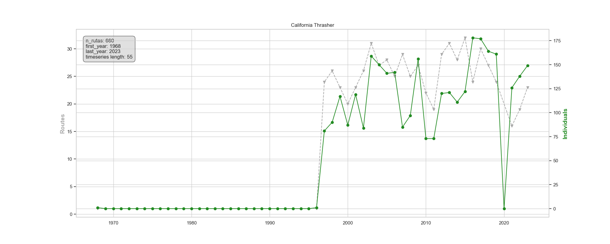{.thumbnail full-src="figs/7100_routes+tts.png"}
  56           730     77        1997         2023        26                  Aleutian Tern                                         Sterne des Aléoutiennes                              Charadriiformes     Laridae             Onychoprion               aleuticus                                      {.thumbnail full-src="https://placehold.co/600x400/cccccc/000000?text=No+Image+Available"}
  57           740     634       1967         2023        56                  Least Tern                                            Petite Sterne                                        Charadriiformes     Laridae             Sternula                  antillarum                                     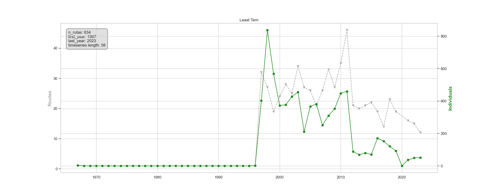{.thumbnail full-src="figs/740_routes+tts.png"}
  58           770     2466      1968         2023        55                  Black Tern                                            Guifette noire                                       Charadriiformes     Laridae             Chlidonias                niger                                          {.thumbnail full-src="figs/770_routes+tts.png"}
  59           800     287       1967         2023        56                  Black Skimmer                                         Bec-en-ciseaux noir                                  Charadriiformes     Laridae             Rynchops                  niger                                          {.thumbnail full-src="figs/800_routes+tts.png"}
  60           860     1         2005         2005        0                   Northern Fulmar                                       Fulmar boréal                                        Procellariiformes   Procellariidae      Fulmarus                  glacialis                                      {.thumbnail full-src="https://placehold.co/600x400/cccccc/000000?text=No+Image+Available"}
  61           900     5         2004         2008        4                   Manx Shearwater                                       Puffin des Anglais                                   Procellariiformes   Procellariidae      Puffinus                  puffinus                                       {.thumbnail full-src="https://placehold.co/600x400/cccccc/000000?text=No+Image+Available"}
  62           1150    2         2007         2007        0                   Brown Booby                                           Fou brun                                             Suliformes          Sulidae             Sula                      leucogaster                                    {.thumbnail full-src="https://placehold.co/600x400/cccccc/000000?text=No+Image+Available"}
  63           1170    131       1997         2023        26                  Northern Gannet                                       Fou de Bassan                                        Suliformes          Sulidae             Morus                     bassanus                                       {.thumbnail full-src="https://placehold.co/600x400/cccccc/000000?text=No+Image+Available"}
  64           1180    1584      1997         2023        26                  Anhinga                                               Anhinga d\'Amérique                                  Suliformes          Anhingidae          Anhinga                   anhinga                                        {.thumbnail full-src="https://placehold.co/600x400/cccccc/000000?text=No+Image+Available"}
  65           1190    19        1997         2021        24                  Great Cormorant                                       Grand Cormoran                                       Suliformes          Phalacrocoracidae   Phalacrocorax             carbo                                          {.thumbnail full-src="https://placehold.co/600x400/cccccc/000000?text=No+Image+Available"}
  66           1200    5227      1987         2023        36                  Double-crested Cormorant                              Cormoran à aigrettes                                 Suliformes          Phalacrocoracidae   Nannopterum               auritum                                        {.thumbnail full-src="https://placehold.co/600x400/cccccc/000000?text=No+Image+Available"}
  67           1205    15        2000         2023        23                  unid. Neotropic / Double-crested Cormorant            Cormoran vigua / Cormoran à aigrettes                Suliformes          Phalacrocoracidae   Nannopterum               brasilianum / auritum                          {.thumbnail full-src="https://placehold.co/600x400/cccccc/000000?text=No+Image+Available"}
  68           1206    2         2012         2012        0                   unid. Double-crested Cormorant / Great Cormorant      Cormoran à aigrettes / Grand Cormoran                Suliformes          Phalacrocoracidae   Nannopterum               auritus / carbo                                {.thumbnail full-src="https://placehold.co/600x400/cccccc/000000?text=No+Image+Available"}
  69           1207    36        1997         2023        26                  unid. west coast cormorant                            unid Cormoran de la côte ouest                       Suliformes          Phalacrocoracidae   Urile                     sp.                                            {.thumbnail full-src="https://placehold.co/600x400/cccccc/000000?text=No+Image+Available"}
  70           1210    351       1997         2023        26                  Neotropic Cormorant                                   Cormoran vigua                                       Suliformes          Phalacrocoracidae   Nannopterum               brasilianum                                    {.thumbnail full-src="https://placehold.co/600x400/cccccc/000000?text=No+Image+Available"}
  71           1220    63        1997         2019        22                  Brandt\'s Cormorant                                   Cormoran de Brandt                                   Suliformes          Phalacrocoracidae   Urile                     penicillatus                                   {.thumbnail full-src="https://placehold.co/600x400/cccccc/000000?text=No+Image+Available"}
  72           1230    118       1991         2023        32                  Pelagic Cormorant                                     Cormoran pélagique                                   Suliformes          Phalacrocoracidae   Urile                     pelagicus                                      {.thumbnail full-src="https://placehold.co/600x400/cccccc/000000?text=No+Image+Available"}
  73           1250    2523      1977         2023        46                  American White Pelican                                Pélican d\'Amérique                                  Pelecaniformes      Pelecanidae         Pelecanus                 erythrorhynchos                                {.thumbnail full-src="https://placehold.co/600x400/cccccc/000000?text=No+Image+Available"}
  74           1260    601       1997         2023        26                  Brown Pelican                                         Pélican brun                                         Pelecaniformes      Pelecanidae         Pelecanus                 occidentalis                                   {.thumbnail full-src="https://placehold.co/600x400/cccccc/000000?text=No+Image+Available"}
  75           1280    53        1997         2021        24                  Magnificent Frigatebird                               Frégate superbe                                      Suliformes          Fregatidae          Fregata                   magnificens                                    {.thumbnail full-src="https://placehold.co/600x400/cccccc/000000?text=No+Image+Available"}
  76           1290    3481      1990         2023        33                  Common Merganser                                      Grand Harle                                          Anseriformes        Anatidae            Mergus                    merganser                                      {.thumbnail full-src="https://placehold.co/600x400/cccccc/000000?text=No+Image+Available"}
  77           1300    504       1997         2023        26                  Red-breasted Merganser                                Harle huppé                                          Anseriformes        Anatidae            Mergus                    serrator                                       {.thumbnail full-src="https://placehold.co/600x400/cccccc/000000?text=No+Image+Available"}
  78           1310    1000      1996         2023        27                  Hooded Merganser                                      Harle couronné                                       Anseriformes        Anatidae            Lophodytes                cucullatus                                     {.thumbnail full-src="https://placehold.co/600x400/cccccc/000000?text=No+Image+Available"}
  79           1320    26265     1972         2023        51                  Mallard                                               Canard colvert                                       Anseriformes        Anatidae            Anas                      platyrhynchos                                  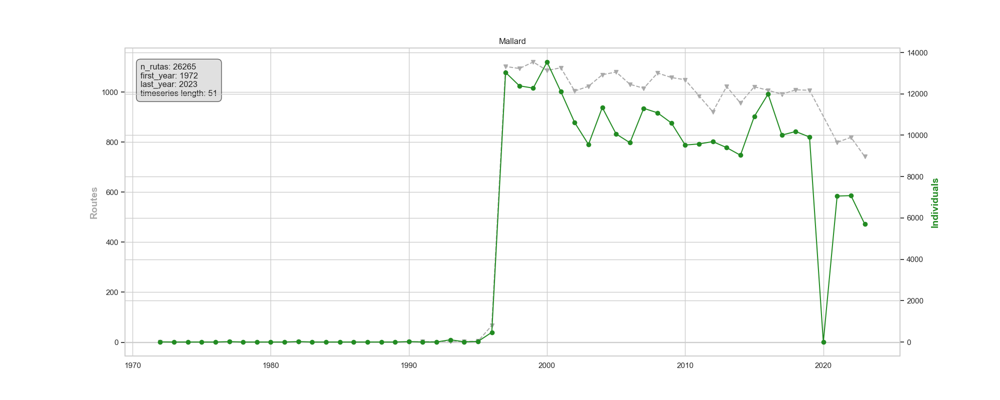{.thumbnail full-src="figs/1320_routes+tts.png"}
  80           1326    19        2005         2022        17                  hybrid Mallard x Black / Mexican / Mottled Duck       hybride Canard colvert x noir / Mexique / brun       Anseriformes        Anatidae            Anas                      platyrhynchos x rubripes / diazi / fulvigula   {.thumbnail full-src="https://placehold.co/600x400/cccccc/000000?text=No+Image+Available"}
  81           1330    895       1996         2023        27                  American Black Duck                                   Canard noir                                          Anseriformes        Anatidae            Anas                      rubripes                                       {.thumbnail full-src="https://placehold.co/600x400/cccccc/000000?text=No+Image+Available"}
  82           1331    118       1997         2023        26                  Mexican Duck                                          Canard du Mexique                                    Anseriformes        Anatidae            Anas                      diazi                                          {.thumbnail full-src="https://placehold.co/600x400/cccccc/000000?text=No+Image+Available"}
  83           1340    874       1967         2023        56                  Mottled Duck                                          Canard brun                                          Anseriformes        Anatidae            Anas                      fulvigula                                      {.thumbnail full-src="figs/1340_routes+tts.png"}
  84           1350    5199      1977         2023        46                  Gadwall                                               Canard chipeau                                       Anseriformes        Anatidae            Mareca                    strepera                                       {.thumbnail full-src="https://placehold.co/600x400/cccccc/000000?text=No+Image+Available"}
  85           1360    6         2001         2018        17                  Eurasian Wigeon                                       Canard siffleur                                      Anseriformes        Anatidae            Mareca                    penelope                                       {.thumbnail full-src="https://placehold.co/600x400/cccccc/000000?text=No+Image+Available"}
  86           1370    3606      1982         2023        41                  American Wigeon                                       Canard d\'Amérique                                   Anseriformes        Anatidae            Mareca                    americana                                      {.thumbnail full-src="https://placehold.co/600x400/cccccc/000000?text=No+Image+Available"}
  87           1390    3234      1987         2023        36                  Green-winged Teal                                     Sarcelle d\'hiver                                    Anseriformes        Anatidae            Anas                      crecca                                         {.thumbnail full-src="https://placehold.co/600x400/cccccc/000000?text=No+Image+Available"}
  88           1400    5348      1972         2023        51                  Blue-winged Teal                                      Sarcelle à ailes bleues                              Anseriformes        Anatidae            Spatula                   discors                                        {.thumbnail full-src="figs/1400_routes+tts.png"}
  89           1410    1986      1995         2023        28                  Cinnamon Teal                                         Sarcelle cannelle                                    Anseriformes        Anatidae            Spatula                   cyanoptera                                     {.thumbnail full-src="https://placehold.co/600x400/cccccc/000000?text=No+Image+Available"}
  90           1420    3975      1982         2023        41                  Northern Shoveler                                     Canard souchet                                       Anseriformes        Anatidae            Spatula                   clypeata                                       {.thumbnail full-src="https://placehold.co/600x400/cccccc/000000?text=No+Image+Available"}
  91           1430    3250      1977         2023        46                  Northern Pintail                                      Canard pilet                                         Anseriformes        Anatidae            Anas                      acuta                                          {.thumbnail full-src="https://placehold.co/600x400/cccccc/000000?text=No+Image+Available"}
  92           1440    9246      1972         2023        51                  Wood Duck                                             Canard branchu                                       Anseriformes        Anatidae            Aix                       sponsa                                         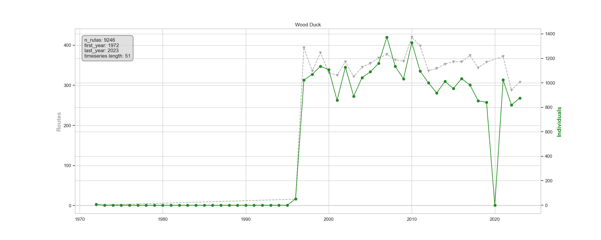{.thumbnail full-src="figs/1440_routes+tts.png"}
  93           1460    2110      1994         2023        29                  Redhead                                               Fuligule à tête rouge                                Anseriformes        Anatidae            Aythya                    americana                                      {.thumbnail full-src="https://placehold.co/600x400/cccccc/000000?text=No+Image+Available"}
  94           1470    1213      1993         2023        30                  Canvasback                                            Fuligule à dos blanc                                 Anseriformes        Anatidae            Aythya                    valisineria                                    {.thumbnail full-src="https://placehold.co/600x400/cccccc/000000?text=No+Image+Available"}
  95           1480    460       1997         2023        26                  Greater Scaup                                         Fuligule milouinan                                   Anseriformes        Anatidae            Aythya                    marila                                         {.thumbnail full-src="https://placehold.co/600x400/cccccc/000000?text=No+Image+Available"}
  96           1489    149       1995         2023        28                  unid. Greater Scaup / Lesser Scaup                    unid Fuligule milouinan / Petit Fuligule             Anseriformes        Anatidae            Aythya                    marila / affinis                               {.thumbnail full-src="https://placehold.co/600x400/cccccc/000000?text=No+Image+Available"}
  97           1490    2948      1993         2023        30                  Lesser Scaup                                          Petit Fuligule                                       Anseriformes        Anatidae            Aythya                    affinis                                        {.thumbnail full-src="https://placehold.co/600x400/cccccc/000000?text=No+Image+Available"}
  98           1500    2047      1993         2023        30                  Ring-necked Duck                                      Fuligule à collier                                   Anseriformes        Anatidae            Aythya                    collaris                                       {.thumbnail full-src="https://placehold.co/600x400/cccccc/000000?text=No+Image+Available"}
  99           1510    1366      1977         2023        46                  Common Goldeneye                                      Garrot à oeil d\'or                                  Anseriformes        Anatidae            Bucephala                 clangula                                       {.thumbnail full-src="https://placehold.co/600x400/cccccc/000000?text=No+Image+Available"}
  100          1512    60        1999         2023        24                  unid. Common Goldeneye / Barrow\'s Goldeneye          unid Garrot à oeil d\'or / Garrot d\'Islande         Anseriformes        Anatidae            Bucephala                 clangula / islandica                           {.thumbnail full-src="https://placehold.co/600x400/cccccc/000000?text=No+Image+Available"}
  101          1520    566       1995         2023        28                  Barrow\'s Goldeneye                                   Garrot d\'Islande                                    Anseriformes        Anatidae            Bucephala                 islandica                                      {.thumbnail full-src="https://placehold.co/600x400/cccccc/000000?text=No+Image+Available"}
  102          1530    1493      1993         2023        30                  Bufflehead                                            Petit Garrot                                         Anseriformes        Anatidae            Bucephala                 albeola                                        {.thumbnail full-src="https://placehold.co/600x400/cccccc/000000?text=No+Image+Available"}
  103          1540    226       1997         2023        26                  Long-tailed Duck                                      Harelde kakawi                                       Anseriformes        Anatidae            Clangula                  hyemalis                                       {.thumbnail full-src="https://placehold.co/600x400/cccccc/000000?text=No+Image+Available"}
  104          1550    246       1991         2023        32                  Harlequin Duck                                        Arlequin plongeur                                    Anseriformes        Anatidae            Histrionicus              histrionicus                                   {.thumbnail full-src="https://placehold.co/600x400/cccccc/000000?text=No+Image+Available"}
  105          1570    3         2021         2023        2                   Steller\'s Eider                                      Eider de Steller                                     Anseriformes        Anatidae            Polysticta                stelleri                                       {.thumbnail full-src="https://placehold.co/600x400/cccccc/000000?text=No+Image+Available"}
  106          1580    3         2021         2023        2                   Spectacled Eider                                      Eider à lunettes                                     Anseriformes        Anatidae            Somateria                 fischeri                                       {.thumbnail full-src="https://placehold.co/600x400/cccccc/000000?text=No+Image+Available"}
  107          1590    146       1995         2023        28                  Common Eider                                          Eider à duvet                                        Anseriformes        Anatidae            Somateria                 mollissima                                     {.thumbnail full-src="https://placehold.co/600x400/cccccc/000000?text=No+Image+Available"}
  108          1620    5         2004         2023        19                  King Eider                                            Eider à tête grise                                   Anseriformes        Anatidae            Somateria                 spectabilis                                    {.thumbnail full-src="https://placehold.co/600x400/cccccc/000000?text=No+Image+Available"}
  109          1630    93        1997         2023        26                  Black Scoter                                          Macreuse à bec jaune                                 Anseriformes        Anatidae            Melanitta                 americana                                      {.thumbnail full-src="https://placehold.co/600x400/cccccc/000000?text=No+Image+Available"}
  110          1650    169       1993         2023        30                  White-winged Scoter                                   Macreuse à ailes blanches                            Anseriformes        Anatidae            Melanitta                 deglandi                                       {.thumbnail full-src="https://placehold.co/600x400/cccccc/000000?text=No+Image+Available"}
  111          1657    11        2001         2023        22                  unid. scoter                                          unid macreuse sp.                                    Anseriformes        Anatidae            Melanitta                 sp.                                            {.thumbnail full-src="https://placehold.co/600x400/cccccc/000000?text=No+Image+Available"}
  112          1660    99        1997         2023        26                  Surf Scoter                                           Macreuse à front blanc                               Anseriformes        Anatidae            Melanitta                 perspicillata                                  {.thumbnail full-src="https://placehold.co/600x400/cccccc/000000?text=No+Image+Available"}
  113          1670    2392      1993         2023        30                  Ruddy Duck                                            Érismature rousse                                    Anseriformes        Anatidae            Oxyura                    jamaicensis                                    {.thumbnail full-src="https://placehold.co/600x400/cccccc/000000?text=No+Image+Available"}
  114          1690    11        2001         2023        22                  Snow Goose                                            Oie des neiges                                       Anseriformes        Anatidae            Anser                     caerulescens                                   {.thumbnail full-src="https://placehold.co/600x400/cccccc/000000?text=No+Image+Available"}
  115          1710    306       1997         2023        26                  Greater White-fronted Goose                           Oie rieuse                                           Anseriformes        Anatidae            Anser                     albifrons                                      {.thumbnail full-src="https://placehold.co/600x400/cccccc/000000?text=No+Image+Available"}
  116          1720    23495     1972         2023        51                  Canada Goose                                          Bernache du Canada                                   Anseriformes        Anatidae            Branta                    canadensis                                     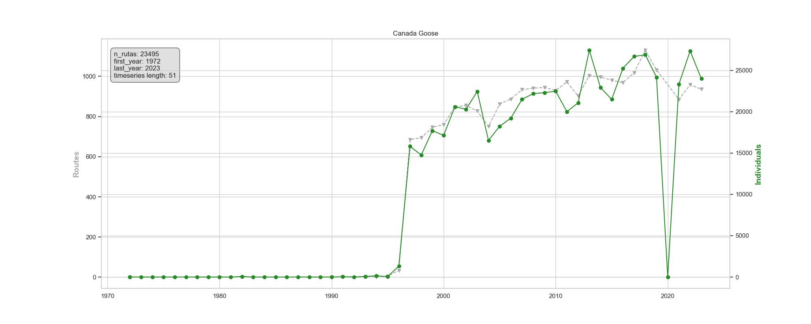{.thumbnail full-src="figs/1720_routes+tts.png"}
  117          1725    36        2005         2023        18                  Cackling Goose                                        Bernache de Hutchins                                 Anseriformes        Anatidae            Branta                    hutchinsii                                     {.thumbnail full-src="https://placehold.co/600x400/cccccc/000000?text=No+Image+Available"}
  118          1740    20        1997         2023        26                  (Black Brant) Brant                                   Bernache cravant (groupe nigricans)                  Anseriformes        Anatidae            Branta                    bernicla nigricans                             {.thumbnail full-src="https://placehold.co/600x400/cccccc/000000?text=No+Image+Available"}
  119          1760    1         2012         2012        0                   Emperor Goose                                         Oie empereur                                         Anseriformes        Anatidae            Anser                     canagicus                                      {.thumbnail full-src="https://placehold.co/600x400/cccccc/000000?text=No+Image+Available"}
  120          1770    1570      1967         2023        56                  Black-bellied Whistling-Duck                          Dendrocygne à ventre noir                            Anseriformes        Anatidae            Dendrocygna               autumnalis                                     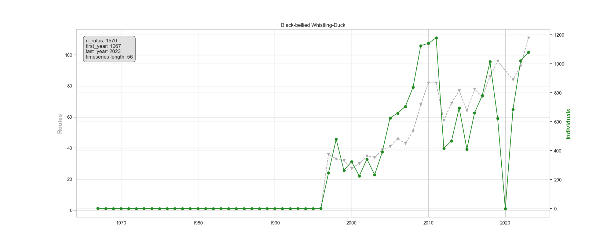{.thumbnail full-src="figs/1770_routes+tts.png"}
  121          1780    417       1967         2023        56                  Fulvous Whistling-Duck                                Dendrocygne fauve                                    Anseriformes        Anatidae            Dendrocygna               bicolor                                        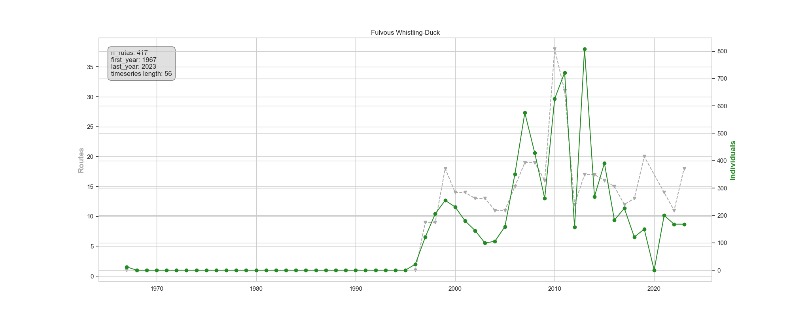{.thumbnail full-src="figs/1780_routes+tts.png"}
  122          1782    402       1996         2023        27                  Mute Swan                                             Cygne tuberculé                                      Anseriformes        Anatidae            Cygnus                    olor                                           {.thumbnail full-src="https://placehold.co/600x400/cccccc/000000?text=No+Image+Available"}
  123          1800    310       1997         2023        26                  Tundra Swan                                           Cygne siffleur                                       Anseriformes        Anatidae            Cygnus                    columbianus                                    {.thumbnail full-src="https://placehold.co/600x400/cccccc/000000?text=No+Image+Available"}
  124          1810    955       1997         2023        26                  Trumpeter Swan                                        Cygne trompette                                      Anseriformes        Anatidae            Cygnus                    buccinator                                     {.thumbnail full-src="https://placehold.co/600x400/cccccc/000000?text=No+Image+Available"}
  125          1830    555       1967         2023        56                  Roseate Spoonbill                                     Spatule rosée                                        Pelecaniformes      Threskiornithidae   Platalea                  ajaja                                          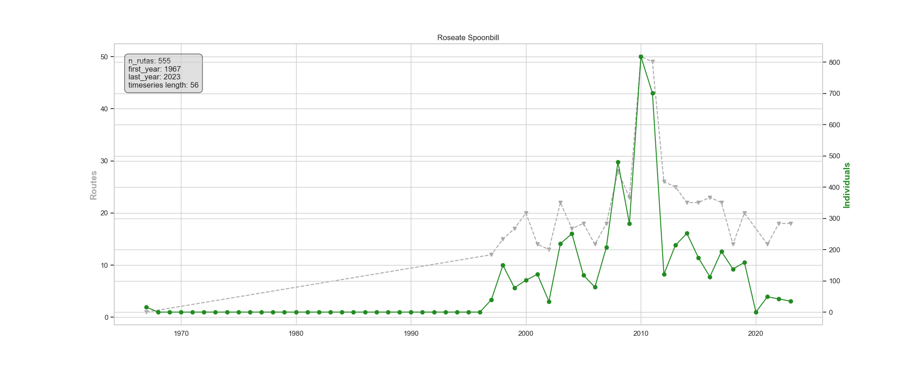{.thumbnail full-src="figs/1830_routes+tts.png"}
  126          1840    2892      1995         2023        28                  White Ibis                                            Ibis blanc                                           Pelecaniformes      Threskiornithidae   Eudocimus                 albus                                          {.thumbnail full-src="https://placehold.co/600x400/cccccc/000000?text=No+Image+Available"}
  127          1860    623       1969         2023        54                  Glossy Ibis                                           Ibis falcinelle                                      Pelecaniformes      Threskiornithidae   Plegadis                  falcinellus                                    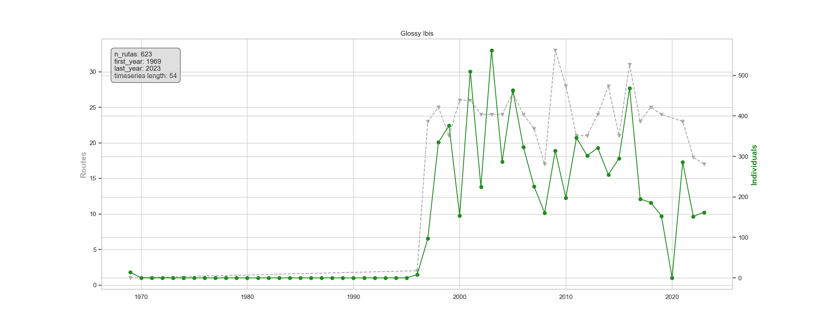{.thumbnail full-src="figs/1860_routes+tts.png"}
  128          1861    162       1997         2023        26                  unid. Glossy Ibis / White-faced Ibis                  unid Ibis falcinelle / Ibis à face blanche           Pelecaniformes      Threskiornithidae   Plegadis                  falcinellus / chihi                            {.thumbnail full-src="https://placehold.co/600x400/cccccc/000000?text=No+Image+Available"}
  129          1870    1150      1967         2023        56                  White-faced Ibis                                      Ibis à face blanche                                  Pelecaniformes      Threskiornithidae   Plegadis                  chihi                                          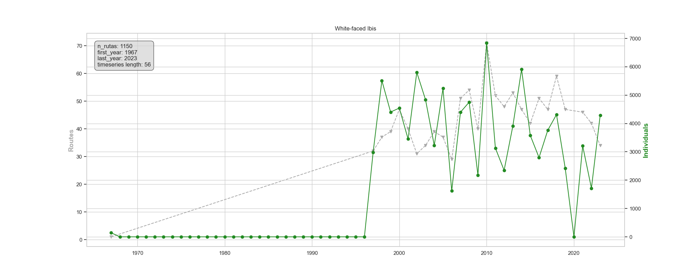{.thumbnail full-src="figs/1870_routes+tts.png"}
  130          1880    857       1996         2023        27                  Wood Stork                                            Tantale d\'Amérique                                  Ciconiiformes       Ciconiidae          Mycteria                  americana                                      {.thumbnail full-src="https://placehold.co/600x400/cccccc/000000?text=No+Image+Available"}
  131          1900    3481      1972         2023        51                  American Bittern                                      Butor d\'Amérique                                    Pelecaniformes      Ardeidae            Botaurus                  lentiginosus                                   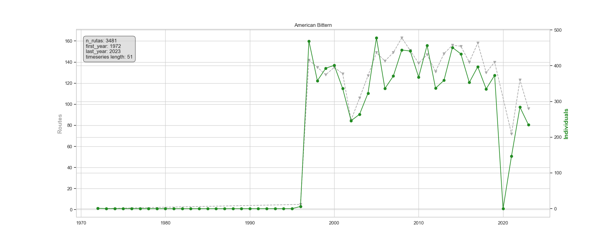{.thumbnail full-src="figs/1900_routes+tts.png"}
  132          1910    453       1996         2023        27                  Least Bittern                                         Petit Blongios                                       Pelecaniformes      Ardeidae            Ixobrychus                exilis                                         {.thumbnail full-src="https://placehold.co/600x400/cccccc/000000?text=No+Image+Available"}
  133          1920    27        1999         2018        19                  (Great White Heron) Great Blue Heron                  Grand Héron (blanche)                                Pelecaniformes      Ardeidae            Ardea                     herodias occidentalis                          {.thumbnail full-src="https://placehold.co/600x400/cccccc/000000?text=No+Image+Available"}
  134          1940    26722     1967         2023        56                  Great Blue Heron                                      Grand Héron                                          Pelecaniformes      Ardeidae            Ardea                     herodias                                       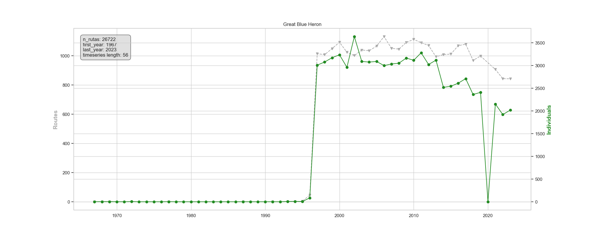{.thumbnail full-src="figs/1940_routes+tts.png"}
  135          1945    39        2005         2023        18                  unid. heron / egret                                   unid héron / aigrette sp.                            Pelecaniformes      Ardeidae            Ardeid                    sp.                                            {.thumbnail full-src="https://placehold.co/600x400/cccccc/000000?text=No+Image+Available"}
  136          1960    8621      1967         2023        56                  Great Egret                                           Grande Aigrette                                      Pelecaniformes      Ardeidae            Ardea                     alba                                           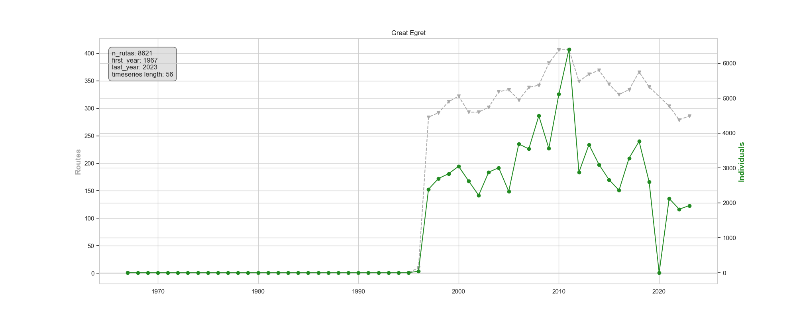{.thumbnail full-src="figs/1960_routes+tts.png"}
  137          1970    2795      1967         2023        56                  Snowy Egret                                           Aigrette neigeuse                                    Pelecaniformes      Ardeidae            Egretta                   thula                                          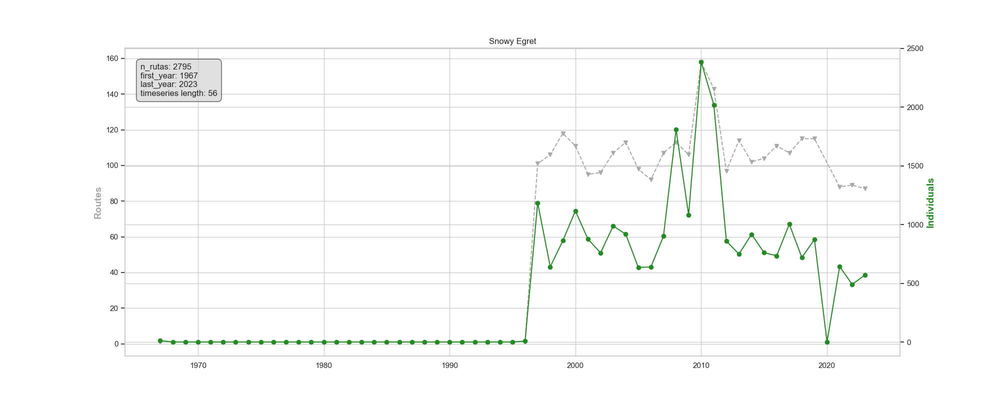{.thumbnail full-src="figs/1970_routes+tts.png"}
  138          1980    139       1967         2023        56                  Reddish Egret                                         Aigrette roussâtre                                   Pelecaniformes      Ardeidae            Egretta                   rufescens                                      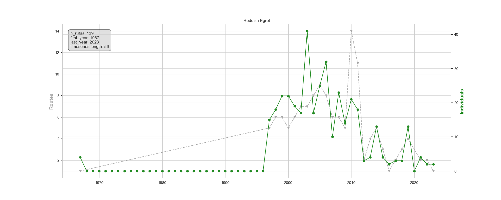{.thumbnail full-src="figs/1980_routes+tts.png"}
  139          1990    1287      1967         2023        56                  Tricolored Heron                                      Aigrette tricolore                                   Pelecaniformes      Ardeidae            Egretta                   tricolor                                       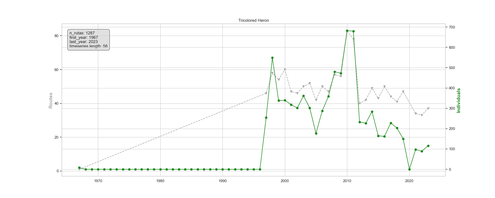{.thumbnail full-src="figs/1990_routes+tts.png"}
  140          2000    4240      1996         2023        27                  Little Blue Heron                                     Aigrette bleue                                       Pelecaniformes      Ardeidae            Egretta                   caerulea                                       {.thumbnail full-src="https://placehold.co/600x400/cccccc/000000?text=No+Image+Available"}
  141          2001    7310      1967         2023        56                  Cattle Egret                                          Héron garde-boeufs                                   Pelecaniformes      Ardeidae            Bubulcus                  ibis                                           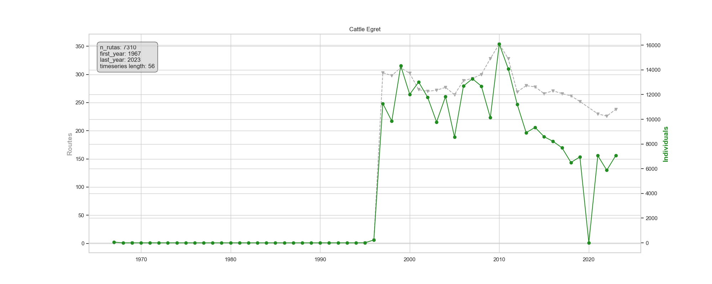{.thumbnail full-src="figs/2001_routes+tts.png"}
  142          2010    12355     1969         2023        54                  Green Heron                                           Héron vert                                           Pelecaniformes      Ardeidae            Butorides                 virescens                                      {.thumbnail full-src="figs/2010_routes+tts.png"}
  143          2020    2085      1968         2023        55                  Black-crowned Night-Heron                             Bihoreau gris                                        Pelecaniformes      Ardeidae            Nycticorax                nycticorax                                     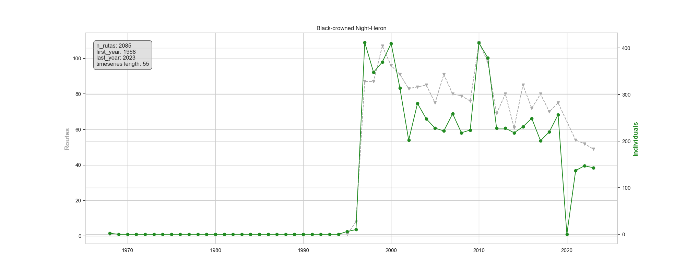{.thumbnail full-src="figs/2020_routes+tts.png"}
  144          2030    1027      1997         2023        26                  Yellow-crowned Night-Heron                            Bihoreau violacé                                     Pelecaniformes      Ardeidae            Nyctanassa                violacea                                       {.thumbnail full-src="https://placehold.co/600x400/cccccc/000000?text=No+Image+Available"}
  145          2035    36        1997         2023        26                  unid Black-crowned / Yellow-crowned Night-Heron       unid Bihoreau gris / Bihoreau violacé                Pelecaniformes      Ardeidae            Nycticorax / Nyctanassa   nycticorax / violacea                          {.thumbnail full-src="https://placehold.co/600x400/cccccc/000000?text=No+Image+Available"}
  146          2040    7         2006         2021        15                  Whooping Crane                                        Grue blanche                                         Gruiformes          Gruidae             Grus                      americana                                      {.thumbnail full-src="https://placehold.co/600x400/cccccc/000000?text=No+Image+Available"}
  147          2060    7908      1991         2023        32                  Sandhill Crane                                        Grue du Canada                                       Gruiformes          Gruidae             Antigone                  canadensis                                     {.thumbnail full-src="https://placehold.co/600x400/cccccc/000000?text=No+Image+Available"}
  148          2070    207       1997         2023        26                  Limpkin                                               Courlan brun                                         Gruiformes          Aramidae            Aramus                    guarauna                                       {.thumbnail full-src="https://placehold.co/600x400/cccccc/000000?text=No+Image+Available"}
  149          2080    229       1967         2023        56                  King Rail                                             Râle élégant                                         Gruiformes          Rallidae            Rallus                    elegans                                        {.thumbnail full-src="figs/2080_routes+tts.png"}
  150          2090    3         2011         2018        7                   unid. Clapper / King Rail                             unid Râle élégant / Râle Gris                        Gruiformes          Rallidae            Rallus                    crepitans / elegans                            {.thumbnail full-src="https://placehold.co/600x400/cccccc/000000?text=No+Image+Available"}
  151          2110    569       1967         2023        56                  Clapper Rail                                          Râle tapageur                                        Gruiformes          Rallidae            Rallus                    crepitans                                      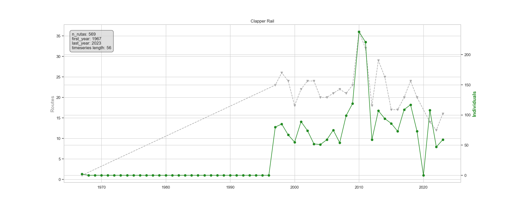{.thumbnail full-src="figs/2110_routes+tts.png"}
  152          2111    58        1997         2023        26                  Ridgway\'s Rail                                       Râle de Californie                                   Gruiformes          Rallidae            Rallus                    obsoletus                                      {.thumbnail full-src="https://placehold.co/600x400/cccccc/000000?text=No+Image+Available"}
  153          2120    748       1977         2023        46                  Virginia Rail                                         Râle de Virginie                                     Gruiformes          Rallidae            Rallus                    limicola                                       {.thumbnail full-src="https://placehold.co/600x400/cccccc/000000?text=No+Image+Available"}
  154          2140    5390      1977         2023        46                  Sora                                                  Marouette de Caroline                                Gruiformes          Rallidae            Porzana                   carolina                                       {.thumbnail full-src="https://placehold.co/600x400/cccccc/000000?text=No+Image+Available"}
  155          2150    176       1997         2023        26                  Yellow Rail                                           Râle jaune                                           Gruiformes          Rallidae            Coturnicops               noveboracensis                                 {.thumbnail full-src="https://placehold.co/600x400/cccccc/000000?text=No+Image+Available"}
  156          2160    37        1997         2023        26                  Black Rail                                            Râle noir                                            Gruiformes          Rallidae            Laterallus                jamaicensis                                    {.thumbnail full-src="https://placehold.co/600x400/cccccc/000000?text=No+Image+Available"}
  157          2180    160       1967         2023        56                  Purple Gallinule                                      Talève violacée                                      Gruiformes          Rallidae            Porphyrio                 martinicus                                     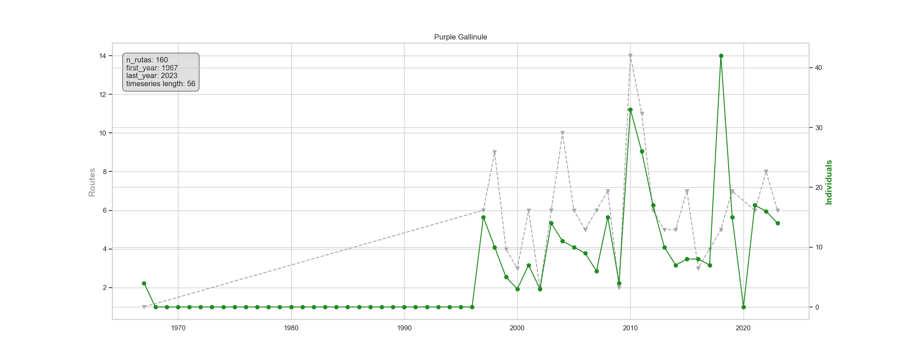{.thumbnail full-src="figs/2180_routes+tts.png"}
  158          2190    1124      1996         2023        27                  Common Gallinule                                      Gallinule d\'Amérique                                Gruiformes          Rallidae            Gallinula                 galeata                                        {.thumbnail full-src="https://placehold.co/600x400/cccccc/000000?text=No+Image+Available"}
  159          2210    5336      1991         2023        32                  American Coot                                         Foulque d\'Amérique                                  Gruiformes          Rallidae            Fulica                    americana                                      {.thumbnail full-src="https://placehold.co/600x400/cccccc/000000?text=No+Image+Available"}
  160          2220    3         2021         2023        2                   Red Phalarope                                         Phalarope à bec large                                Charadriiformes     Scolopacidae        Phalaropus                fulicarius                                     {.thumbnail full-src="https://placehold.co/600x400/cccccc/000000?text=No+Image+Available"}
  161          2230    210       1997         2023        26                  Red-necked Phalarope                                  Phalarope à bec étroit                               Charadriiformes     Scolopacidae        Phalaropus                lobatus                                        {.thumbnail full-src="https://placehold.co/600x400/cccccc/000000?text=No+Image+Available"}
  162          2240    2456      1990         2023        33                  Wilson\'s Phalarope                                   Phalarope de Wilson                                  Charadriiformes     Scolopacidae        Phalaropus                tricolor                                       {.thumbnail full-src="https://placehold.co/600x400/cccccc/000000?text=No+Image+Available"}
  163          2250    2041      1990         2023        33                  American Avocet                                       Avocette d\'Amérique                                 Charadriiformes     Recurvirostridae    Recurvirostra             americana                                      {.thumbnail full-src="https://placehold.co/600x400/cccccc/000000?text=No+Image+Available"}
  164          2260    1645      1967         2023        56                  Black-necked Stilt                                    Échasse d\'Amérique                                  Charadriiformes     Recurvirostridae    Himantopus                mexicanus                                      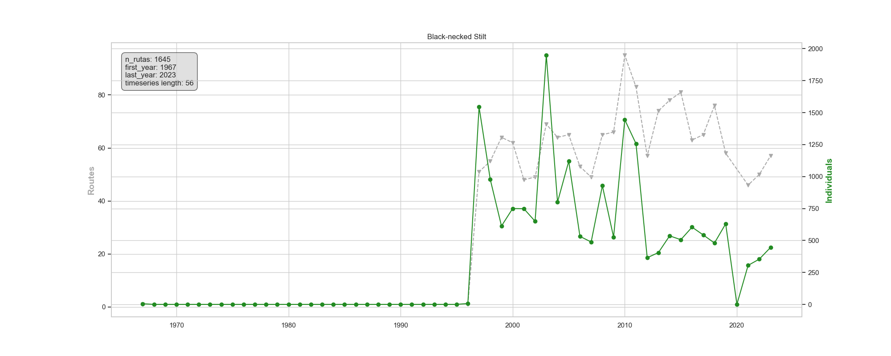{.thumbnail full-src="figs/2260_routes+tts.png"}
  165          2280    484       1995         2023        28                  American Woodcock                                     Bécasse d\'Amérique                                  Charadriiformes     Scolopacidae        Scolopax                  minor                                          {.thumbnail full-src="https://placehold.co/600x400/cccccc/000000?text=No+Image+Available"}
  166          2300    16311     1968         2023        55                  Wilson\'s Snipe                                       Bécassine de Wilson                                  Charadriiformes     Scolopacidae        Gallinago                 delicata                                       {.thumbnail full-src="figs/2300_routes+tts.png"}
  167          2310    83        1997         2023        26                  Short-billed Dowitcher                                Bécassin roux                                        Charadriiformes     Scolopacidae        Limnodromus               griseus                                        {.thumbnail full-src="https://placehold.co/600x400/cccccc/000000?text=No+Image+Available"}
  168          2320    7         2004         2023        19                  Long-billed Dowitcher                                 Bécassin à long bec                                  Charadriiformes     Scolopacidae        Limnodromus               scolopaceus                                    {.thumbnail full-src="https://placehold.co/600x400/cccccc/000000?text=No+Image+Available"}
  169          2327    6         2000         2013        13                  unid. Short-billed / Long-billed Dowitcher            unid Bécassin roux / Bécassin à long bec             Charadriiformes     Scolopacidae        Limnodromus               griseus / scolopaceus                          {.thumbnail full-src="https://placehold.co/600x400/cccccc/000000?text=No+Image+Available"}
  170          2330    25        2004         2022        18                  Stilt Sandpiper                                       Bécasseau à échasses                                 Charadriiformes     Scolopacidae        Calidris                  himantopus                                     {.thumbnail full-src="https://placehold.co/600x400/cccccc/000000?text=No+Image+Available"}
  171          2340    4         2017         2022        5                   Red Knot                                              Bécasseau maubèche                                   Charadriiformes     Scolopacidae        Calidris                  canutus                                        {.thumbnail full-src="https://placehold.co/600x400/cccccc/000000?text=No+Image+Available"}
  172          2356    19        1997         2023        26                  Rock Sandpiper                                        Bécasseau des Aléoutiennes                           Charadriiformes     Scolopacidae        Calidris                  ptilocnemis                                    {.thumbnail full-src="https://placehold.co/600x400/cccccc/000000?text=No+Image+Available"}
  173          2390    8         2003         2023        20                  Pectoral Sandpiper                                    Bécasseau à poitrine cendrée                         Charadriiformes     Scolopacidae        Calidris                  melanotos                                      {.thumbnail full-src="https://placehold.co/600x400/cccccc/000000?text=No+Image+Available"}
  174          2400    3         2021         2023        2                   White-rumped Sandpiper                                Bécasseau à croupion blanc                           Charadriiformes     Scolopacidae        Calidris                  fuscicollis                                    {.thumbnail full-src="https://placehold.co/600x400/cccccc/000000?text=No+Image+Available"}
  175          2410    6         2011         2023        12                  Baird\'s Sandpiper                                    Bécasseau de Baird                                   Charadriiformes     Scolopacidae        Calidris                  bairdii                                        {.thumbnail full-src="https://placehold.co/600x400/cccccc/000000?text=No+Image+Available"}
  176          2420    311       1995         2023        28                  Least Sandpiper                                       Bécasseau minuscule                                  Charadriiformes     Scolopacidae        Calidris                  minutilla                                      {.thumbnail full-src="https://placehold.co/600x400/cccccc/000000?text=No+Image+Available"}
  177          2422    1         2023         2023        0                   Red-necked Stint                                      Bécasseau à col roux                                 Charadriiformes     Scolopacidae        Calidris                  ruficollis                                     {.thumbnail full-src="https://placehold.co/600x400/cccccc/000000?text=No+Image+Available"}
  178          2429    45        2003         2023        20                  unid. small \'\'peep\'\' sandpiper                    unid petit Bécasseau sp.                             Charadriiformes     Scolopacidae        Calidris                  sp.                                            {.thumbnail full-src="https://placehold.co/600x400/cccccc/000000?text=No+Image+Available"}
  179          2430    36        1998         2023        25                  Dunlin                                                Bécasseau variable                                   Charadriiformes     Scolopacidae        Calidris                  alpina                                         {.thumbnail full-src="https://placehold.co/600x400/cccccc/000000?text=No+Image+Available"}
  180          2460    104       1997         2023        26                  Semipalmated Sandpiper                                Bécasseau semipalmé                                  Charadriiformes     Scolopacidae        Calidris                  pusilla                                        {.thumbnail full-src="https://placehold.co/600x400/cccccc/000000?text=No+Image+Available"}
  181          2470    122       1997         2023        26                  Western Sandpiper                                     Bécasseau d\'Alaska                                  Charadriiformes     Scolopacidae        Calidris                  mauri                                          {.thumbnail full-src="https://placehold.co/600x400/cccccc/000000?text=No+Image+Available"}
  182          2480    1         2010         2010        0                   Sanderling                                            Bécasseau sanderling                                 Charadriiformes     Scolopacidae        Calidris                  alba                                           {.thumbnail full-src="https://placehold.co/600x400/cccccc/000000?text=No+Image+Available"}
  183          2490    2667      1982         2023        41                  Marbled Godwit                                        Barge marbrée                                        Charadriiformes     Scolopacidae        Limosa                    fedoa                                          {.thumbnail full-src="https://placehold.co/600x400/cccccc/000000?text=No+Image+Available"}
  184          2500    40        1997         2023        26                  Bar-tailed Godwit                                     Barge rousse                                         Charadriiformes     Scolopacidae        Limosa                    lapponica                                      {.thumbnail full-src="https://placehold.co/600x400/cccccc/000000?text=No+Image+Available"}
  185          2510    44        1997         2018        21                  Hudsonian Godwit                                      Barge hudsonienne                                    Charadriiformes     Scolopacidae        Limosa                    haemastica                                     {.thumbnail full-src="https://placehold.co/600x400/cccccc/000000?text=No+Image+Available"}
  186          2540    1237      1995         2023        28                  Greater Yellowlegs                                    Grand Chevalier                                      Charadriiformes     Scolopacidae        Tringa                    melanoleuca                                    {.thumbnail full-src="https://placehold.co/600x400/cccccc/000000?text=No+Image+Available"}
  187          2550    1712      1982         2023        41                  Lesser Yellowlegs                                     Petit Chevalier                                      Charadriiformes     Scolopacidae        Tringa                    flavipes                                       {.thumbnail full-src="https://placehold.co/600x400/cccccc/000000?text=No+Image+Available"}
  188          2555    33        1997         2023        26                  unid. Greater Yellowlegs / Lesser Yellowlegs          unid Grand Chevalier / Petit Chevalier               Charadriiformes     Scolopacidae        Tringa                    melanoleuca / flavipes                         {.thumbnail full-src="https://placehold.co/600x400/cccccc/000000?text=No+Image+Available"}
  189          2560    1007      1995         2023        28                  Solitary Sandpiper                                    Chevalier solitaire                                  Charadriiformes     Scolopacidae        Tringa                    solitaria                                      {.thumbnail full-src="https://placehold.co/600x400/cccccc/000000?text=No+Image+Available"}
  190          2580    4040      1967         2023        56                  Willet                                                Chevalier semipalmé                                  Charadriiformes     Scolopacidae        Tringa                    semipalmata                                    {.thumbnail full-src="figs/2580_routes+tts.png"}
  191          2590    84        1998         2023        25                  Wandering Tattler                                     Chevalier errant                                     Charadriiformes     Scolopacidae        Tringa                    incana                                         {.thumbnail full-src="https://placehold.co/600x400/cccccc/000000?text=No+Image+Available"}
  192          2610    5809      1968         2023        55                  Upland Sandpiper                                      Maubèche des champs                                  Charadriiformes     Scolopacidae        Bartramia                 longicauda                                     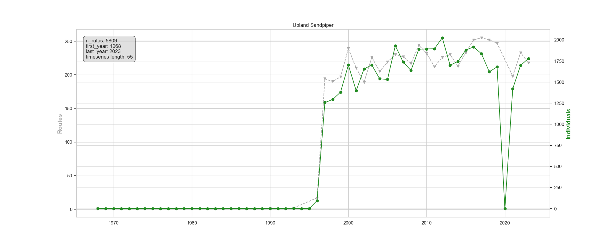{.thumbnail full-src="figs/2610_routes+tts.png"}
  193          2620    2         2021         2022        1                   Buff-breasted Sandpiper                               Bécasseau roussâtre                                  Charadriiformes     Scolopacidae        Calidris                  subruficollis                                  {.thumbnail full-src="https://placehold.co/600x400/cccccc/000000?text=No+Image+Available"}
  194          2630    7847      1968         2023        55                  Spotted Sandpiper                                     Chevalier grivelé                                    Charadriiformes     Scolopacidae        Actitis                   macularius                                     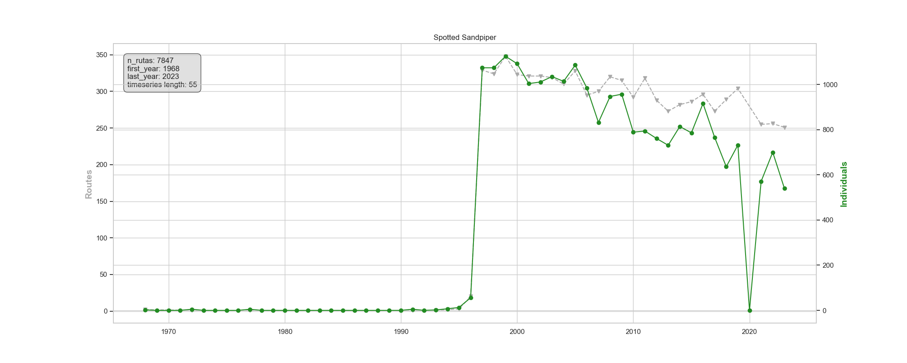{.thumbnail full-src="figs/2630_routes+tts.png"}
  195          2640    3777      1990         2023        33                  Long-billed Curlew                                    Courlis à long bec                                   Charadriiformes     Scolopacidae        Numenius                  americanus                                     {.thumbnail full-src="https://placehold.co/600x400/cccccc/000000?text=No+Image+Available"}
  196          2650    230       1997         2023        26                  Whimbrel                                              Courlis corlieu                                      Charadriiformes     Scolopacidae        Numenius                  phaeopus                                       {.thumbnail full-src="https://placehold.co/600x400/cccccc/000000?text=No+Image+Available"}
  197          2680    18        1997         2014        17                  Bristle-thighed Curlew                                Courlis d\'Alaska                                    Charadriiformes     Scolopacidae        Numenius                  tahitiensis                                    {.thumbnail full-src="https://placehold.co/600x400/cccccc/000000?text=No+Image+Available"}
  198          2700    12        1998         2018        20                  Black-bellied Plover                                  Pluvier argenté                                      Charadriiformes     Charadriidae        Pluvialis                 squatarola                                     {.thumbnail full-src="https://placehold.co/600x400/cccccc/000000?text=No+Image+Available"}
  199          2720    169       1997         2023        26                  American Golden-Plover                                Pluvier bronzé                                       Charadriiformes     Charadriidae        Pluvialis                 dominica                                       {.thumbnail full-src="https://placehold.co/600x400/cccccc/000000?text=No+Image+Available"}
  200          2721    129       1997         2023        26                  Pacific Golden-Plover                                 Pluvier fauve                                        Charadriiformes     Charadriidae        Pluvialis                 fulva                                          {.thumbnail full-src="https://placehold.co/600x400/cccccc/000000?text=No+Image+Available"}
  201          2730    46054     1967         2023        56                  Killdeer                                              Pluvier kildir                                       Charadriiformes     Charadriidae        Charadrius                vociferus                                      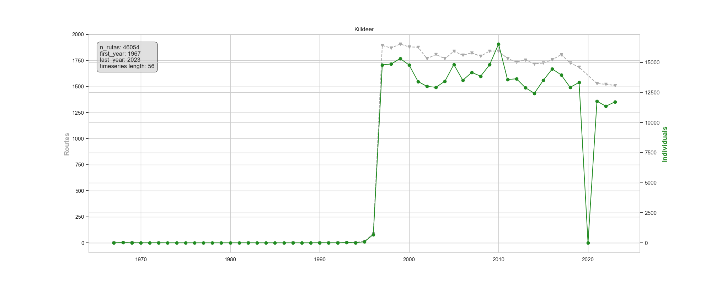{.thumbnail full-src="figs/2730_routes+tts.png"}
  202          2740    355       1997         2023        26                  Semipalmated Plover                                   Pluvier semipalmé                                    Charadriiformes     Charadriidae        Charadrius                semipalmatus                                   {.thumbnail full-src="https://placehold.co/600x400/cccccc/000000?text=No+Image+Available"}
  203          2770    7         2007         2019        12                  Piping Plover                                         Pluvier siffleur                                     Charadriiformes     Charadriidae        Charadrius                melodus                                        {.thumbnail full-src="https://placehold.co/600x400/cccccc/000000?text=No+Image+Available"}
  204          2780    70        1997         2023        26                  Snowy Plover                                          Pluvier neigeux                                      Charadriiformes     Charadriidae        Charadrius                nivosus                                        {.thumbnail full-src="https://placehold.co/600x400/cccccc/000000?text=No+Image+Available"}
  205          2800    49        1997         2023        26                  Wilson\'s Plover                                      Pluvier de Wilson                                    Charadriiformes     Charadriidae        Charadrius                wilsonia                                       {.thumbnail full-src="https://placehold.co/600x400/cccccc/000000?text=No+Image+Available"}
  206          2810    311       1996         2023        27                  Mountain Plover                                       Pluvier montagnard                                   Charadriiformes     Charadriidae        Charadrius                montanus                                       {.thumbnail full-src="https://placehold.co/600x400/cccccc/000000?text=No+Image+Available"}
  207          2820    5         2003         2009        6                   Surfbird                                              Bécasseau du ressac                                  Charadriiformes     Scolopacidae        Calidris                  virgata                                        {.thumbnail full-src="https://placehold.co/600x400/cccccc/000000?text=No+Image+Available"}
  208          2830    20        1997         2010        13                  Ruddy Turnstone                                       Tournepierre à collier                               Charadriiformes     Scolopacidae        Arenaria                  interpres                                      {.thumbnail full-src="https://placehold.co/600x400/cccccc/000000?text=No+Image+Available"}
  209          2840    20        1997         2018        21                  Black Turnstone                                       Tournepierre noir                                    Charadriiformes     Scolopacidae        Arenaria                  melanocephala                                  {.thumbnail full-src="https://placehold.co/600x400/cccccc/000000?text=No+Image+Available"}
  210          2860    146       1997         2023        26                  American Oystercatcher                                Huîtrier d\'Amérique                                 Charadriiformes     Haematopodidae      Haematopus                palliatus                                      {.thumbnail full-src="https://placehold.co/600x400/cccccc/000000?text=No+Image+Available"}
  211          2870    91        1994         2023        29                  Black Oystercatcher                                   Huîtrier de Bachman                                  Charadriiformes     Haematopodidae      Haematopus                bachmani                                       {.thumbnail full-src="https://placehold.co/600x400/cccccc/000000?text=No+Image+Available"}
  212          2881    1433      1982         2023        41                  Gray Partridge                                        Perdrix grise                                        Galliformes         Phasianidae         Perdix                    perdix                                         {.thumbnail full-src="https://placehold.co/600x400/cccccc/000000?text=No+Image+Available"}
  213          2882    992       1995         2023        28                  Chukar                                                Perdrix choukar                                      Galliformes         Phasianidae         Alectoris                 chukar                                         {.thumbnail full-src="https://placehold.co/600x400/cccccc/000000?text=No+Image+Available"}
  214          2890    21230     1967         2023        56                  Northern Bobwhite                                     Colin de Virginie                                    Galliformes         Odontophoridae      Colinus                   virginianus                                    {.thumbnail full-src="figs/2890_routes+tts.png"}
  215          2920    1573      1968         2023        55                  Mountain Quail                                        Colin des montagnes                                  Galliformes         Odontophoridae      Oreortyx                  pictus                                         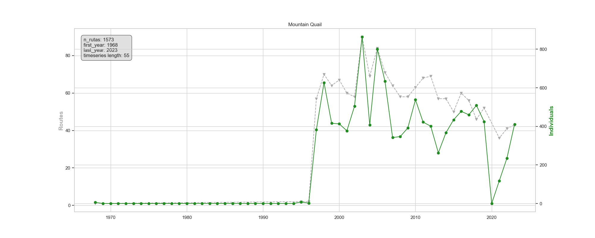{.thumbnail full-src="figs/2920_routes+tts.png"}
  216          2930    2091      1996         2023        27                  Scaled Quail                                          Colin écaillé                                        Galliformes         Odontophoridae      Callipepla                squamata                                       {.thumbnail full-src="https://placehold.co/600x400/cccccc/000000?text=No+Image+Available"}
  217          2940    4637      1968         2023        55                  California Quail                                      Colin de Californie                                  Galliformes         Odontophoridae      Callipepla                californica                                    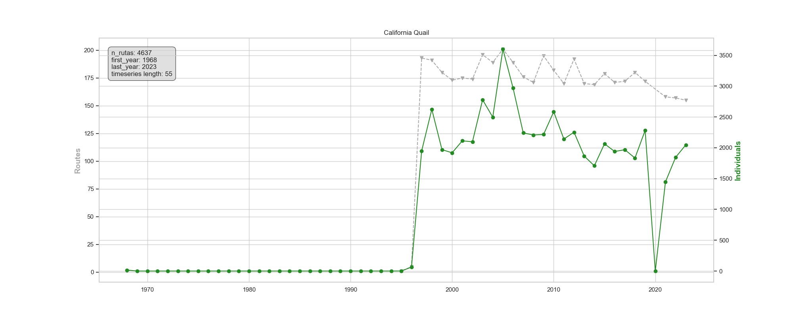{.thumbnail full-src="figs/2940_routes+tts.png"}
  218          2950    2166      1996         2023        27                  Gambel\'s Quail                                       Colin de Gambel                                      Galliformes         Odontophoridae      Callipepla                gambelii                                       {.thumbnail full-src="https://placehold.co/600x400/cccccc/000000?text=No+Image+Available"}
  219          2960    131       1997         2023        26                  Montezuma Quail                                       Colin arlequin                                       Galliformes         Odontophoridae      Cyrtonyx                  montezumae                                     {.thumbnail full-src="https://placehold.co/600x400/cccccc/000000?text=No+Image+Available"}
  220          2970    279       1997         2023        26                  Dusky Grouse                                          Tétras sombre                                        Galliformes         Phasianidae         Dendragapus               obscurus                                       {.thumbnail full-src="https://placehold.co/600x400/cccccc/000000?text=No+Image+Available"}
  221          2971    874       1996         2023        27                  Sooty Grouse                                          Tétras fuligineux                                    Galliformes         Phasianidae         Dendragapus               fuliginosus                                    {.thumbnail full-src="https://placehold.co/600x400/cccccc/000000?text=No+Image+Available"}
  222          2973    43        1998         2022        24                  unid. Dusky Grouse / Sooty Grouse                     unid Tétras sombre / Tétras fuligineux               Galliformes         Phasianidae         Dendragapus               obscurus / fuliginosus                         {.thumbnail full-src="https://placehold.co/600x400/cccccc/000000?text=No+Image+Available"}
  223          2980    189       1997         2023        26                  Spruce Grouse                                         Tétras du Canada                                     Galliformes         Phasianidae         Canachites                canadensis                                     {.thumbnail full-src="https://placehold.co/600x400/cccccc/000000?text=No+Image+Available"}
  224          3000    3927      1993         2023        30                  Ruffed Grouse                                         Gélinotte huppée                                     Galliformes         Phasianidae         Bonasa                    umbellus                                       {.thumbnail full-src="https://placehold.co/600x400/cccccc/000000?text=No+Image+Available"}
  225          3010    442       1997         2023        26                  Willow Ptarmigan                                      Lagopède des saules                                  Galliformes         Phasianidae         Lagopus                   lagopus                                        {.thumbnail full-src="https://placehold.co/600x400/cccccc/000000?text=No+Image+Available"}
  226          3020    114       1997         2023        26                  Rock Ptarmigan                                        Lagopède alpin                                       Galliformes         Phasianidae         Lagopus                   muta                                           {.thumbnail full-src="https://placehold.co/600x400/cccccc/000000?text=No+Image+Available"}
  227          3040    12        1997         2022        25                  White-tailed Ptarmigan                                Lagopède à queue blanche                             Galliformes         Phasianidae         Lagopus                   leucura                                        {.thumbnail full-src="https://placehold.co/600x400/cccccc/000000?text=No+Image+Available"}
  228          3050    464       1997         2023        26                  Greater Prairie-Chicken                               Tétras des prairies                                  Galliformes         Phasianidae         Tympanuchus               cupido                                         {.thumbnail full-src="https://placehold.co/600x400/cccccc/000000?text=No+Image+Available"}
  229          3070    77        1997         2021        24                  Lesser Prairie-Chicken                                Tétras pâle                                          Galliformes         Phasianidae         Tympanuchus               pallidicinctus                                 {.thumbnail full-src="https://placehold.co/600x400/cccccc/000000?text=No+Image+Available"}
  230          3080    1356      1968         2023        55                  Sharp-tailed Grouse                                   Tétras à queue fine                                  Galliformes         Phasianidae         Tympanuchus               phasianellus                                   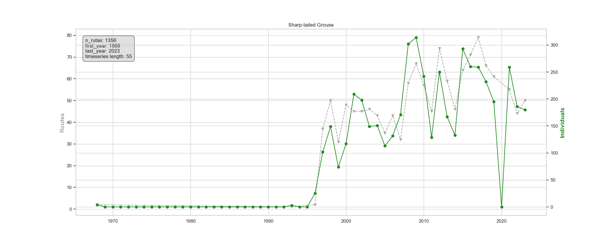{.thumbnail full-src="figs/3080_routes+tts.png"}
  231          3089    26        1997         2023        26                  Gunnison Sage-Grouse                                  Tétras du Gunnison                                   Galliformes         Phasianidae         Centrocercus              minimus                                        {.thumbnail full-src="https://placehold.co/600x400/cccccc/000000?text=No+Image+Available"}
  232          3090    522       1991         2023        32                  Greater Sage-Grouse                                   Tétras des armoises                                  Galliformes         Phasianidae         Centrocercus              urophasianus                                   {.thumbnail full-src="https://placehold.co/600x400/cccccc/000000?text=No+Image+Available"}
  233          3091    14248     1968         2023        55                  Ring-necked Pheasant                                  Faisan de Colchide                                   Galliformes         Phasianidae         Phasianus                 colchicus                                      {.thumbnail full-src="figs/3091_routes+tts.png"}
  234          3095    9         2014         2023        9                   Indian Peafowl                                        Paon bleu                                            Galliformes         Phasianidae         Pavo                      cristatus                                      {.thumbnail full-src="https://placehold.co/600x400/cccccc/000000?text=No+Image+Available"}
  235          3100    17018     1995         2023        28                  Wild Turkey                                           Dindon sauvage                                       Galliformes         Phasianidae         Meleagris                 gallopavo                                      {.thumbnail full-src="https://placehold.co/600x400/cccccc/000000?text=No+Image+Available"}
  236          3110    33        1997         2023        26                  Plain Chachalaca                                      Ortalide chacamel                                    Galliformes         Cracidae            Ortalis                   vetula                                         {.thumbnail full-src="https://placehold.co/600x400/cccccc/000000?text=No+Image+Available"}
  237          3120    2659      1972         2023        51                  Band-tailed Pigeon                                    Pigeon à queue barrée                                Columbiformes       Columbidae          Patagioenas               fasciata                                       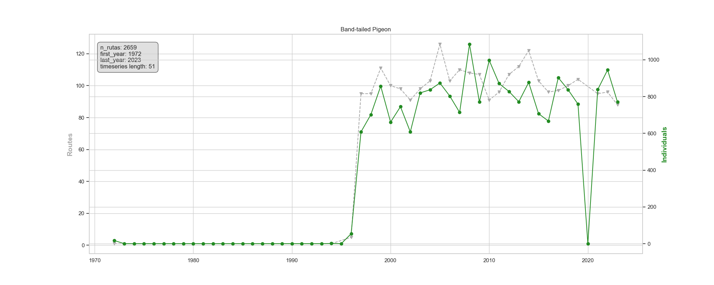{.thumbnail full-src="figs/3120_routes+tts.png"}
  238          3130    3         1997         2021        24                  Red-billed Pigeon                                     Pigeon à bec rouge                                   Columbiformes       Columbidae          Patagioenas               flavirostris                                   {.thumbnail full-src="https://placehold.co/600x400/cccccc/000000?text=No+Image+Available"}
  239          3131    28370     1967         2023        56                  Rock Pigeon                                           Pigeon biset                                         Columbiformes       Columbidae          Columba                   livia                                          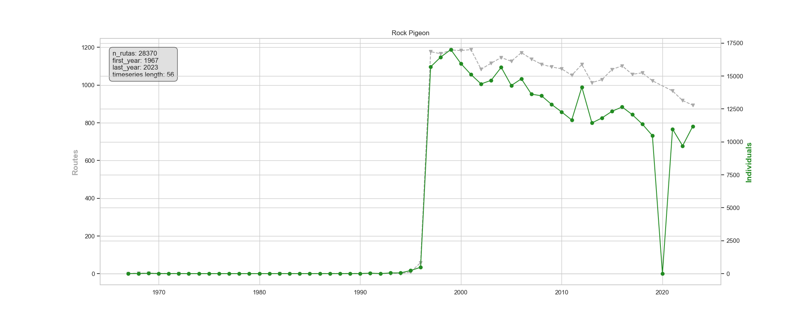{.thumbnail full-src="figs/3131_routes+tts.png"}
  240          3140    56        1998         2023        25                  White-crowned Pigeon                                  Pigeon à couronne blanche                            Columbiformes       Columbidae          Patagioenas               leucocephala                                   {.thumbnail full-src="https://placehold.co/600x400/cccccc/000000?text=No+Image+Available"}
  241          3151    7         2004         2017        13                  Spotted Dove                                          Tourterelle tigrine                                  Columbiformes       Columbidae          Streptopelia              chinensis                                      {.thumbnail full-src="https://placehold.co/600x400/cccccc/000000?text=No+Image+Available"}
  242          3152    6         1999         2011        12                  African Collared-Dove (a.k.a. Ringed Turtle-Dove)     Tourterelle rieuse                                   Columbiformes       Columbidae          Streptopelia              roseogrisea                                    {.thumbnail full-src="https://placehold.co/600x400/cccccc/000000?text=No+Image+Available"}
  243          3160    66263     1967         2023        56                  Mourning Dove                                         Tourterelle triste                                   Columbiformes       Columbidae          Zenaida                   macroura                                       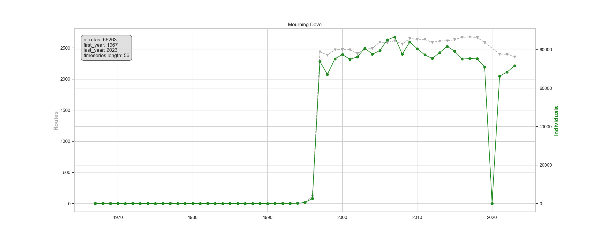{.thumbnail full-src="figs/3160_routes+tts.png"}
  244          3180    195       1996         2023        27                  White-tipped Dove                                     Colombe de Verreaux                                  Columbiformes       Columbidae          Leptotila                 verreauxi                                      {.thumbnail full-src="https://placehold.co/600x400/cccccc/000000?text=No+Image+Available"}
  245          3190    3724      1996         2023        27                  White-winged Dove                                     Tourterelle à ailes blanches                         Columbiformes       Columbidae          Zenaida                   asiatica                                       {.thumbnail full-src="https://placehold.co/600x400/cccccc/000000?text=No+Image+Available"}
  246          3200    3530      1996         2023        27                  Common Ground Dove                                    Colombe à queue noire                                Columbiformes       Columbidae          Columbina                 passerina                                      {.thumbnail full-src="https://placehold.co/600x400/cccccc/000000?text=No+Image+Available"}
  247          3201    3         2003         2021        18                  Ruddy Ground Dove                                     Colombe rousse                                       Columbiformes       Columbidae          Columbina                 talpacoti                                      {.thumbnail full-src="https://placehold.co/600x400/cccccc/000000?text=No+Image+Available"}
  248          3210    1838      1996         2023        27                  Inca Dove                                             Colombe inca                                         Columbiformes       Columbidae          Columbina                 inca                                           {.thumbnail full-src="https://placehold.co/600x400/cccccc/000000?text=No+Image+Available"}
  249          3240    9         1998         2011        13                  California Condor                                     Condor de Californie                                 Cathartiformes      Cathartidae         Gymnogyps                 californianus                                  {.thumbnail full-src="https://placehold.co/600x400/cccccc/000000?text=No+Image+Available"}
  250          3250    35861     1967         2023        56                  Turkey Vulture                                        Urubu à tête rouge                                   Cathartiformes      Cathartidae         Cathartes                 aura                                           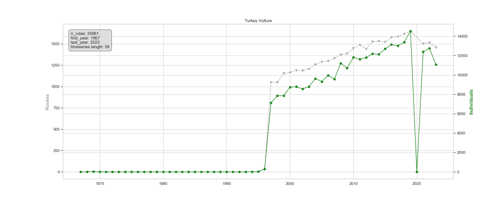{.thumbnail full-src="figs/3250_routes+tts.png"}
  251          3255    30        2000         2023        23                  unid. Black Vulture / Turkey Vulture                  unid Urubu noir / Urubu à tête rouge                 Cathartiformes      Cathartidae         Coragyps / Cathartes      atratus / aura                                 {.thumbnail full-src="https://placehold.co/600x400/cccccc/000000?text=No+Image+Available"}
  252          3260    10799     1969         2023        54                  Black Vulture                                         Urubu noir                                           Cathartiformes      Cathartidae         Coragyps                  atratus                                        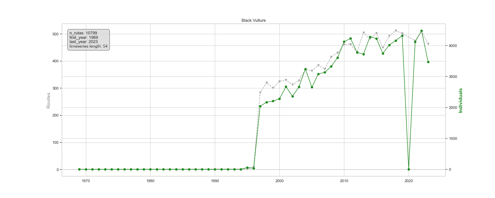{.thumbnail full-src="figs/3260_routes+tts.png"}
  253          3270    1083      1997         2023        26                  Swallow-tailed Kite                                   Naucler à queue fourchue                             Accipitriformes     Accipitridae        Elanoides                 forficatus                                     {.thumbnail full-src="https://placehold.co/600x400/cccccc/000000?text=No+Image+Available"}
  254          3271    1         2009         2009        0                   Hook-billed Kite                                      Bec-en-croc de Temminck                              Accipitriformes     Accipitridae        Chondrohierax             uncinatus                                      {.thumbnail full-src="https://placehold.co/600x400/cccccc/000000?text=No+Image+Available"}
  255          3280    370       1996         2023        27                  White-tailed Kite                                     Élanion à queue blanche                              Accipitriformes     Accipitridae        Elanus                    leucurus                                       {.thumbnail full-src="https://placehold.co/600x400/cccccc/000000?text=No+Image+Available"}
  256          3290    3261      1996         2023        27                  Mississippi Kite                                      Milan du Mississippi                                 Accipitriformes     Accipitridae        Ictinia                   mississippiensis                               {.thumbnail full-src="https://placehold.co/600x400/cccccc/000000?text=No+Image+Available"}
  257          3300    23        1997         2022        25                  Snail Kite                                            Milan des marais                                     Accipitriformes     Accipitridae        Rostrhamus                sociabilis                                     {.thumbnail full-src="https://placehold.co/600x400/cccccc/000000?text=No+Image+Available"}
  258          3310    8439      1982         2023        41                  Northern Harrier                                      Busard des marais                                    Accipitriformes     Accipitridae        Circus                    hudsonius                                      {.thumbnail full-src="https://placehold.co/600x400/cccccc/000000?text=No+Image+Available"}
  259          3320    1825      1991         2023        32                  Sharp-shinned Hawk                                    Épervier brun                                        Accipitriformes     Accipitridae        Accipiter                 striatus                                       {.thumbnail full-src="https://placehold.co/600x400/cccccc/000000?text=No+Image+Available"}
  260          3330    5561      1977         2023        46                  Cooper\'s Hawk                                        Épervier de Cooper                                   Accipitriformes     Accipitridae        Accipiter                 cooperii                                       {.thumbnail full-src="https://placehold.co/600x400/cccccc/000000?text=No+Image+Available"}
  261          3333    155       1977         2023        46                  unid. Accipiter hawk                                  unid épervier sp.                                    Accipitriformes     Accipitridae        Accipiter                 sp.                                            {.thumbnail full-src="https://placehold.co/600x400/cccccc/000000?text=No+Image+Available"}
  262          3340    640       1996         2023        27                  American Goshawk                                      Autour d'Amérique                                    Accipitriformes     Accipitridae        Accipiter                 atricapillus                                   {.thumbnail full-src="https://placehold.co/600x400/cccccc/000000?text=No+Image+Available"}
  263          3350    513       1996         2023        27                  Harris\'s Hawk                                        Buse de Harris                                       Accipitriformes     Accipitridae        Parabuteo                 unicinctus                                     {.thumbnail full-src="https://placehold.co/600x400/cccccc/000000?text=No+Image+Available"}
  264          3370    39233     1968         2023        55                  Red-tailed Hawk                                       Buse à queue rousse                                  Accipitriformes     Accipitridae        Buteo                     jamaicensis                                    {.thumbnail full-src="figs/3370_routes+tts.png"}
  265          3380    104       1997         2023        26                  (Harlan\'s Hawk) Red-tailed Hawk                      Buse à queue rousse (groupe harlani)                 Accipitriformes     Accipitridae        Buteo                     jamaicensis harlani                            {.thumbnail full-src="https://placehold.co/600x400/cccccc/000000?text=No+Image+Available"}
  266          3390    14003     1968         2023        55                  Red-shouldered Hawk                                   Buse à épaulettes                                    Accipitriformes     Accipitridae        Buteo                     lineatus                                       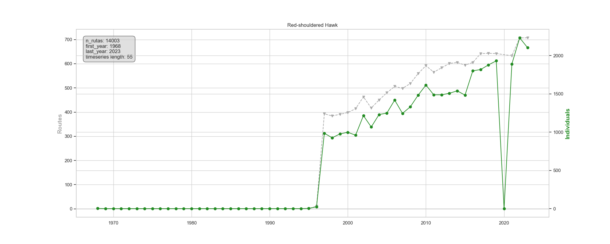{.thumbnail full-src="figs/3390_routes+tts.png"}
  267          3400    137       1997         2023        26                  Zone-tailed Hawk                                      Buse à queue barrée                                  Accipitriformes     Accipitridae        Buteo                     albonotatus                                    {.thumbnail full-src="https://placehold.co/600x400/cccccc/000000?text=No+Image+Available"}
  268          3410    224       1997         2023        26                  White-tailed Hawk                                     Buse à queue blanche                                 Accipitriformes     Accipitridae        Geranoaetus               albicaudatus                                   {.thumbnail full-src="https://placehold.co/600x400/cccccc/000000?text=No+Image+Available"}
  269          3420    8469      1990         2023        33                  Swainson\'s Hawk                                      Buse de Swainson                                     Accipitriformes     Accipitridae        Buteo                     swainsoni                                      {.thumbnail full-src="https://placehold.co/600x400/cccccc/000000?text=No+Image+Available"}
  270          3430    5009      1968         2023        55                  Broad-winged Hawk                                     Petite Buse                                          Accipitriformes     Accipitridae        Buteo                     platypterus                                    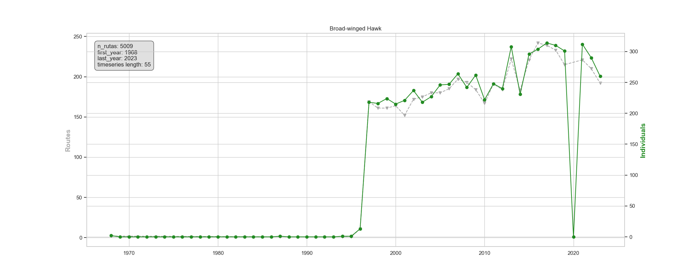{.thumbnail full-src="figs/3430_routes+tts.png"}
  271          3440    12        2003         2021        18                  Short-tailed Hawk                                     Buse à queue courte                                  Accipitriformes     Accipitridae        Buteo                     brachyurus                                     {.thumbnail full-src="https://placehold.co/600x400/cccccc/000000?text=No+Image+Available"}
  272          3450    25        2003         2023        20                  Common Black Hawk                                     Buse noire                                           Accipitriformes     Accipitridae        Buteogallus               anthracinus                                    {.thumbnail full-src="https://placehold.co/600x400/cccccc/000000?text=No+Image+Available"}
  273          3451    327       1997         2023        26                  unid. Buteo hawk                                      unid Buse sp.                                        Accipitriformes     Accipitridae        Buteo                     sp.                                            {.thumbnail full-src="https://placehold.co/600x400/cccccc/000000?text=No+Image+Available"}
  274          3460    163       1997         2023        26                  Gray Hawk                                             Buse grise                                           Accipitriformes     Accipitridae        Buteo                     plagiatus                                      {.thumbnail full-src="https://placehold.co/600x400/cccccc/000000?text=No+Image+Available"}
  275          3470    167       1997         2023        26                  Rough-legged Hawk                                     Buse pattue                                          Accipitriformes     Accipitridae        Buteo                     lagopus                                        {.thumbnail full-src="https://placehold.co/600x400/cccccc/000000?text=No+Image+Available"}
  276          3480    2372      1996         2023        27                  Ferruginous Hawk                                      Buse rouilleuse                                      Accipitriformes     Accipitridae        Buteo                     regalis                                        {.thumbnail full-src="https://placehold.co/600x400/cccccc/000000?text=No+Image+Available"}
  277          3490    2839      1991         2023        32                  Golden Eagle                                          Aigle royal                                          Accipitriformes     Accipitridae        Aquila                    chrysaetos                                     {.thumbnail full-src="https://placehold.co/600x400/cccccc/000000?text=No+Image+Available"}
  278          3520    6105      1991         2023        32                  Bald Eagle                                            Pygargue à tête blanche                              Accipitriformes     Accipitridae        Haliaeetus                leucocephalus                                  {.thumbnail full-src="https://placehold.co/600x400/cccccc/000000?text=No+Image+Available"}
  279          3540    34        1997         2022        25                  Gyrfalcon                                             Faucon gerfaut                                       Falconiformes       Falconidae          Falco                     rusticolus                                     {.thumbnail full-src="https://placehold.co/600x400/cccccc/000000?text=No+Image+Available"}
  280          3550    1587      1992         2023        31                  Prairie Falcon                                        Faucon des prairies                                  Falconiformes       Falconidae          Falco                     mexicanus                                      {.thumbnail full-src="https://placehold.co/600x400/cccccc/000000?text=No+Image+Available"}
  281          3560    536       1997         2023        26                  Peregrine Falcon                                      Faucon pèlerin                                       Falconiformes       Falconidae          Falco                     peregrinus                                     {.thumbnail full-src="https://placehold.co/600x400/cccccc/000000?text=No+Image+Available"}
  282          3570    1811      1993         2023        30                  Merlin                                                Faucon émerillon                                     Falconiformes       Falconidae          Falco                     columbarius                                    {.thumbnail full-src="https://placehold.co/600x400/cccccc/000000?text=No+Image+Available"}
  283          3590    6         2004         2012        8                   Aplomado Falcon                                       Faucon aplomado                                      Falconiformes       Falconidae          Falco                     femoralis                                      {.thumbnail full-src="https://placehold.co/600x400/cccccc/000000?text=No+Image+Available"}
  284          3600    22188     1968         2023        55                  American Kestrel                                      Crécerelle d\'Amérique                               Falconiformes       Falconidae          Falco                     sparverius                                     {.thumbnail full-src="figs/3600_routes+tts.png"}
  285          3620    1342      1996         2023        27                  Crested Caracara                                      Caracara huppé                                       Falconiformes       Falconidae          Caracara                  plancus                                        {.thumbnail full-src="https://placehold.co/600x400/cccccc/000000?text=No+Image+Available"}
  286          3640    6417      1969         2023        54                  Osprey                                                Balbuzard pêcheur                                    Accipitriformes     Pandionidae         Pandion                   haliaetus                                      {.thumbnail full-src="figs/3640_routes+tts.png"}
  287          3650    273       1997         2023        26                  Barn Owl                                              Effraie des clochers                                 Strigiformes        Tytonidae           Tyto                      alba                                           {.thumbnail full-src="https://placehold.co/600x400/cccccc/000000?text=No+Image+Available"}
  288          3660    69        1997         2023        26                  Long-eared Owl                                        Hibou moyen-duc                                      Strigiformes        Strigidae           Asio                      otus                                           {.thumbnail full-src="https://placehold.co/600x400/cccccc/000000?text=No+Image+Available"}
  289          3670    1041      1996         2023        27                  Short-eared Owl                                       Hibou des marais                                     Strigiformes        Strigidae           Asio                      flammeus                                       {.thumbnail full-src="https://placehold.co/600x400/cccccc/000000?text=No+Image+Available"}
  290          3680    5924      1996         2023        27                  Barred Owl                                            Chouette rayée                                       Strigiformes        Strigidae           Strix                     varia                                          {.thumbnail full-src="https://placehold.co/600x400/cccccc/000000?text=No+Image+Available"}
  291          3690    30        1997         2023        26                  Spotted Owl                                           Chouette tachetée                                    Strigiformes        Strigidae           Strix                     occidentalis                                   {.thumbnail full-src="https://placehold.co/600x400/cccccc/000000?text=No+Image+Available"}
  292          3700    152       1996         2023        27                  Great Gray Owl                                        Chouette lapone                                      Strigiformes        Strigidae           Strix                     nebulosa                                       {.thumbnail full-src="https://placehold.co/600x400/cccccc/000000?text=No+Image+Available"}
  293          3710    49        1997         2023        26                  Boreal Owl                                            Nyctale de Tengmalm                                  Strigiformes        Strigidae           Aegolius                  funereus                                       {.thumbnail full-src="https://placehold.co/600x400/cccccc/000000?text=No+Image+Available"}
  294          3720    111       1996         2023        27                  Northern Saw-whet Owl                                 Petite Nyctale                                       Strigiformes        Strigidae           Aegolius                  acadicus                                       {.thumbnail full-src="https://placehold.co/600x400/cccccc/000000?text=No+Image+Available"}
  295          3730    658       1997         2023        26                  Eastern Screech-Owl                                   Petit-duc maculé                                     Strigiformes        Strigidae           Megascops                 asio                                           {.thumbnail full-src="https://placehold.co/600x400/cccccc/000000?text=No+Image+Available"}
  296          3731    2         1998         1998        0                   Whiskered Screech-Owl                                 Petit-duc à moustaches                               Strigiformes        Strigidae           Megascops                 trichopsis                                     {.thumbnail full-src="https://placehold.co/600x400/cccccc/000000?text=No+Image+Available"}
  297          3732    130       1997         2023        26                  Western Screech-Owl                                   Petit-duc des montagnes                              Strigiformes        Strigidae           Megascops                 kennicottii                                    {.thumbnail full-src="https://placehold.co/600x400/cccccc/000000?text=No+Image+Available"}
  298          3740    13        1999         2019        20                  Flammulated Owl                                       Petit-duc nain                                       Strigiformes        Strigidae           Psiloscops                flammeolus                                     {.thumbnail full-src="https://placehold.co/600x400/cccccc/000000?text=No+Image+Available"}
  299          3750    7551      1983         2023        40                  Great Horned Owl                                      Grand-duc d\'Amérique                                Strigiformes        Strigidae           Bubo                      virginianus                                    {.thumbnail full-src="https://placehold.co/600x400/cccccc/000000?text=No+Image+Available"}
  300          3760    4         2011         2022        11                  Snowy Owl                                             Harfang des neiges                                   Strigiformes        Strigidae           Bubo                      scandiacus                                     {.thumbnail full-src="https://placehold.co/600x400/cccccc/000000?text=No+Image+Available"}
  301          3770    154       1982         2023        41                  Northern Hawk Owl                                     Chouette épervière                                   Strigiformes        Strigidae           Surnia                    ulula                                          {.thumbnail full-src="https://placehold.co/600x400/cccccc/000000?text=No+Image+Available"}
  302          3780    2648      1996         2023        27                  Burrowing Owl                                         Chevêche des terriers                                Strigiformes        Strigidae           Athene                    cunicularia                                    {.thumbnail full-src="https://placehold.co/600x400/cccccc/000000?text=No+Image+Available"}
  303          3790    514       1996         2023        27                  Northern Pygmy-Owl                                    Chevêchette naine                                    Strigiformes        Strigidae           Glaucidium                gnoma                                          {.thumbnail full-src="https://placehold.co/600x400/cccccc/000000?text=No+Image+Available"}
  304          3800    4         1998         2014        16                  Ferruginous Pygmy-Owl                                 Chevêchette brune                                    Strigiformes        Strigidae           Glaucidium                brasilianum                                    {.thumbnail full-src="https://placehold.co/600x400/cccccc/000000?text=No+Image+Available"}
  305          3810    45        1997         2023        26                  Elf Owl                                               Chevêchette des saguaros                             Strigiformes        Strigidae           Micrathene                whitneyi                                       {.thumbnail full-src="https://placehold.co/600x400/cccccc/000000?text=No+Image+Available"}
  306          3822    2         1999         2008        9                   Budgerigar                                            Perruche ondulée                                     Psittaciformes      Psittaculidae       Melopsittacus             undulatus                                      {.thumbnail full-src="https://placehold.co/600x400/cccccc/000000?text=No+Image+Available"}
  307          3824    50        1997         2023        26                  Monk Parakeet                                         Conure veuve                                         Psittaciformes      Psittacidae         Myiopsitta                monachus                                       {.thumbnail full-src="https://placehold.co/600x400/cccccc/000000?text=No+Image+Available"}
  308          3826    3         2019         2022        3                   Red-crowned Parrot                                    Amazone à joues vertes                               Psittaciformes      Psittacidae         Amazona                   viridigenalis                                  {.thumbnail full-src="https://placehold.co/600x400/cccccc/000000?text=No+Image+Available"}
  309          3827    1         2010         2010        0                   unid. White-winged / Yellow-chevroned Parakeet        Toui à ailes variées / Toui à ailes jaunes           Psittaciformes      Psittacidae         Brotogeris                versicolurus / chiriri                         {.thumbnail full-src="https://placehold.co/600x400/cccccc/000000?text=No+Image+Available"}
  310          3830    5         1999         2015        16                  Smooth-billed Ani                                     Ani à bec lisse                                      Cuculiformes        Cuculidae           Crotophaga                ani                                            {.thumbnail full-src="https://placehold.co/600x400/cccccc/000000?text=No+Image+Available"}
  311          3840    112       1997         2023        26                  Groove-billed Ani                                     Ani à bec cannelé                                    Cuculiformes        Cuculidae           Crotophaga                sulcirostris                                   {.thumbnail full-src="https://placehold.co/600x400/cccccc/000000?text=No+Image+Available"}
  312          3850    3158      1996         2023        27                  Greater Roadrunner                                    Grand Géocoucou                                      Cuculiformes        Cuculidae           Geococcyx                 californianus                                  {.thumbnail full-src="https://placehold.co/600x400/cccccc/000000?text=No+Image+Available"}
  313          3860    34        1997         2018        21                  Mangrove Cuckoo                                       Coulicou manioc                                      Cuculiformes        Cuculidae           Coccyzus                  minor                                          {.thumbnail full-src="https://placehold.co/600x400/cccccc/000000?text=No+Image+Available"}
  314          3870    25747     1967         2023        56                  Yellow-billed Cuckoo                                  Coulicou à bec jaune                                 Cuculiformes        Cuculidae           Coccyzus                  americanus                                     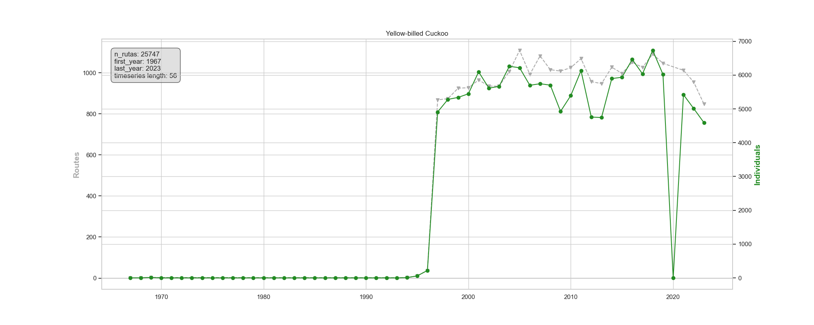{.thumbnail full-src="figs/3870_routes+tts.png"}
  315          3875    65        1999         2023        24                  unid. Yellow-billed Cuckoo / Black-billed Cuckoo      unid Coulicou à bec jaune / Coulicou à bec noir      Cuculiformes        Cuculidae           Coccyzus                  americanus / erythropthalmus                   {.thumbnail full-src="https://placehold.co/600x400/cccccc/000000?text=No+Image+Available"}
  316          3880    5426      1977         2023        46                  Black-billed Cuckoo                                   Coulicou à bec noir                                  Cuculiformes        Cuculidae           Coccyzus                  erythropthalmus                                {.thumbnail full-src="https://placehold.co/600x400/cccccc/000000?text=No+Image+Available"}
  317          3890    30        1998         2023        25                  Elegant Trogon                                        Trogon élégant                                       Trogoniformes       Trogonidae          Trogon                    elegans                                        {.thumbnail full-src="https://placehold.co/600x400/cccccc/000000?text=No+Image+Available"}
  318          3900    12251     1968         2023        55                  Belted Kingfisher                                     Martin-pêcheur d\'Amérique                           Coraciiformes       Alcedinidae         Megaceryle                alcyon                                         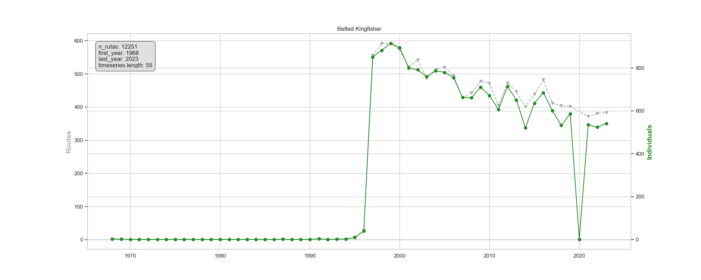{.thumbnail full-src="figs/3900_routes+tts.png"}
  319          3901    5         1998         2022        24                  Ringed Kingfisher                                     Martin-pêcheur à ventre roux                         Coraciiformes       Alcedinidae         Megaceryle                torquata                                       {.thumbnail full-src="https://placehold.co/600x400/cccccc/000000?text=No+Image+Available"}
  320          3910    7         2002         2019        17                  Green Kingfisher                                      Martin-pêcheur vert                                  Coraciiformes       Alcedinidae         Chloroceryle              americana                                      {.thumbnail full-src="https://placehold.co/600x400/cccccc/000000?text=No+Image+Available"}
  321          3920    2099      1977         2023        46                  unid. woodpecker                                      unid Pic sp.                                         Piciformes          Picidae             Woodpecker                sp.                                            {.thumbnail full-src="https://placehold.co/600x400/cccccc/000000?text=No+Image+Available"}
  322          3930    22413     1977         2023        46                  Hairy Woodpecker                                      Pic chevelu                                          Piciformes          Picidae             Dryobates                 villosus                                       {.thumbnail full-src="https://placehold.co/600x400/cccccc/000000?text=No+Image+Available"}
  323          3940    36213     1968         2023        55                  Downy Woodpecker                                      Pic mineur                                           Piciformes          Picidae             Dryobates                 pubescens                                      {.thumbnail full-src="figs/3940_routes+tts.png"}
  324          3950    371       1995         2023        28                  Red-cockaded Woodpecker                               Pic à face blanche                                   Piciformes          Picidae             Dryobates                 borealis                                       {.thumbnail full-src="https://placehold.co/600x400/cccccc/000000?text=No+Image+Available"}
  325          3960    3391      1996         2023        27                  Ladder-backed Woodpecker                              Pic arlequin                                         Piciformes          Picidae             Dryobates                 scalaris                                       {.thumbnail full-src="https://placehold.co/600x400/cccccc/000000?text=No+Image+Available"}
  326          3970    1077      1968         2023        55                  Nuttall\'s Woodpecker                                 Pic de Nuttall                                       Piciformes          Picidae             Dryobates                 nuttallii                                      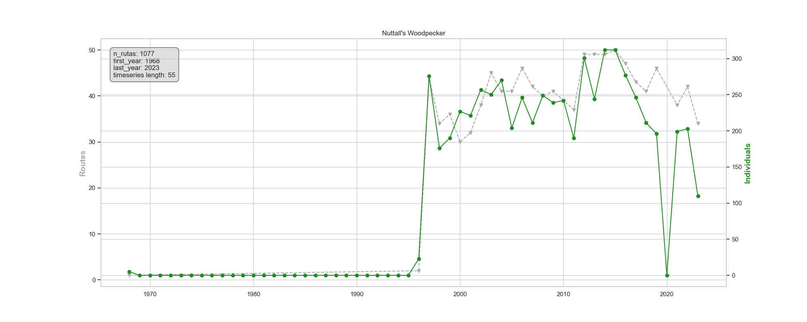{.thumbnail full-src="figs/3970_routes+tts.png"}
  327          3975    96        1997         2023        26                  Arizona Woodpecker                                    Pic d\'Arizona                                       Piciformes          Picidae             Dryobates                 arizonae                                       {.thumbnail full-src="https://placehold.co/600x400/cccccc/000000?text=No+Image+Available"}
  328          3990    797       1996         2023        27                  White-headed Woodpecker                               Pic à tête blanche                                   Piciformes          Picidae             Dryobates                 albolarvatus                                   {.thumbnail full-src="https://placehold.co/600x400/cccccc/000000?text=No+Image+Available"}
  329          4000    712       1987         2023        36                  Black-backed Woodpecker                               Pic à dos noir                                       Piciformes          Picidae             Picoides                  arcticus                                       {.thumbnail full-src="https://placehold.co/600x400/cccccc/000000?text=No+Image+Available"}
  330          4010    1211      1997         2023        26                  American Three-toed Woodpecker                        Pic à dos rayé                                       Piciformes          Picidae             Picoides                  dorsalis                                       {.thumbnail full-src="https://placehold.co/600x400/cccccc/000000?text=No+Image+Available"}
  331          4020    10264     1977         2023        46                  Yellow-bellied Sapsucker                              Pic maculé                                           Piciformes          Picidae             Sphyrapicus               varius                                         {.thumbnail full-src="https://placehold.co/600x400/cccccc/000000?text=No+Image+Available"}
  332          4021    3611      1991         2023        32                  Red-naped Sapsucker                                   Pic à nuque rouge                                    Piciformes          Picidae             Sphyrapicus               nuchalis                                       {.thumbnail full-src="https://placehold.co/600x400/cccccc/000000?text=No+Image+Available"}
  333          4022    324       1996         2023        27                  unid. sapsucker                                       unid Sphyrapicus sp.                                 Piciformes          Picidae             Sphyrapicus               sp.                                            {.thumbnail full-src="https://placehold.co/600x400/cccccc/000000?text=No+Image+Available"}
  334          4030    2679      1996         2023        27                  Red-breasted Sapsucker                                Pic à poitrine rouge                                 Piciformes          Picidae             Sphyrapicus               ruber                                          {.thumbnail full-src="https://placehold.co/600x400/cccccc/000000?text=No+Image+Available"}
  335          4040    1220      1996         2023        27                  Williamson\'s Sapsucker                               Pic de Williamson                                    Piciformes          Picidae             Sphyrapicus               thyroideus                                     {.thumbnail full-src="https://placehold.co/600x400/cccccc/000000?text=No+Image+Available"}
  336          4050    26789     1968         2023        55                  Pileated Woodpecker                                   Grand Pic                                            Piciformes          Picidae             Dryocopus                 pileatus                                       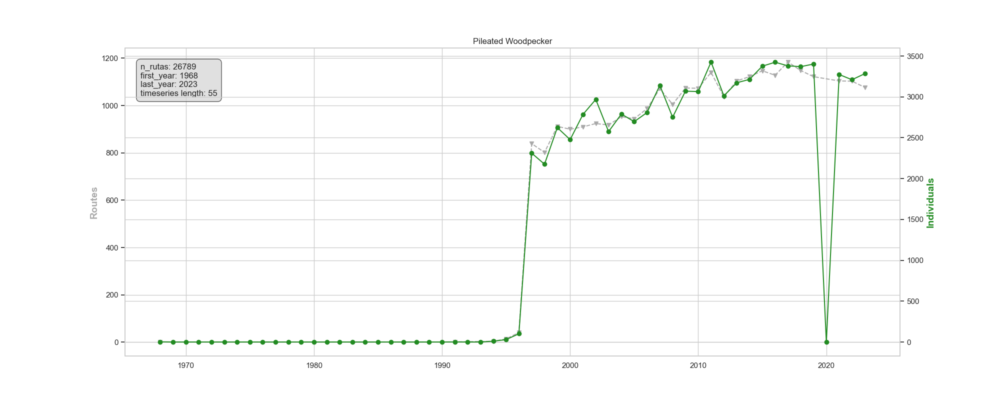{.thumbnail full-src="figs/4050_routes+tts.png"}
  337          4060    15322     1995         2023        28                  Red-headed Woodpecker                                 Pic à tête rouge                                     Piciformes          Picidae             Melanerpes                erythrocephalus                                {.thumbnail full-src="https://placehold.co/600x400/cccccc/000000?text=No+Image+Available"}
  338          4070    2346      1968         2023        55                  Acorn Woodpecker                                      Pic glandivore                                       Piciformes          Picidae             Melanerpes                formicivorus                                   {.thumbnail full-src="figs/4070_routes+tts.png"}
  339          4080    732       1997         2023        26                  Lewis\'s Woodpecker                                   Pic de Lewis                                         Piciformes          Picidae             Melanerpes                lewis                                          {.thumbnail full-src="https://placehold.co/600x400/cccccc/000000?text=No+Image+Available"}
  340          4090    32772     1968         2023        55                  Red-bellied Woodpecker                                Pic à ventre roux                                    Piciformes          Picidae             Melanerpes                carolinus                                      {.thumbnail full-src="figs/4090_routes+tts.png"}
  341          4100    1274      1996         2023        27                  Golden-fronted Woodpecker                             Pic à front doré                                     Piciformes          Picidae             Melanerpes                aurifrons                                      {.thumbnail full-src="https://placehold.co/600x400/cccccc/000000?text=No+Image+Available"}
  342          4110    873       1997         2023        26                  Gila Woodpecker                                       Pic des saguaros                                     Piciformes          Picidae             Melanerpes                uropygialis                                    {.thumbnail full-src="https://placehold.co/600x400/cccccc/000000?text=No+Image+Available"}
  343          4120    31952     1968         2023        55                  (Yellow-shafted Flicker) Northern Flicker             Pic flamboyant (groupe auratus)                      Piciformes          Picidae             Colaptes                  auratus auratus                                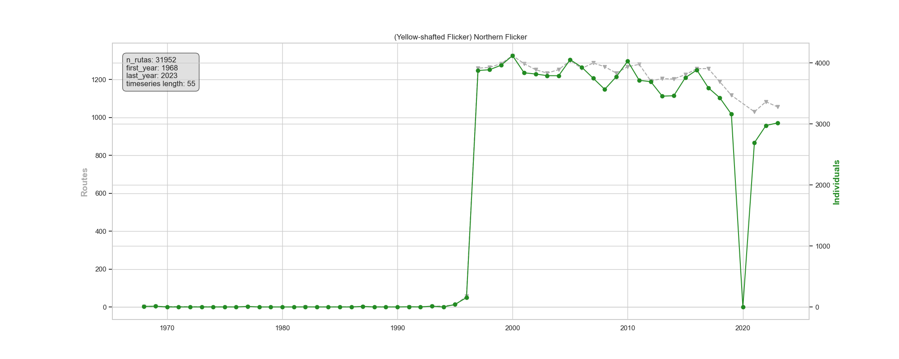{.thumbnail full-src="figs/4120_routes+tts.png"}
  344          4123    1231      1997         2023        26                  (unid. Red / Yellow Shafted) Northern Flicker         Pic flamboyant (groupe non identifié)                Piciformes          Picidae             Colaptes                  auratus                                        {.thumbnail full-src="https://placehold.co/600x400/cccccc/000000?text=No+Image+Available"}
  345          4125    20        2004         2023        19                  hybrid Northern Flicker (Red x Yellow-shafted)        hybride Pic flamboyant (cafer x auratus)             Piciformes          Picidae             Colaptes                  auratus auratus x auratus cafer                {.thumbnail full-src="https://placehold.co/600x400/cccccc/000000?text=No+Image+Available"}
  346          4130    14130     1968         2023        55                  (Red-shafted Flicker) Northern Flicker                Pic flamboyant (groupe cafer)                        Piciformes          Picidae             Colaptes                  auratus cafer                                  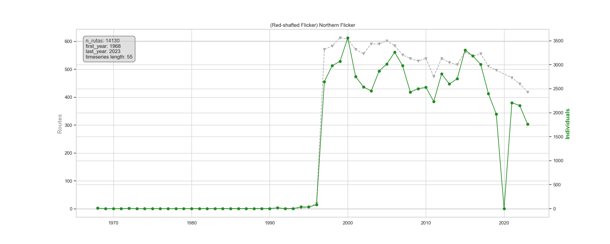{.thumbnail full-src="figs/4130_routes+tts.png"}
  347          4140    577       1997         2023        26                  Gilded Flicker                                        Pic chrysoïde                                        Piciformes          Picidae             Colaptes                  chrysoides                                     {.thumbnail full-src="https://placehold.co/600x400/cccccc/000000?text=No+Image+Available"}
  348          4160    6437      1969         2023        54                  Chuck-will\'s-widow                                   Engoulevent de Caroline                              Caprimulgiformes    Caprimulgidae       Antrostomus               carolinensis                                   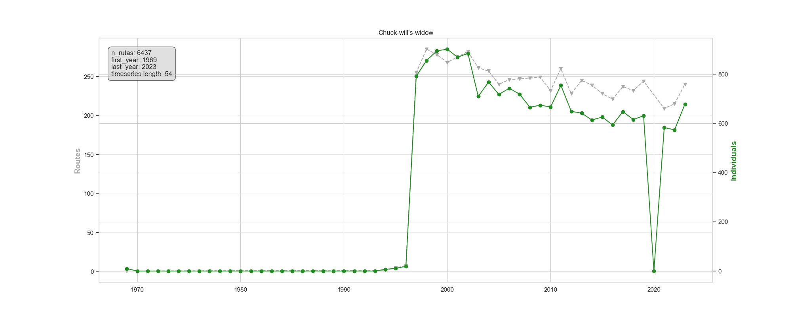{.thumbnail full-src="figs/4160_routes+tts.png"}
  349          4171    2632      1969         2023        54                  Eastern Whip-poor-will                                Engoulevent bois-pourri                              Caprimulgiformes    Caprimulgidae       Antrostomus               vociferus                                      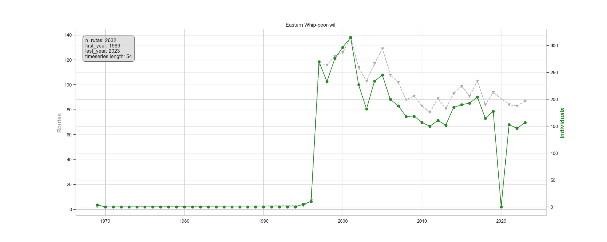{.thumbnail full-src="figs/4171_routes+tts.png"}
  350          4172    48        1997         2023        26                  Mexican Whip-poor-will                                Engoulevent d\'Arizona                               Caprimulgiformes    Caprimulgidae       Antrostomus               arizonae                                       {.thumbnail full-src="https://placehold.co/600x400/cccccc/000000?text=No+Image+Available"}
  351          4180    1174      1996         2023        27                  Common Poorwill                                       Engoulevent de Nuttall                               Caprimulgiformes    Caprimulgidae       Phalaenoptilus            nuttallii                                      {.thumbnail full-src="https://placehold.co/600x400/cccccc/000000?text=No+Image+Available"}
  352          4190    136       1997         2023        26                  Common Pauraque                                       Engoulevent pauraqué                                 Caprimulgiformes    Caprimulgidae       Nyctidromus               albicollis                                     {.thumbnail full-src="https://placehold.co/600x400/cccccc/000000?text=No+Image+Available"}
  353          4200    16580     1967         2023        56                  Common Nighthawk                                      Engoulevent d\'Amérique                              Caprimulgiformes    Caprimulgidae       Chordeiles                minor                                          {.thumbnail full-src="figs/4200_routes+tts.png"}
  354          4205    22        1997         2023        26                  unid. Lesser Nighthawk / Common Nighthawk             unid Engoulevent minime / Engoulevent d\'Amérique    Caprimulgiformes    Caprimulgidae       Chordeiles                acutipennis / minor                            {.thumbnail full-src="https://placehold.co/600x400/cccccc/000000?text=No+Image+Available"}
  355          4206    1         2004         2004        0                   unid. Common Nighthawk / Antillean Nighthawk          unid Engoulevent d\'Amérique / piramidig             Caprimulgiformes    Caprimulgidae       Chordeiles                minor / gundlachii                             {.thumbnail full-src="https://placehold.co/600x400/cccccc/000000?text=No+Image+Available"}
  356          4210    1680      1996         2023        27                  Lesser Nighthawk                                      Engoulevent minime                                   Caprimulgiformes    Caprimulgidae       Chordeiles                acutipennis                                    {.thumbnail full-src="https://placehold.co/600x400/cccccc/000000?text=No+Image+Available"}
  357          4220    236       1991         2023        32                  Black Swift                                           Martinet sombre                                      Apodiformes         Apodidae            Cypseloides               niger                                          {.thumbnail full-src="https://placehold.co/600x400/cccccc/000000?text=No+Image+Available"}
  358          4230    29397     1968         2023        55                  Chimney Swift                                         Martinet ramoneur                                    Apodiformes         Apodidae            Chaetura                  pelagica                                       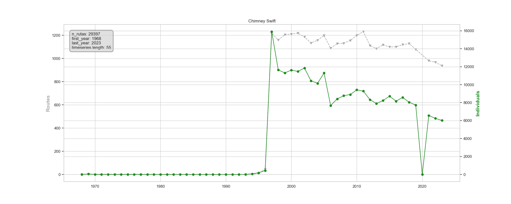{.thumbnail full-src="figs/4230_routes+tts.png"}
  359          4240    1268      1972         2023        51                  Vaux\'s Swift                                         Martinet de Vaux                                     Apodiformes         Apodidae            Chaetura                  vauxi                                          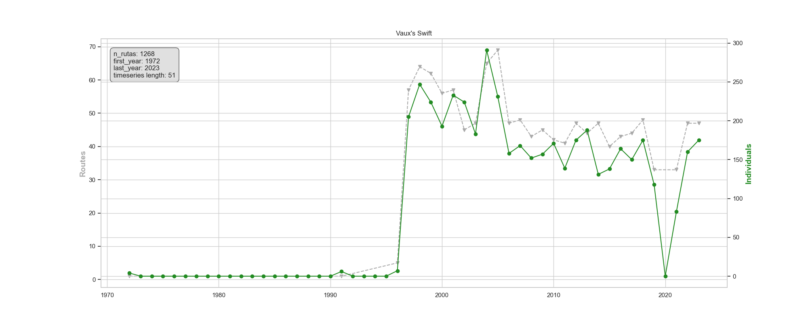{.thumbnail full-src="figs/4240_routes+tts.png"}
  360          4250    2013      1995         2023        28                  White-throated Swift                                  Martinet à gorge blanche                             Apodiformes         Apodidae            Aeronautes                saxatalis                                      {.thumbnail full-src="https://placehold.co/600x400/cccccc/000000?text=No+Image+Available"}
  361          4260    21        1997         2023        26                  Rivoli\'s Hummingbird                                 Colibri de Rivoli                                    Apodiformes         Trochilidae         Eugenes                   fulgens                                        {.thumbnail full-src="https://placehold.co/600x400/cccccc/000000?text=No+Image+Available"}
  362          4270    38        1997         2023        26                  Blue-throated Mountain-gem                            Colibri à gorge bleue                                Apodiformes         Trochilidae         Lampornis                 clemenciae                                     {.thumbnail full-src="https://placehold.co/600x400/cccccc/000000?text=No+Image+Available"}
  363          4280    16272     1969         2023        54                  Ruby-throated Hummingbird                             Colibri à gorge rubis                                Apodiformes         Trochilidae         Archilochus               colubris                                       {.thumbnail full-src="figs/4280_routes+tts.png"}
  364          4290    2492      1996         2023        27                  Black-chinned Hummingbird                             Colibri à gorge noire                                Apodiformes         Trochilidae         Archilochus               alexandri                                      {.thumbnail full-src="https://placehold.co/600x400/cccccc/000000?text=No+Image+Available"}
  365          4295    3         2012         2018        6                   unid. Ruby-throated / Black-chinned Hummingbird       unid Colibri à gorge rubis / Colibri à gorge noire   Apodiformes         Trochilidae         Archilochus               colubris / alexandri                           {.thumbnail full-src="https://placehold.co/600x400/cccccc/000000?text=No+Image+Available"}
  366          4300    475       1997         2023        26                  Costa\'s Hummingbird                                  Colibri de Costa                                     Apodiformes         Trochilidae         Calypte                   costae                                         {.thumbnail full-src="https://placehold.co/600x400/cccccc/000000?text=No+Image+Available"}
  367          4310    1963      1991         2023        32                  Anna\'s Hummingbird                                   Colibri d\'Anna                                      Apodiformes         Trochilidae         Calypte                   anna                                           {.thumbnail full-src="https://placehold.co/600x400/cccccc/000000?text=No+Image+Available"}
  368          4320    3242      1997         2023        26                  Broad-tailed Hummingbird                              Colibri à queue large                                Apodiformes         Trochilidae         Selasphorus               platycercus                                    {.thumbnail full-src="https://placehold.co/600x400/cccccc/000000?text=No+Image+Available"}
  369          4330    3004      1972         2023        51                  Rufous Hummingbird                                    Colibri roux                                         Apodiformes         Trochilidae         Selasphorus               rufus                                          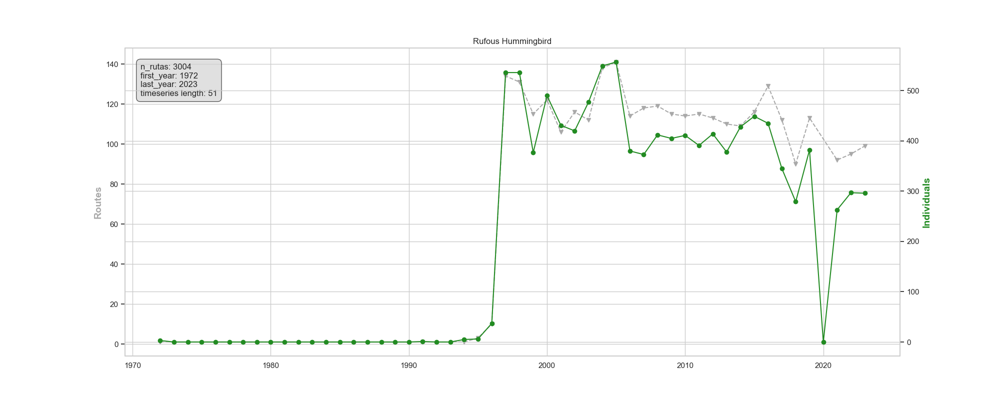{.thumbnail full-src="figs/4330_routes+tts.png"}
  370          4335    19        2010         2022        12                  unid. Rufous Hummingbird / Allen\'s Hummingbird       unid Colibri roux / Colibri d\'Allen                 Apodiformes         Trochilidae         Selasphorus               rufus / sasin                                  {.thumbnail full-src="https://placehold.co/600x400/cccccc/000000?text=No+Image+Available"}
  371          4340    316       1968         2023        55                  Allen\'s Hummingbird                                  Colibri d\'Allen                                     Apodiformes         Trochilidae         Selasphorus               sasin                                          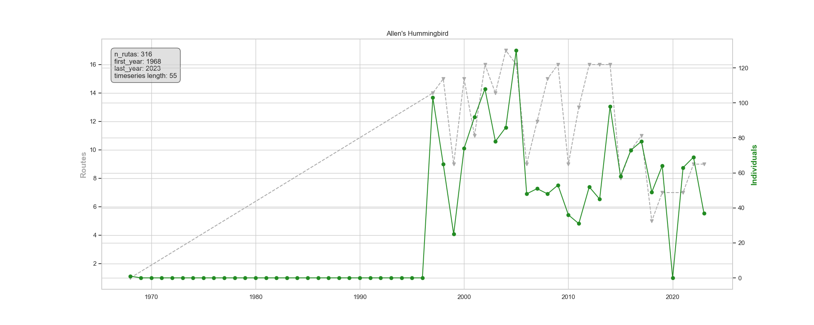{.thumbnail full-src="figs/4340_routes+tts.png"}
  372          4360    1101      1991         2023        32                  Calliope Hummingbird                                  Colibri calliope                                     Apodiformes         Trochilidae         Selasphorus               calliope                                       {.thumbnail full-src="https://placehold.co/600x400/cccccc/000000?text=No+Image+Available"}
  373          4370    3         2006         2018        12                  Lucifer Hummingbird                                   Colibri lucifer                                      Apodiformes         Trochilidae         Calothorax                lucifer                                        {.thumbnail full-src="https://placehold.co/600x400/cccccc/000000?text=No+Image+Available"}
  374          4390    25        1997         2023        26                  Buff-bellied Hummingbird                              Ariane du Yucatan                                    Apodiformes         Trochilidae         Amazilia                  yucatanensis                                   {.thumbnail full-src="https://placehold.co/600x400/cccccc/000000?text=No+Image+Available"}
  375          4391    8         2004         2013        9                   Violet-crowned Hummingbird                            Ariane à couronne violette                           Apodiformes         Trochilidae         Ramosomyia                violiceps                                      {.thumbnail full-src="https://placehold.co/600x400/cccccc/000000?text=No+Image+Available"}
  376          4402    1129      1996         2023        27                  unid. hummingbird                                     unid Colibri sp.                                     Apodiformes         Trochilidae         Trochilid                 sp.                                            {.thumbnail full-src="https://placehold.co/600x400/cccccc/000000?text=No+Image+Available"}
  377          4410    105       1997         2023        26                  Broad-billed Hummingbird                              Colibri circé                                        Apodiformes         Trochilidae         Cynanthus                 latirostris                                    {.thumbnail full-src="https://placehold.co/600x400/cccccc/000000?text=No+Image+Available"}
  378          4411    2         2019         2019        0                   Rose-throated Becard                                  Bécarde à gorge rose                                 Passeriformes       Tityridae           Pachyramphus              aglaiae                                        {.thumbnail full-src="https://placehold.co/600x400/cccccc/000000?text=No+Image+Available"}
  379          4430    5304      1967         2023        56                  Scissor-tailed Flycatcher                             Tyran à longue queue                                 Passeriformes       Tyrannidae          Tyrannus                  forficatus                                     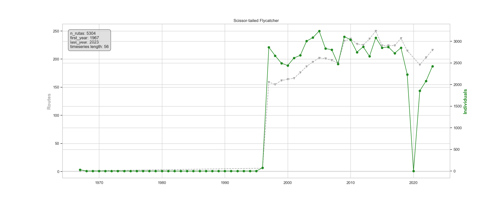{.thumbnail full-src="figs/4430_routes+tts.png"}
  380          4440    38610     1968         2023        55                  Eastern Kingbird                                      Tyran tritri                                         Passeriformes       Tyrannidae          Tyrannus                  tyrannus                                       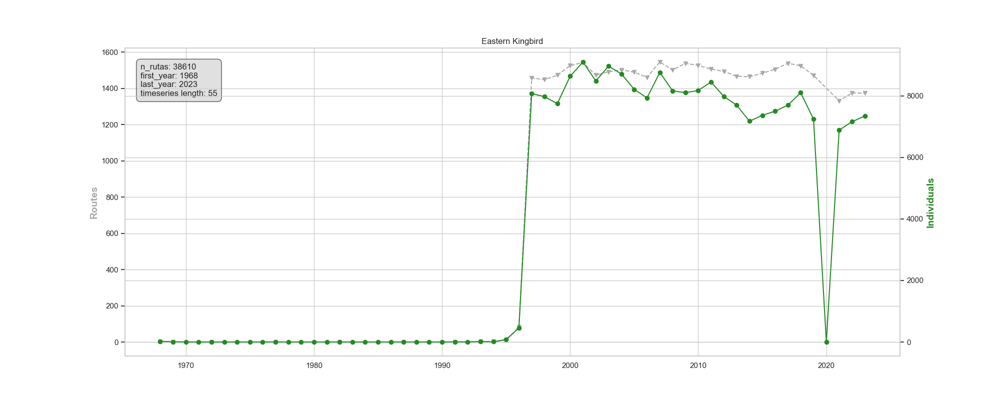{.thumbnail full-src="figs/4440_routes+tts.png"}
  381          4447    73        1998         2023        25                  unid. Cassin\'s Kingbird / Western Kingbird           unid Tyran de Cassin / Tyran de l\'Ouest             Passeriformes       Tyrannidae          Tyrannus                  vociferans / verticalis                        {.thumbnail full-src="https://placehold.co/600x400/cccccc/000000?text=No+Image+Available"}
  382          4450    117       1997         2023        26                  Gray Kingbird                                         Tyran gris                                           Passeriformes       Tyrannidae          Tyrannus                  dominicensis                                   {.thumbnail full-src="https://placehold.co/600x400/cccccc/000000?text=No+Image+Available"}
  383          4451    46        1997         2023        26                  Thick-billed Kingbird                                 Tyran à bec épais                                    Passeriformes       Tyrannidae          Tyrannus                  crassirostris                                  {.thumbnail full-src="https://placehold.co/600x400/cccccc/000000?text=No+Image+Available"}
  384          4460    22        1999         2023        24                  Tropical Kingbird                                     Tyran mélancolique                                   Passeriformes       Tyrannidae          Tyrannus                  melancholicus                                  {.thumbnail full-src="https://placehold.co/600x400/cccccc/000000?text=No+Image+Available"}
  385          4461    451       1996         2023        27                  Couch\'s Kingbird                                     Tyran de Couch                                       Passeriformes       Tyrannidae          Tyrannus                  couchii                                        {.thumbnail full-src="https://placehold.co/600x400/cccccc/000000?text=No+Image+Available"}
  386          4462    7         2000         2023        23                  unid. Tropical Kingbird / Couch\'s Kingbird           unid Tyran mélancolique / Tyran de Couch             Passeriformes       Tyrannidae          Tyrannus                  melancholicus / couchii                        {.thumbnail full-src="https://placehold.co/600x400/cccccc/000000?text=No+Image+Available"}
  387          4470    16841     1968         2023        55                  Western Kingbird                                      Tyran de l\'Ouest                                    Passeriformes       Tyrannidae          Tyrannus                  verticalis                                     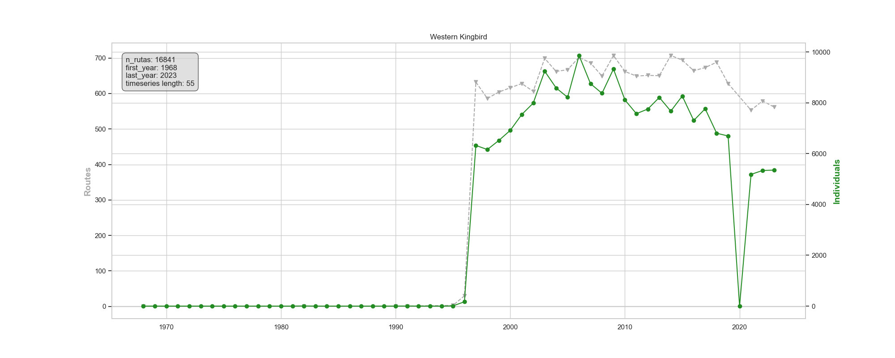{.thumbnail full-src="figs/4470_routes+tts.png"}
  388          4480    2556      1996         2023        27                  Cassin\'s Kingbird                                    Tyran de Cassin                                      Passeriformes       Tyrannidae          Tyrannus                  vociferans                                     {.thumbnail full-src="https://placehold.co/600x400/cccccc/000000?text=No+Image+Available"}
  389          4490    306       1996         2023        27                  Great Kiskadee                                        Tyran quiquivi                                       Passeriformes       Tyrannidae          Pitangus                  sulphuratus                                    {.thumbnail full-src="https://placehold.co/600x400/cccccc/000000?text=No+Image+Available"}
  390          4510    71        1997         2023        26                  Sulphur-bellied Flycatcher                            Tyran tigré                                          Passeriformes       Tyrannidae          Myiodynastes              luteiventris                                   {.thumbnail full-src="https://placehold.co/600x400/cccccc/000000?text=No+Image+Available"}
  391          4520    34079     1968         2023        55                  Great Crested Flycatcher                              Tyran huppé                                          Passeriformes       Tyrannidae          Myiarchus                 crinitus                                       {.thumbnail full-src="figs/4520_routes+tts.png"}
  392          4530    1233      1996         2023        27                  Brown-crested Flycatcher                              Tyran de Wied                                        Passeriformes       Tyrannidae          Myiarchus                 tyrannulus                                     {.thumbnail full-src="https://placehold.co/600x400/cccccc/000000?text=No+Image+Available"}
  393          4540    8602      1968         2023        55                  Ash-throated Flycatcher                               Tyran à gorge cendrée                                Passeriformes       Tyrannidae          Myiarchus                 cinerascens                                    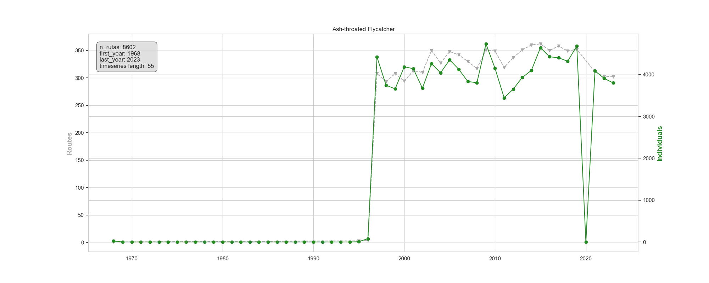{.thumbnail full-src="figs/4540_routes+tts.png"}
  394          4550    212       1997         2023        26                  Dusky-capped Flycatcher                               Tyran olivâtre                                       Passeriformes       Tyrannidae          Myiarchus                 tuberculifer                                   {.thumbnail full-src="https://placehold.co/600x400/cccccc/000000?text=No+Image+Available"}
  395          4560    31396     1968         2023        55                  Eastern Phoebe                                        Moucherolle phébi                                    Passeriformes       Tyrannidae          Sayornis                  phoebe                                         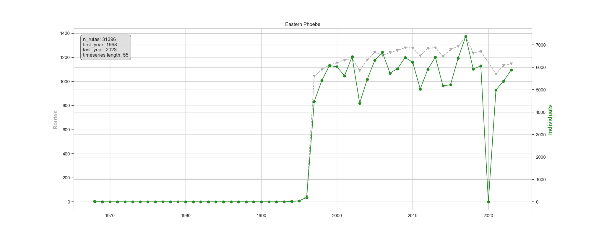{.thumbnail full-src="figs/4560_routes+tts.png"}
  396          4570    8747      1995         2023        28                  Say\'s Phoebe                                         Moucherolle à ventre roux                            Passeriformes       Tyrannidae          Sayornis                  saya                                           {.thumbnail full-src="https://placehold.co/600x400/cccccc/000000?text=No+Image+Available"}
  397          4580    2022      1968         2023        55                  Black Phoebe                                          Moucherolle noir                                     Passeriformes       Tyrannidae          Sayornis                  nigricans                                      {.thumbnail full-src="figs/4580_routes+tts.png"}
  398          4590    8831      1968         2023        55                  Olive-sided Flycatcher                                Moucherolle à côtés olive                            Passeriformes       Tyrannidae          Contopus                  cooperi                                        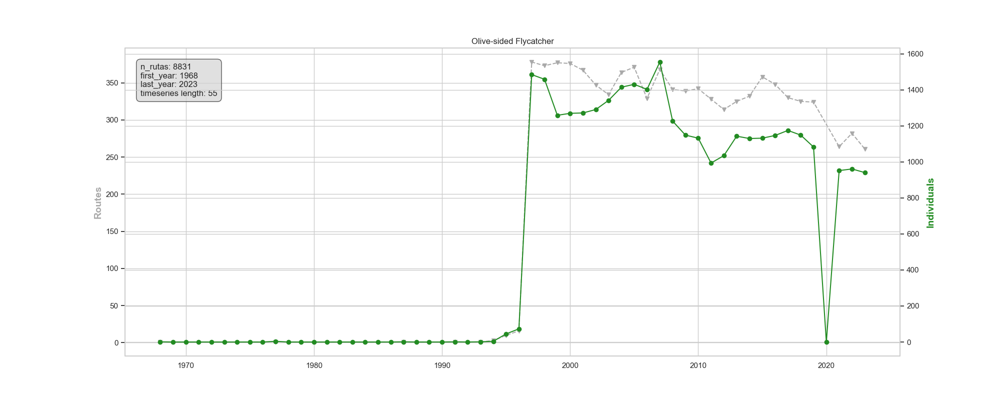{.thumbnail full-src="figs/4590_routes+tts.png"}
  399          4600    78        1997         2023        26                  Greater Pewee                                         Moucherolle de Coues                                 Passeriformes       Tyrannidae          Contopus                  pertinax                                       {.thumbnail full-src="https://placehold.co/600x400/cccccc/000000?text=No+Image+Available"}
  400          4610    31667     1968         2023        55                  Eastern Wood-Pewee                                    Pioui de l\'Est                                      Passeriformes       Tyrannidae          Contopus                  virens                                         {.thumbnail full-src="figs/4610_routes+tts.png"}
  401          4620    14377     1968         2023        55                  Western Wood-Pewee                                    Pioui de l\'Ouest                                    Passeriformes       Tyrannidae          Contopus                  sordidulus                                     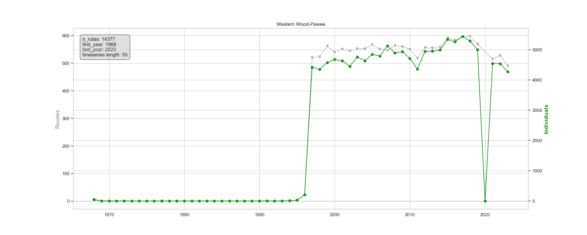{.thumbnail full-src="figs/4620_routes+tts.png"}
  402          4630    2628      1977         2023        46                  Yellow-bellied Flycatcher                             Moucherolle à ventre jaune                           Passeriformes       Tyrannidae          Empidonax                 flaviventris                                   {.thumbnail full-src="https://placehold.co/600x400/cccccc/000000?text=No+Image+Available"}
  403          4640    2534      1996         2023        27                  (Cordilleran Flycatcher) Western Flycatcher           Moucherolle obscur (groupe occidentalis)             Passeriformes       Tyrannidae          Empidonax                 difficilis occidentalis                        {.thumbnail full-src="https://placehold.co/600x400/cccccc/000000?text=No+Image+Available"}
  404          4641    4153      1968         2023        55                  (Pacific-slope Flycatcher) Western Flycatcher         Moucherolle obscur (groupe difficilis)               Passeriformes       Tyrannidae          Empidonax                 difficilis difficilis                          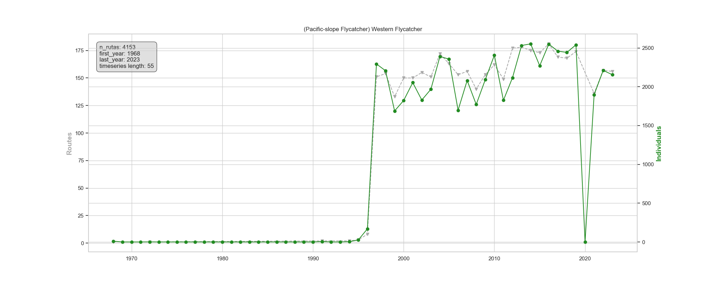{.thumbnail full-src="figs/4641_routes+tts.png"}
  405          4642    231       1996         2023        27                  (unid. Cordilleran / Pac-slope) Western Flycatcher    Moucherolle obscur (groupe non identifié)            Passeriformes       Tyrannidae          Empidonax                 difficilis                                     {.thumbnail full-src="https://placehold.co/600x400/cccccc/000000?text=No+Image+Available"}
  406          4650    14728     1968         2023        55                  Acadian Flycatcher                                    Moucherolle vert                                     Passeriformes       Tyrannidae          Empidonax                 virescens                                      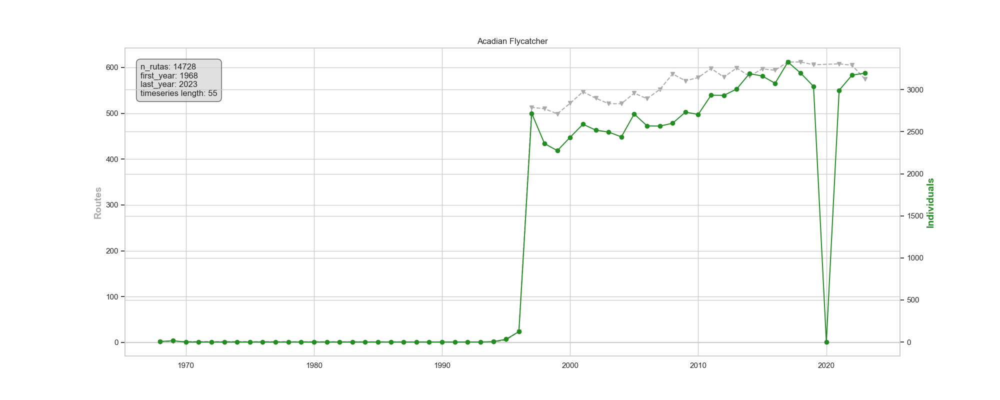{.thumbnail full-src="figs/4650_routes+tts.png"}
  407          4660    13360     1991         2023        32                  Willow Flycatcher                                     Moucherolle des saules                               Passeriformes       Tyrannidae          Empidonax                 traillii                                       {.thumbnail full-src="https://placehold.co/600x400/cccccc/000000?text=No+Image+Available"}
  408          4661    14358     1968         2023        55                  Alder Flycatcher                                      Moucherolle des aulnes                               Passeriformes       Tyrannidae          Empidonax                 alnorum                                        {.thumbnail full-src="figs/4661_routes+tts.png"}
  409          4665    32        1972         2022        50                  unid. Alder Flycatcher / Willow Flycatcher            unid Moucherolle des aulnes / des saules             Passeriformes       Tyrannidae          Empidonax                 alnorum / traillii                             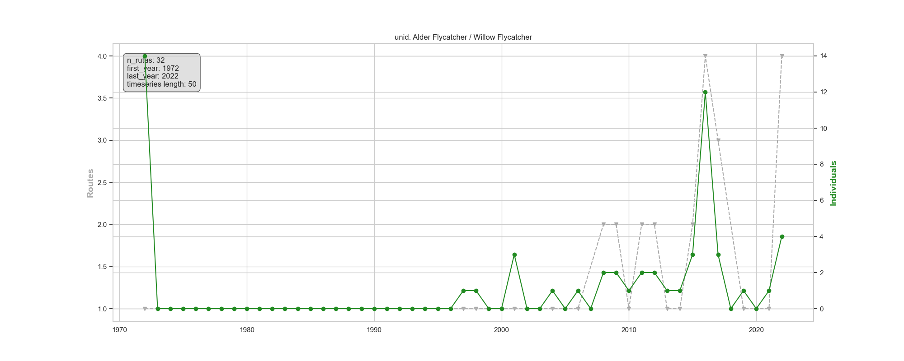{.thumbnail full-src="figs/4665_routes+tts.png"}
  410          4670    15683     1968         2023        55                  Least Flycatcher                                      Moucherolle tchébec                                  Passeriformes       Tyrannidae          Empidonax                 minimus                                        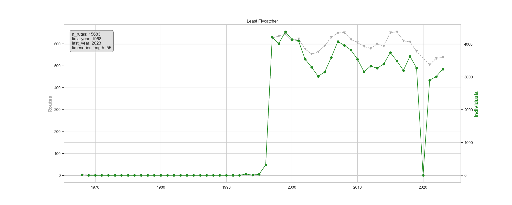{.thumbnail full-src="figs/4670_routes+tts.png"}
  411          4679    730       1997         2023        26                  unid. Empidonax flycatcher                            unid Empidonax sp.                                   Passeriformes       Tyrannidae          Empidonax                 sp.                                            {.thumbnail full-src="https://placehold.co/600x400/cccccc/000000?text=No+Image+Available"}
  412          4680    5997      1991         2023        32                  Hammond\'s Flycatcher                                 Moucherolle de Hammond                               Passeriformes       Tyrannidae          Empidonax                 hammondii                                      {.thumbnail full-src="https://placehold.co/600x400/cccccc/000000?text=No+Image+Available"}
  413          4689    231       1997         2023        26                  unid. Hammond\'s Flycatcher / Dusky Flycatcher        unid Moucherolle Hammond\'s / Moucherolle Dusky      Passeriformes       Tyrannidae          Empidonax                 hammondii / oberholseri                        {.thumbnail full-src="https://placehold.co/600x400/cccccc/000000?text=No+Image+Available"}
  414          4690    6490      1991         2023        32                  Dusky Flycatcher                                      Moucherolle sombre                                   Passeriformes       Tyrannidae          Empidonax                 oberholseri                                    {.thumbnail full-src="https://placehold.co/600x400/cccccc/000000?text=No+Image+Available"}
  415          4691    2475      1995         2023        28                  Gray Flycatcher                                       Moucherolle gris                                     Passeriformes       Tyrannidae          Empidonax                 wrightii                                       {.thumbnail full-src="https://placehold.co/600x400/cccccc/000000?text=No+Image+Available"}
  416          4700    2         1997         1997        0                   Buff-breasted Flycatcher                              Moucherolle beige                                    Passeriformes       Tyrannidae          Empidonax                 fulvifrons                                     {.thumbnail full-src="https://placehold.co/600x400/cccccc/000000?text=No+Image+Available"}
  417          4710    977       1997         2023        26                  Vermilion Flycatcher                                  Moucherolle vermillon                                Passeriformes       Tyrannidae          Pyrocephalus              rubinus                                        {.thumbnail full-src="https://placehold.co/600x400/cccccc/000000?text=No+Image+Available"}
  418          4720    123       1997         2023        26                  Northern Beardless-Tyrannulet                         Tyranneau imberbe                                    Passeriformes       Tyrannidae          Camptostoma               imberbe                                        {.thumbnail full-src="https://placehold.co/600x400/cccccc/000000?text=No+Image+Available"}
  419          4730    1         2002         2002        0                   Eurasian Skylark                                      Alouette des champs                                  Passeriformes       Alaudidae           Alauda                    arvensis                                       {.thumbnail full-src="https://placehold.co/600x400/cccccc/000000?text=No+Image+Available"}
  420          4740    26680     1967         2023        56                  Horned Lark                                           Alouette hausse-col                                  Passeriformes       Alaudidae           Eremophila                alpestris                                      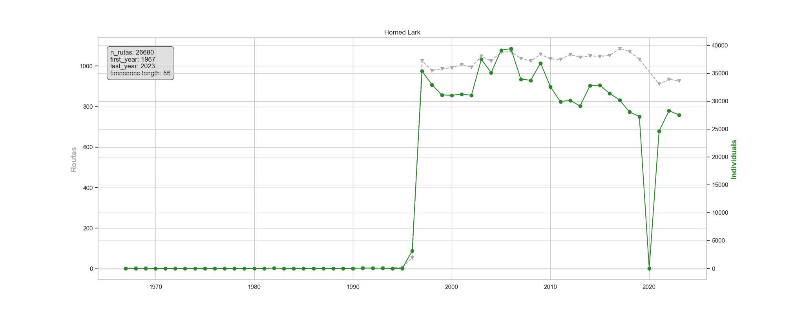{.thumbnail full-src="figs/4740_routes+tts.png"}
  421          4750    13177     1968         2023        55                  Black-billed Magpie                                   Pie d\'Amérique                                      Passeriformes       Corvidae            Pica                      hudsonia                                       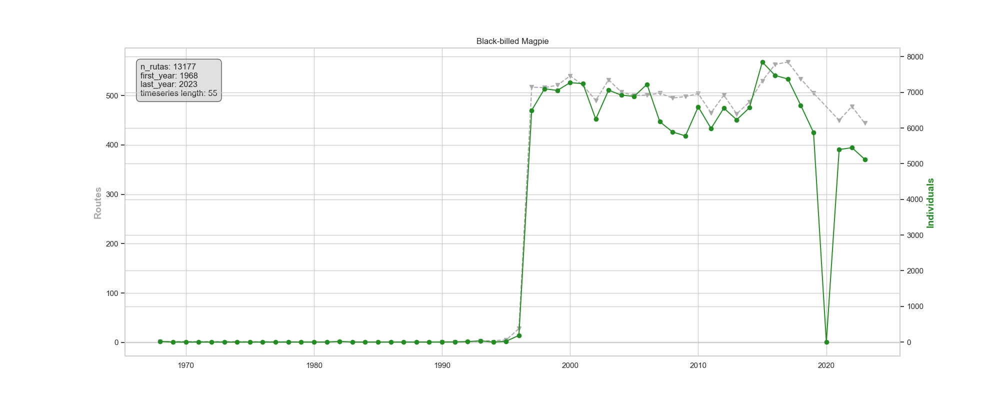{.thumbnail full-src="figs/4750_routes+tts.png"}
  422          4760    514       1996         2023        27                  Yellow-billed Magpie                                  Pie à bec jaune                                      Passeriformes       Corvidae            Pica                      nuttalli                                       {.thumbnail full-src="https://placehold.co/600x400/cccccc/000000?text=No+Image+Available"}
  423          4770    44326     1968         2023        55                  Blue Jay                                              Geai bleu                                            Passeriformes       Corvidae            Cyanocitta                cristata                                       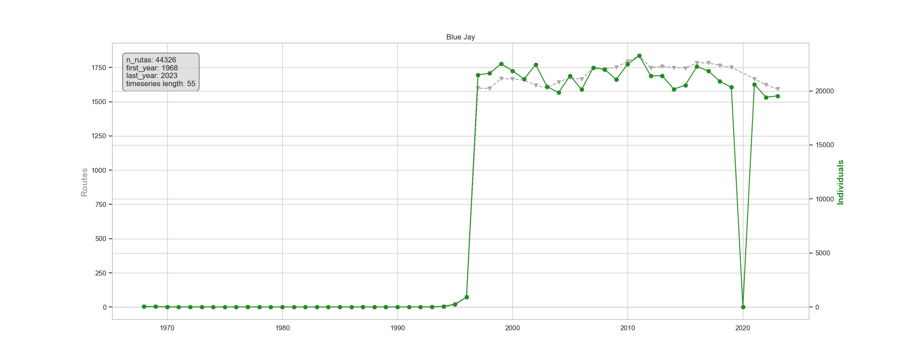{.thumbnail full-src="figs/4770_routes+tts.png"}
  424          4780    8040      1968         2023        55                  Steller\'s Jay                                        Geai de Steller                                      Passeriformes       Corvidae            Cyanocitta                stelleri                                       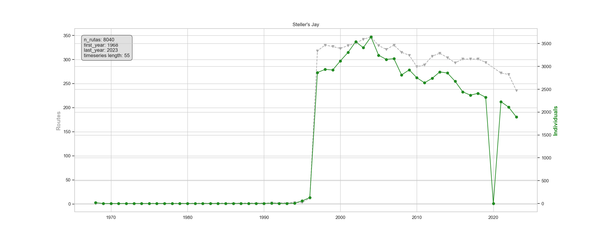{.thumbnail full-src="figs/4780_routes+tts.png"}
  425          4790    116       1997         2023        26                  Florida Scrub-Jay                                     Geai à gorge blanche                                 Passeriformes       Corvidae            Aphelocoma                coerulescens                                   {.thumbnail full-src="https://placehold.co/600x400/cccccc/000000?text=No+Image+Available"}
  426          4810    111       1997         2022        25                  unid. California Scrub-Jay / Woodhouse\'s Scrub-Jay   unid Geai buissonnier / Geai de Woodhouse            Passeriformes       Corvidae            Aphelocoma                californica / woodhouseii                      {.thumbnail full-src="https://placehold.co/600x400/cccccc/000000?text=No+Image+Available"}
  427          4812    2703      1968         2023        55                  California Scrub-Jay                                  Geai buissonnier                                     Passeriformes       Corvidae            Aphelocoma                californica                                    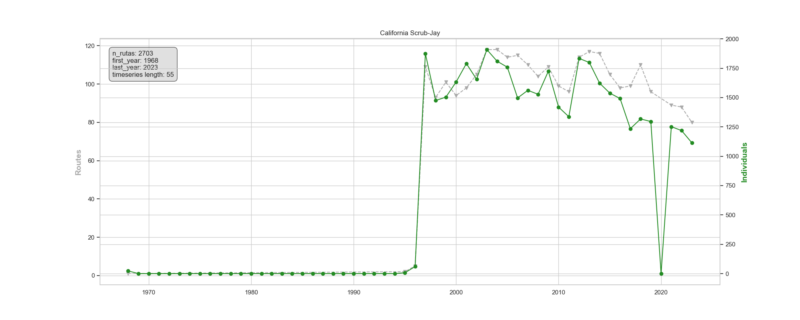{.thumbnail full-src="figs/4812_routes+tts.png"}
  428          4813    2540      1995         2023        28                  Woodhouse\'s Scrub-Jay                                Geai de Woodhouse                                    Passeriformes       Corvidae            Aphelocoma                woodhouseii                                    {.thumbnail full-src="https://placehold.co/600x400/cccccc/000000?text=No+Image+Available"}
  429          4820    301       1997         2023        26                  Mexican Jay                                           Geai du Mexique                                      Passeriformes       Corvidae            Aphelocoma                wollweberi                                     {.thumbnail full-src="https://placehold.co/600x400/cccccc/000000?text=No+Image+Available"}
  430          4830    269       1997         2023        26                  Green Jay                                             Geai vert                                            Passeriformes       Corvidae            Cyanocorax                yncas                                          {.thumbnail full-src="https://placehold.co/600x400/cccccc/000000?text=No+Image+Available"}
  431          4840    6301      1977         2023        46                  Canada Jay                                            Mésangeai du Canada                                  Passeriformes       Corvidae            Perisoreus                canadensis                                     {.thumbnail full-src="https://placehold.co/600x400/cccccc/000000?text=No+Image+Available"}
  432          4860    33079     1968         2023        55                  Common Raven                                          Grand Corbeau                                        Passeriformes       Corvidae            Corvus                    corax                                          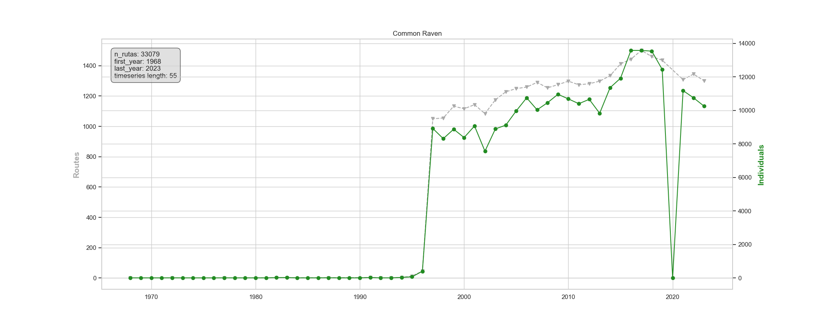{.thumbnail full-src="figs/4860_routes+tts.png"}
  433          4865    343       1997         2023        26                  unid. Chihuahuan Raven / Common Raven                 unid Grand Corbeau / Corbeau à cou blanc             Passeriformes       Corvidae            Corvus                    cryptoleucus / corax                           {.thumbnail full-src="https://placehold.co/600x400/cccccc/000000?text=No+Image+Available"}
  434          4870    1594      1996         2023        27                  Chihuahuan Raven                                      Corbeau à cou blanc                                  Passeriformes       Corvidae            Corvus                    cryptoleucus                                   {.thumbnail full-src="https://placehold.co/600x400/cccccc/000000?text=No+Image+Available"}
  435          4880    57466     1968         2023        55                  American Crow                                         Corneille d\'Amérique                                Passeriformes       Corvidae            Corvus                    brachyrhynchos                                 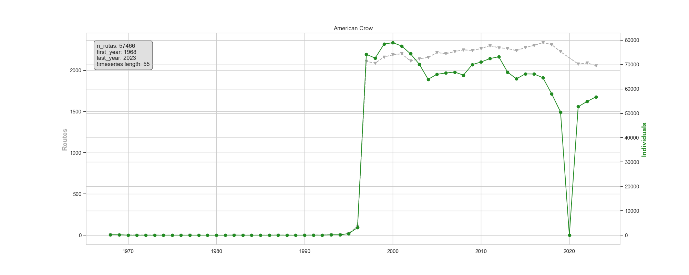{.thumbnail full-src="figs/4880_routes+tts.png"}
  436          4881    1459      1996         2023        27                  unid. American Crow / Fish Crow                       unid Corneille d\'Amérique / Corneille de rivage     Passeriformes       Corvidae            Corvus                    brachyrhynchos / ossifragus                    {.thumbnail full-src="https://placehold.co/600x400/cccccc/000000?text=No+Image+Available"}
  437          4882    25        1998         2021        23                  nan                                                   nan                                                  nan                 nan                 nan                       nan                                            {.thumbnail full-src="https://placehold.co/600x400/cccccc/000000?text=No+Image+Available"}
  438          4890    878       1972         2022        50                  nan                                                   nan                                                  nan                 nan                 nan                       nan                                            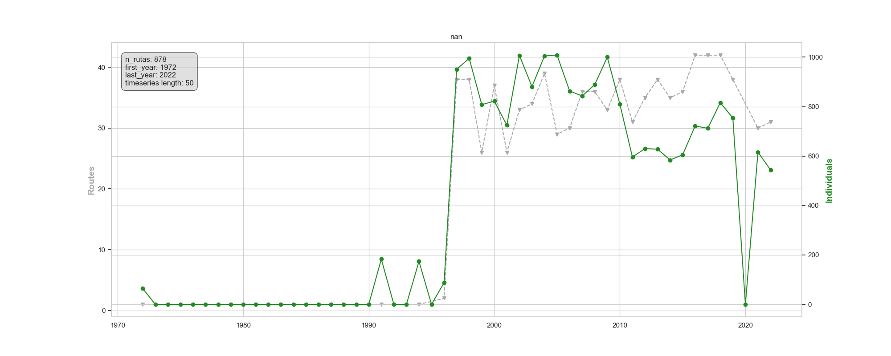{.thumbnail full-src="figs/4890_routes+tts.png"}
  439          4900    10099     1969         2023        54                  Fish Crow                                             Corneille de rivage                                  Passeriformes       Corvidae            Corvus                    ossifragus                                     {.thumbnail full-src="figs/4900_routes+tts.png"}
  440          4910    3239      1995         2023        28                  Clark\'s Nutcracker                                   Cassenoix d\'Amérique                                Passeriformes       Corvidae            Nucifraga                 columbiana                                     {.thumbnail full-src="https://placehold.co/600x400/cccccc/000000?text=No+Image+Available"}
  441          4920    2267      1995         2023        28                  Pinyon Jay                                            Geai des pinèdes                                     Passeriformes       Corvidae            Gymnorhinus               cyanocephalus                                  {.thumbnail full-src="https://placehold.co/600x400/cccccc/000000?text=No+Image+Available"}
  442          4930    53967     1968         2023        55                  European Starling                                     Étourneau sansonnet                                  Passeriformes       Sturnidae           Sturnus                   vulgaris                                       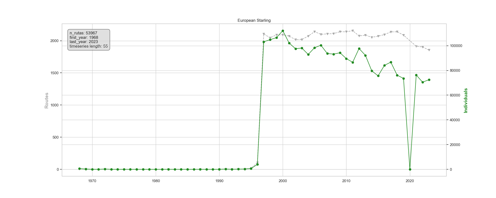{.thumbnail full-src="figs/4930_routes+tts.png"}
  443          4932    11        2002         2022        20                  Common Myna                                           Martin triste                                        Passeriformes       Sturnidae           Acridotheres              tristis                                        {.thumbnail full-src="https://placehold.co/600x400/cccccc/000000?text=No+Image+Available"}
  444          4940    14174     1968         2023        55                  Bobolink                                              Goglu des prés                                       Passeriformes       Icteridae           Dolichonyx                oryzivorus                                     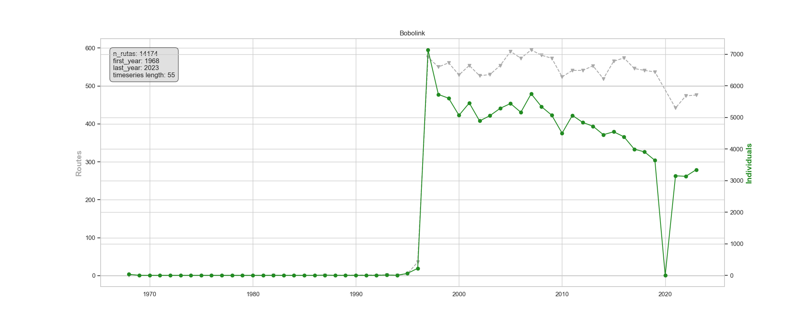{.thumbnail full-src="figs/4940_routes+tts.png"}
  445          4950    59694     1967         2023        56                  Brown-headed Cowbird                                  Vacher à tête brune                                  Passeriformes       Icteridae           Molothrus                 ater                                           {.thumbnail full-src="figs/4950_routes+tts.png"}
  446          4955    10        1997         2023        26                  unid. Bronzed Cowbird / Brown-headed Cowbird          unid Vacher bronzé / à tête brune                    Passeriformes       Icteridae           Molothrus                 aeneus / ater                                  {.thumbnail full-src="https://placehold.co/600x400/cccccc/000000?text=No+Image+Available"}
  447          4960    900       1996         2023        27                  Bronzed Cowbird                                       Vacher bronzé                                        Passeriformes       Icteridae           Molothrus                 aeneus                                         {.thumbnail full-src="https://placehold.co/600x400/cccccc/000000?text=No+Image+Available"}
  448          4961    9         1999         2018        19                  Shiny Cowbird                                         Vacher luisant                                       Passeriformes       Icteridae           Molothrus                 bonariensis                                    {.thumbnail full-src="https://placehold.co/600x400/cccccc/000000?text=No+Image+Available"}
  449          4970    7524      1977         2023        46                  Yellow-headed Blackbird                               Carouge à tête jaune                                 Passeriformes       Icteridae           Xanthocephalus            xanthocephalus                                 {.thumbnail full-src="https://placehold.co/600x400/cccccc/000000?text=No+Image+Available"}
  450          4980    60790     1967         2023        56                  Red-winged Blackbird                                  Carouge à épaulettes                                 Passeriformes       Icteridae           Agelaius                  phoeniceus                                     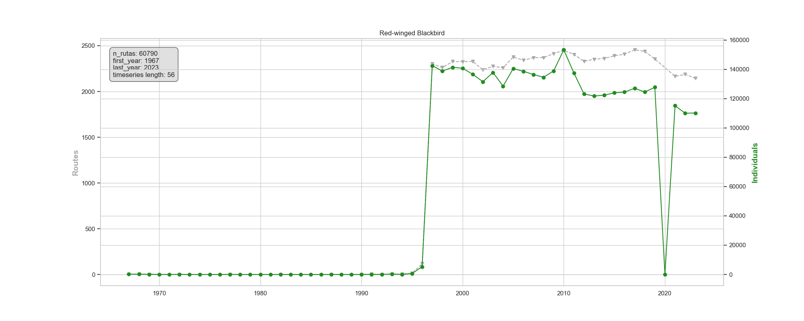{.thumbnail full-src="figs/4980_routes+tts.png"}
  451          5000    298       1997         2023        26                  Tricolored Blackbird                                  Carouge de Californie                                Passeriformes       Icteridae           Agelaius                  tricolor                                       {.thumbnail full-src="https://placehold.co/600x400/cccccc/000000?text=No+Image+Available"}
  452          5009    23        2023         2023        0                   Chihuahuan Meadowlark                                 Sturnelle de Lilian                                  Passeriformes       Icteridae           Sturnella                 lilianae                                       {.thumbnail full-src="https://placehold.co/600x400/cccccc/000000?text=No+Image+Available"}
  453          5010    29979     1967         2023        56                  Eastern Meadowlark                                    Sturnelle des prés                                   Passeriformes       Icteridae           Sturnella                 magna                                          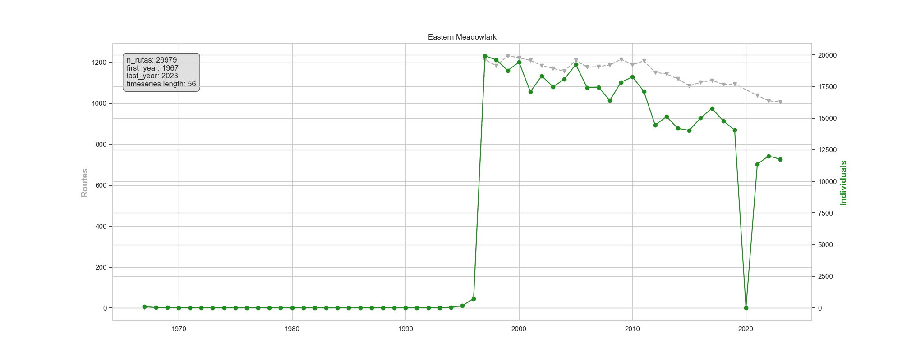{.thumbnail full-src="figs/5010_routes+tts.png"}
  454          5011    23560     1968         2023        55                  Western Meadowlark                                    Sturnelle de l\'Ouest                                Passeriformes       Icteridae           Sturnella                 neglecta                                       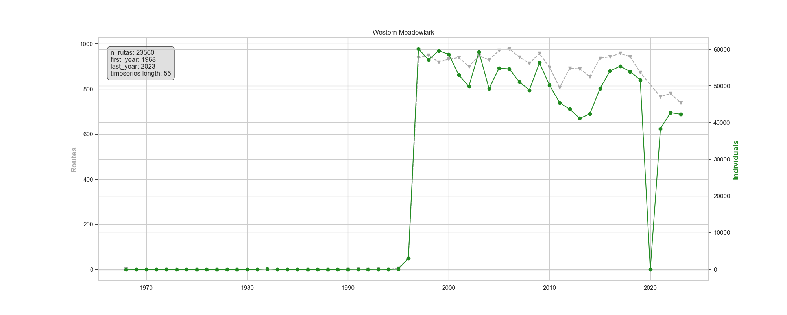{.thumbnail full-src="figs/5011_routes+tts.png"}
  455          5012    363       1997         2023        26                  unid. Meadowlark                                      unid Sturnelle                                       Passeriformes       Icteridae           Sturnella                 sp.                                            {.thumbnail full-src="https://placehold.co/600x400/cccccc/000000?text=No+Image+Available"}
  456          5030    167       1996         2023        27                  Audubon\'s Oriole                                     Oriole d\'Audubon                                    Passeriformes       Icteridae           Icterus                   graduacauda                                    {.thumbnail full-src="https://placehold.co/600x400/cccccc/000000?text=No+Image+Available"}
  457          5031    6         1997         2023        26                  Altamira Oriole                                       Oriole à gros bec                                    Passeriformes       Icteridae           Icterus                   gularis                                        {.thumbnail full-src="https://placehold.co/600x400/cccccc/000000?text=No+Image+Available"}
  458          5032    3         2002         2010        8                   Spot-breasted Oriole                                  Oriole maculé                                        Passeriformes       Icteridae           Icterus                   pectoralis                                     {.thumbnail full-src="https://placehold.co/600x400/cccccc/000000?text=No+Image+Available"}
  459          5040    2203      1996         2023        27                  Scott\'s Oriole                                       Oriole jaune-verdâtre                                Passeriformes       Icteridae           Icterus                   parisorum                                      {.thumbnail full-src="https://placehold.co/600x400/cccccc/000000?text=No+Image+Available"}
  460          5050    982       1996         2023        27                  Hooded Oriole                                         Oriole masqué                                        Passeriformes       Icteridae           Icterus                   cucullatus                                     {.thumbnail full-src="https://placehold.co/600x400/cccccc/000000?text=No+Image+Available"}
  461          5060    21324     1968         2023        55                  Orchard Oriole                                        Oriole des vergers                                   Passeriformes       Icteridae           Icterus                   spurius                                        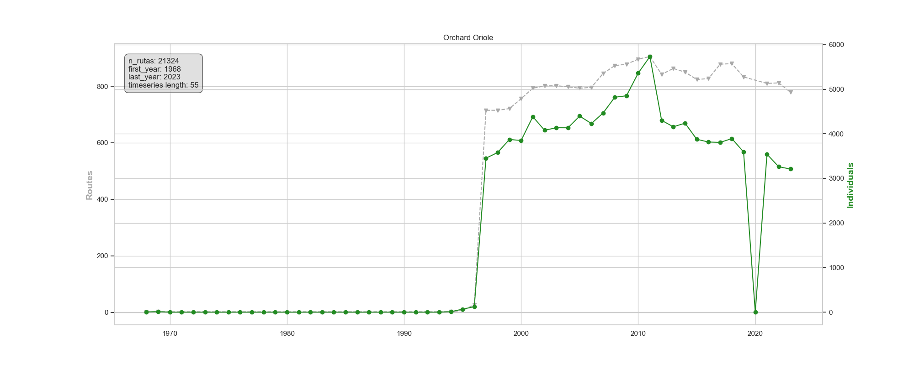{.thumbnail full-src="figs/5060_routes+tts.png"}
  462          5070    23075     1968         2023        55                  Baltimore Oriole                                      Oriole de Baltimore                                  Passeriformes       Icteridae           Icterus                   galbula                                        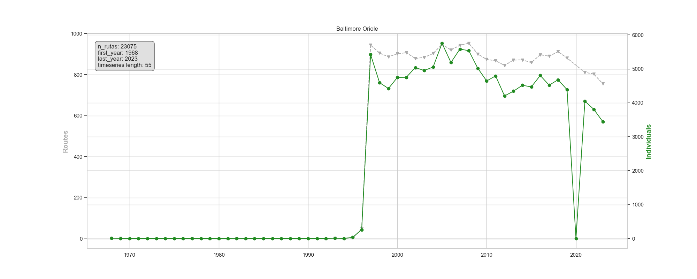{.thumbnail full-src="figs/5070_routes+tts.png"}
  463          5077    36        1997         2023        26                  unid. Bullock\'s Oriole / Baltimore Oriole            unid Oriole de Baltimore / Oriole de Bullock\'s      Passeriformes       Icteridae           Icterus                   bullockii / galbula                            {.thumbnail full-src="https://placehold.co/600x400/cccccc/000000?text=No+Image+Available"}
  464          5078    2         2017         2018        1                   hybrid Bullock\'s Oriole x Baltimore Oriole           hybride Oriole de Baltimore x Oriole de Bullock\'s   Passeriformes       Icteridae           Icterus                   bullockii x galbula                            {.thumbnail full-src="https://placehold.co/600x400/cccccc/000000?text=No+Image+Available"}
  465          5080    9724      1968         2023        55                  Bullock\'s Oriole                                     Oriole de Bullock                                    Passeriformes       Icteridae           Icterus                   bullockii                                      {.thumbnail full-src="figs/5080_routes+tts.png"}
  466          5090    941       1995         2023        28                  Rusty Blackbird                                       Quiscale rouilleux                                   Passeriformes       Icteridae           Euphagus                  carolinus                                      {.thumbnail full-src="https://placehold.co/600x400/cccccc/000000?text=No+Image+Available"}
  467          5100    17977     1968         2023        55                  Brewer\'s Blackbird                                   Quiscale de Brewer                                   Passeriformes       Icteridae           Euphagus                  cyanocephalus                                  {.thumbnail full-src="figs/5100_routes+tts.png"}
  468          5110    45240     1968         2023        55                  Common Grackle                                        Quiscale bronzé                                      Passeriformes       Icteridae           Quiscalus                 quiscula                                       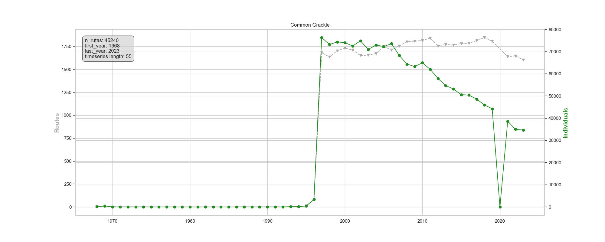{.thumbnail full-src="figs/5110_routes+tts.png"}
  469          5120    4404      1996         2023        27                  Great-tailed Grackle                                  Quiscale à longue queue                              Passeriformes       Icteridae           Quiscalus                 mexicanus                                      {.thumbnail full-src="https://placehold.co/600x400/cccccc/000000?text=No+Image+Available"}
  470          5130    1983      1967         2023        56                  Boat-tailed Grackle                                   Quiscale des marais                                  Passeriformes       Icteridae           Quiscalus                 major                                          {.thumbnail full-src="figs/5130_routes+tts.png"}
  471          5135    85        1997         2023        26                  unid. Boat-tailed Grackle / Great-tailed Grackle      unid Quiscale des marais / Quiscale à longue queue   Passeriformes       Icteridae           Quiscalus                 major / mexicanus                              {.thumbnail full-src="https://placehold.co/600x400/cccccc/000000?text=No+Image+Available"}
  472          5140    3950      1977         2023        46                  Evening Grosbeak                                      Gros-bec errant                                      Passeriformes       Fringillidae        Coccothraustes            vespertinus                                    {.thumbnail full-src="https://placehold.co/600x400/cccccc/000000?text=No+Image+Available"}
  473          5150    1761      1991         2023        32                  Pine Grosbeak                                         Durbec des sapins                                    Passeriformes       Fringillidae        Pinicola                  enucleator                                     {.thumbnail full-src="https://placehold.co/600x400/cccccc/000000?text=No+Image+Available"}
  474          5170    10211     1968         2023        55                  Purple Finch                                          Roselin pourpré                                      Passeriformes       Fringillidae        Haemorhous                purpureus                                      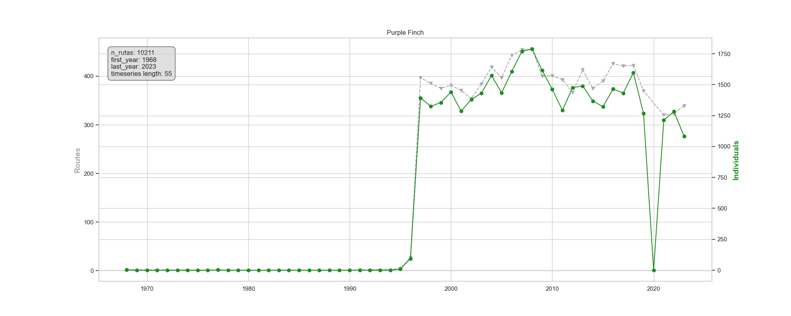{.thumbnail full-src="figs/5170_routes+tts.png"}
  475          5180    4009      1995         2023        28                  Cassin\'s Finch                                       Roselin de Cassin                                    Passeriformes       Fringillidae        Haemorhous                cassinii                                       {.thumbnail full-src="https://placehold.co/600x400/cccccc/000000?text=No+Image+Available"}
  476          5190    34000     1968         2023        55                  House Finch                                           Roselin familier                                     Passeriformes       Fringillidae        Haemorhous                mexicanus                                      {.thumbnail full-src="figs/5190_routes+tts.png"}
  477          5195    34        2004         2023        19                  unid. Purple Finch / Cassin\'s Finch / House Finch    unid Roselin pourpré / de Cassin / familier          Passeriformes       Fringillidae        Carpodacus                purpureus / cassinii / mexicanus               {.thumbnail full-src="https://placehold.co/600x400/cccccc/000000?text=No+Image+Available"}
  478          5210    5457      1991         2023        32                  Red Crossbill                                         Bec-croisé des sapins                                Passeriformes       Fringillidae        Loxia                     curvirostra                                    {.thumbnail full-src="https://placehold.co/600x400/cccccc/000000?text=No+Image+Available"}
  479          5212    23        1997         2023        26                  unid. Cassia Crossbill / Red Crossbill                Unid Bec-croisé de l\'Idaho / des sapins             Passeriformes       Fringillidae        Loxia                     sinesciuris / curvirostra                      {.thumbnail full-src="https://placehold.co/600x400/cccccc/000000?text=No+Image+Available"}
  480          5220    2699      1996         2023        27                  White-winged Crossbill                                Bec-croisé bifascié                                  Passeriformes       Fringillidae        Loxia                     leucoptera                                     {.thumbnail full-src="https://placehold.co/600x400/cccccc/000000?text=No+Image+Available"}
  481          5225    27        1997         2023        26                  unid. Red Crossbill / White-winged Crossbill          unid Bec-croisé des sapins / Bec-croisé bifascié     Passeriformes       Fringillidae        Loxia                     curvirostra / leucoptera                       {.thumbnail full-src="https://placehold.co/600x400/cccccc/000000?text=No+Image+Available"}
  482          5240    14        1997         2019        22                  Gray-crowned Rosy-Finch                               Roselin à tête grise                                 Passeriformes       Fringillidae        Leucosticte               tephrocotis                                    {.thumbnail full-src="https://placehold.co/600x400/cccccc/000000?text=No+Image+Available"}
  483          5250    3         1997         2006        9                   Black Rosy-Finch                                      Roselin noir                                         Passeriformes       Fringillidae        Leucosticte               atrata                                         {.thumbnail full-src="https://placehold.co/600x400/cccccc/000000?text=No+Image+Available"}
  484          5260    13        1997         2021        24                  Brown-capped Rosy-Finch                               Roselin à tête brune                                 Passeriformes       Fringillidae        Leucosticte               australis                                      {.thumbnail full-src="https://placehold.co/600x400/cccccc/000000?text=No+Image+Available"}
  485          5261    3         2018         2023        5                   European Goldfinch                                    Chardonneret élégant                                 Passeriformes       Fringillidae        Carduelis                 carduelis                                      {.thumbnail full-src="https://placehold.co/600x400/cccccc/000000?text=No+Image+Available"}
  486          5270    86        1997         2023        26                  Hoary Redpoll                                         Sizerin blanchâtre                                   Passeriformes       Fringillidae        Acanthis                  hornemanni                                     {.thumbnail full-src="https://placehold.co/600x400/cccccc/000000?text=No+Image+Available"}
  487          5275    360       1997         2023        26                  unid. Common Redpoll / Hoary Redpoll                  unid Sizerin flame / Sizerin blanchâtre              Passeriformes       Fringillidae        Carduelis                 flammea / hornemanni                           {.thumbnail full-src="https://placehold.co/600x400/cccccc/000000?text=No+Image+Available"}
  488          5280    2198      1982         2023        41                  Common Redpoll                                        Sizerin flammé                                       Passeriformes       Fringillidae        Acanthis                  flammea                                        {.thumbnail full-src="https://placehold.co/600x400/cccccc/000000?text=No+Image+Available"}
  489          5290    41958     1968         2023        55                  American Goldfinch                                    Chardonneret jaune                                   Passeriformes       Fringillidae        Spinus                    tristis                                        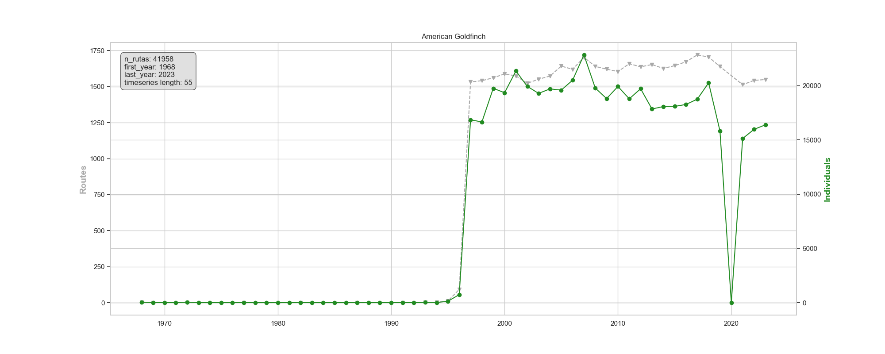{.thumbnail full-src="figs/5290_routes+tts.png"}
  490          5300    4795      1968         2023        55                  Lesser Goldfinch                                      Chardonneret mineur                                  Passeriformes       Fringillidae        Spinus                    psaltria                                       {.thumbnail full-src="figs/5300_routes+tts.png"}
  491          5310    427       1996         2023        27                  Lawrence\'s Goldfinch                                 Chardonneret gris                                    Passeriformes       Fringillidae        Spinus                    lawrencei                                      {.thumbnail full-src="https://placehold.co/600x400/cccccc/000000?text=No+Image+Available"}
  492          5330    10217     1972         2023        51                  Pine Siskin                                           Tarin des pins                                       Passeriformes       Fringillidae        Spinus                    pinus                                          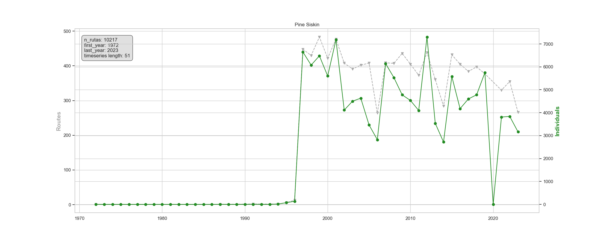{.thumbnail full-src="figs/5330_routes+tts.png"}
  493          5340    9         1997         2023        26                  Snow Bunting                                          Plectrophane des neiges                              Passeriformes       Calcariidae         Plectrophenax             nivalis                                        {.thumbnail full-src="https://placehold.co/600x400/cccccc/000000?text=No+Image+Available"}
  494          5360    368       1997         2023        26                  Lapland Longspur                                      Plectrophane lapon                                   Passeriformes       Calcariidae         Calcarius                 lapponicus                                     {.thumbnail full-src="https://placehold.co/600x400/cccccc/000000?text=No+Image+Available"}
  495          5370    52        1997         2023        26                  Smith\'s Longspur                                     Plectrophane de Smith                                Passeriformes       Calcariidae         Calcarius                 pictus                                         {.thumbnail full-src="https://placehold.co/600x400/cccccc/000000?text=No+Image+Available"}
  496          5380    1410      1990         2023        33                  Chestnut-collared Longspur                            Plectrophane à ventre noir                           Passeriformes       Calcariidae         Calcarius                 ornatus                                        {.thumbnail full-src="https://placehold.co/600x400/cccccc/000000?text=No+Image+Available"}
  497          5390    705       1996         2023        27                  Thick-billed Longspur                                 Plectrophane de McCown                               Passeriformes       Calcariidae         Rhynchophanes             mccownii                                       {.thumbnail full-src="https://placehold.co/600x400/cccccc/000000?text=No+Image+Available"}
  498          5400    19884     1968         2023        55                  Vesper Sparrow                                        Bruant vespéral                                      Passeriformes       Passerellidae       Pooecetes                 gramineus                                      {.thumbnail full-src="figs/5400_routes+tts.png"}
  499          5420    23970     1968         2023        55                  Savannah Sparrow                                      Bruant des prés                                      Passeriformes       Passerellidae       Passerculus               sandwichensis                                  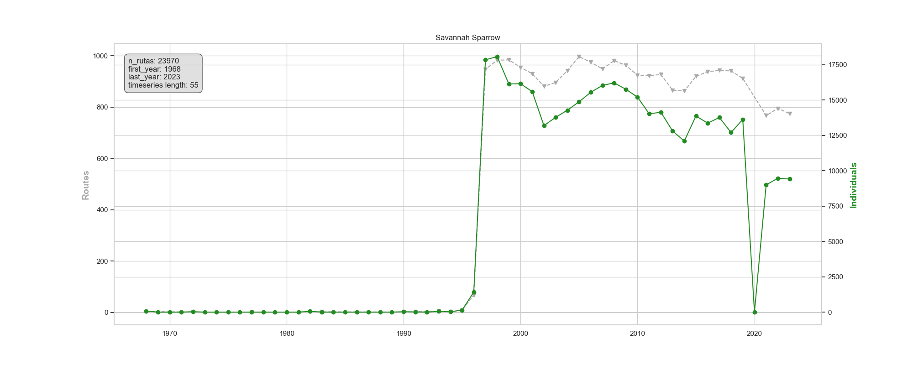{.thumbnail full-src="figs/5420_routes+tts.png"}
  500          5450    1177      1982         2023        41                  Baird\'s Sparrow                                      Bruant de Baird                                      Passeriformes       Passerellidae       Centronyx                 bairdii                                        {.thumbnail full-src="https://placehold.co/600x400/cccccc/000000?text=No+Image+Available"}
  501          5460    15227     1968         2023        55                  Grasshopper Sparrow                                   Bruant sauterelle                                    Passeriformes       Passerellidae       Ammodramus                savannarum                                     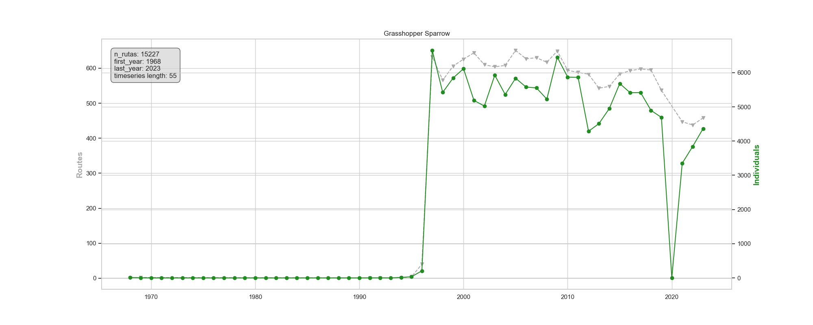{.thumbnail full-src="figs/5460_routes+tts.png"}
  502          5470    858       1996         2023        27                  Henslow\'s Sparrow                                    Bruant de Henslow                                    Passeriformes       Passerellidae       Centronyx                 henslowii                                      {.thumbnail full-src="https://placehold.co/600x400/cccccc/000000?text=No+Image+Available"}
  503          5480    2261      1968         2023        55                  LeConte\'s Sparrow                                    Bruant de LeConte                                    Passeriformes       Passerellidae       Ammospiza                 leconteii                                      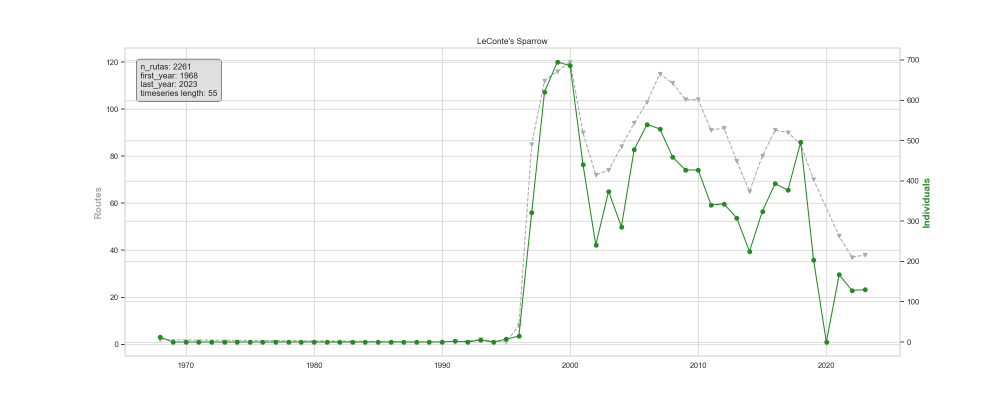{.thumbnail full-src="figs/5480_routes+tts.png"}
  504          5490    30        1996         2023        27                  Saltmarsh Sparrow                                     Bruant à queue aiguë                                 Passeriformes       Passerellidae       Ammospiza                 caudacuta                                      {.thumbnail full-src="https://placehold.co/600x400/cccccc/000000?text=No+Image+Available"}
  505          5491    657       1996         2023        27                  Nelson\'s Sparrow                                     Bruant de Nelson                                     Passeriformes       Passerellidae       Ammospiza                 nelsoni                                        {.thumbnail full-src="https://placehold.co/600x400/cccccc/000000?text=No+Image+Available"}
  506          5500    411       1997         2023        26                  Seaside Sparrow                                       Bruant maritime                                      Passeriformes       Passerellidae       Ammospiza                 maritima                                       {.thumbnail full-src="https://placehold.co/600x400/cccccc/000000?text=No+Image+Available"}
  507          5520    14824     1967         2023        56                  Lark Sparrow                                          Bruant à joues marron                                Passeriformes       Passerellidae       Chondestes                grammacus                                      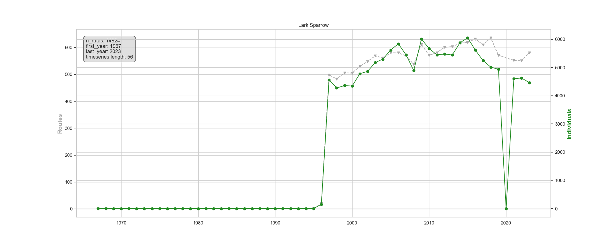{.thumbnail full-src="figs/5520_routes+tts.png"}
  508          5530    45        1998         2023        25                  Harris\'s Sparrow                                     Bruant à face noire                                  Passeriformes       Passerellidae       Zonotrichia               querula                                        {.thumbnail full-src="https://placehold.co/600x400/cccccc/000000?text=No+Image+Available"}
  509          5540    7615      1972         2023        51                  White-crowned Sparrow                                 Bruant à couronne blanche                            Passeriformes       Passerellidae       Zonotrichia               leucophrys                                     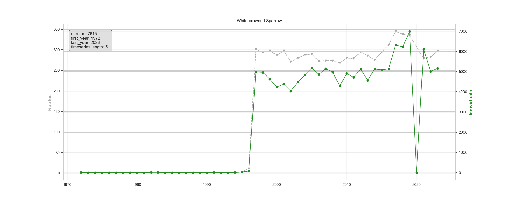{.thumbnail full-src="figs/5540_routes+tts.png"}
  510          5570    694       1995         2023        28                  Golden-crowned Sparrow                                Bruant à couronne dorée                              Passeriformes       Passerellidae       Zonotrichia               atricapilla                                    {.thumbnail full-src="https://placehold.co/600x400/cccccc/000000?text=No+Image+Available"}
  511          5580    10069     1968         2023        55                  White-throated Sparrow                                Bruant à gorge blanche                               Passeriformes       Passerellidae       Zonotrichia               albicollis                                     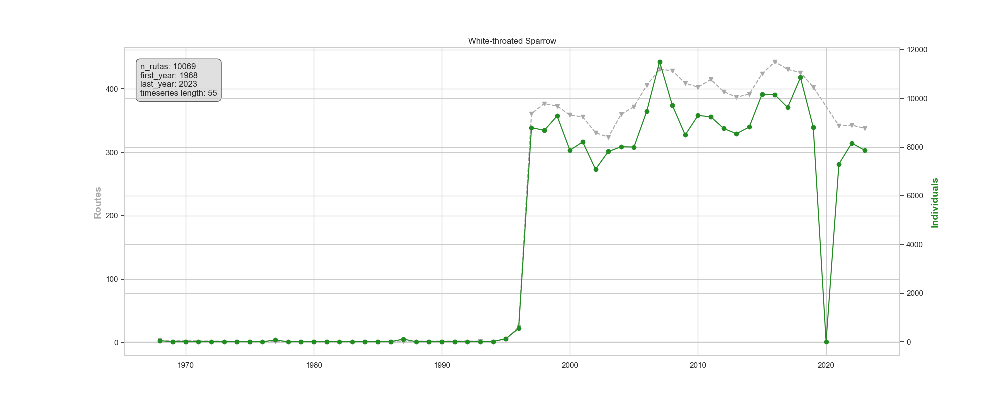{.thumbnail full-src="figs/5580_routes+tts.png"}
  512          5590    1078      1997         2023        26                  American Tree Sparrow                                 Bruant hudsonien                                     Passeriformes       Passerellidae       Spizelloides              arborea                                        {.thumbnail full-src="https://placehold.co/600x400/cccccc/000000?text=No+Image+Available"}
  513          5600    50727     1968         2023        55                  Chipping Sparrow                                      Bruant familier                                      Passeriformes       Passerellidae       Spizella                  passerina                                      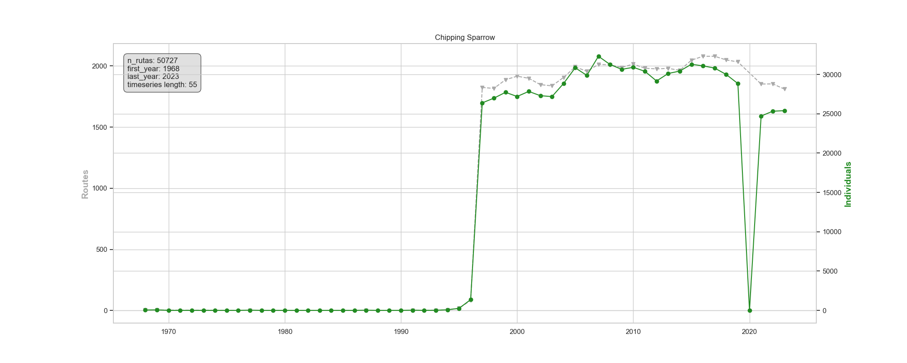{.thumbnail full-src="figs/5600_routes+tts.png"}
  514          5610    8128      1968         2023        55                  Clay-colored Sparrow                                  Bruant des plaines                                   Passeriformes       Passerellidae       Spizella                  pallida                                        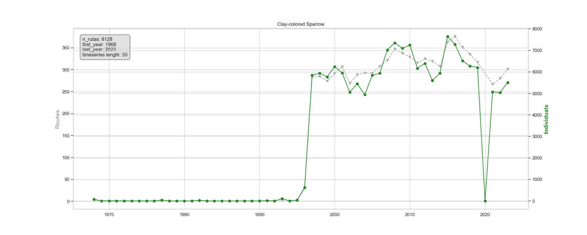{.thumbnail full-src="figs/5610_routes+tts.png"}
  515          5620    7395      1991         2023        32                  Brewer\'s Sparrow                                     Bruant de Brewer                                     Passeriformes       Passerellidae       Spizella                  breweri                                        {.thumbnail full-src="https://placehold.co/600x400/cccccc/000000?text=No+Image+Available"}
  516          5630    24630     1968         2023        55                  Field Sparrow                                         Bruant des champs                                    Passeriformes       Passerellidae       Spizella                  pusilla                                        {.thumbnail full-src="figs/5630_routes+tts.png"}
  517          5650    689       1996         2023        27                  Black-chinned Sparrow                                 Bruant à menton noir                                 Passeriformes       Passerellidae       Spizella                  atrogularis                                    {.thumbnail full-src="https://placehold.co/600x400/cccccc/000000?text=No+Image+Available"}
  518          5660    268       1997         2023        26                  (White-winged Junco) Dark-eyed Junco                  Junco ardoisé (à ailes blanches)                     Passeriformes       Passerellidae       Junco                     hyemalis aikeni                                {.thumbnail full-src="https://placehold.co/600x400/cccccc/000000?text=No+Image+Available"}
  519          5670    9683      1968         2023        55                  (Slate-colored Junco) Dark-eyed Junco                 Junco ardoisé (groupe hyemalis)                      Passeriformes       Passerellidae       Junco                     hyemalis hyemalis                              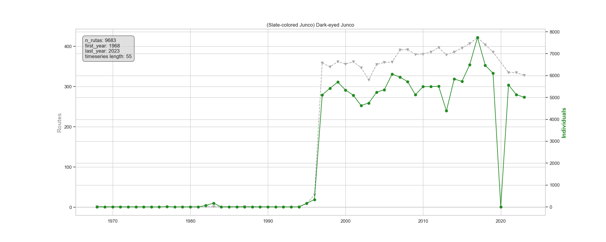{.thumbnail full-src="figs/5670_routes+tts.png"}
  520          5671    7802      1968         2023        55                  (Oregon Junco) Dark-eyed Junco                        Junco ardoisé (groupe oreganus)                      Passeriformes       Passerellidae       Junco                     hyemalis oreganus                              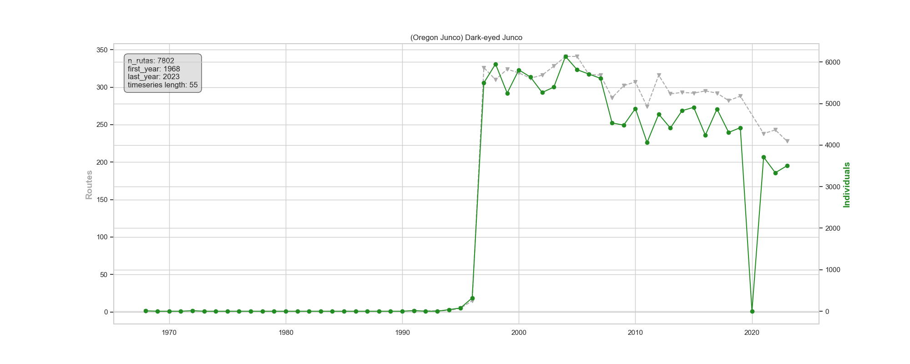{.thumbnail full-src="figs/5671_routes+tts.png"}
  521          5677    762       1997         2023        26                  (unid. race) Dark-eyed Junco                          Junco ardoisé (groupe non identifié)                 Passeriformes       Passerellidae       Junco                     hyemalis                                       {.thumbnail full-src="https://placehold.co/600x400/cccccc/000000?text=No+Image+Available"}
  522          5680    96        1998         2023        25                  (Pink-sided Junco) Dark-eyed Junco                    Junco ardoisé (groupe mearnsi)                       Passeriformes       Passerellidae       Junco                     hyemalis mearnsi                               {.thumbnail full-src="https://placehold.co/600x400/cccccc/000000?text=No+Image+Available"}
  523          5690    2301      1997         2023        26                  (Gray-headed Junco) Dark-eyed Junco                   Junco ardoisé (à tête grise)                         Passeriformes       Passerellidae       Junco                     hyemalis caniceps                              {.thumbnail full-src="https://placehold.co/600x400/cccccc/000000?text=No+Image+Available"}
  524          5700    103       1997         2023        26                  Yellow-eyed Junco                                     Junco aux yeux jaunes                                Passeriformes       Passerellidae       Junco                     phaeonotus                                     {.thumbnail full-src="https://placehold.co/600x400/cccccc/000000?text=No+Image+Available"}
  525          5730    4966      1995         2023        28                  Black-throated Sparrow                                Bruant à gorge noire                                 Passeriformes       Passerellidae       Amphispiza                bilineata                                      {.thumbnail full-src="https://placehold.co/600x400/cccccc/000000?text=No+Image+Available"}
  526          5738    2331      1991         2023        32                  Sagebrush Sparrow                                     Bruant des armoises                                  Passeriformes       Passerellidae       Artemisiospiza            nevadensis                                     {.thumbnail full-src="https://placehold.co/600x400/cccccc/000000?text=No+Image+Available"}
  527          5739    305       1996         2023        27                  Bell\'s Sparrow                                       Bruant de Bell                                       Passeriformes       Passerellidae       Artemisiospiza            belli                                          {.thumbnail full-src="https://placehold.co/600x400/cccccc/000000?text=No+Image+Available"}
  528          5740    140       1996         2023        27                  unid. Sagebrush Sparrow / Bell\'s Sparrow             unid Bruant des armoises / Burant de Bell            Passeriformes       Passerellidae       Artemisiospiza            nevadensis / belli                             {.thumbnail full-src="https://placehold.co/600x400/cccccc/000000?text=No+Image+Available"}
  529          5750    1323      1995         2023        28                  Bachman\'s Sparrow                                    Bruant des pinèdes                                   Passeriformes       Passerellidae       Peucaea                   aestivalis                                     {.thumbnail full-src="https://placehold.co/600x400/cccccc/000000?text=No+Image+Available"}
  530          5760    166       1997         2023        26                  Botteri\'s Sparrow                                    Bruant de Botteri                                    Passeriformes       Passerellidae       Peucaea                   botterii                                       {.thumbnail full-src="https://placehold.co/600x400/cccccc/000000?text=No+Image+Available"}
  531          5780    3593      1967         2023        56                  Cassin\'s Sparrow                                     Bruant de Cassin                                     Passeriformes       Passerellidae       Peucaea                   cassinii                                       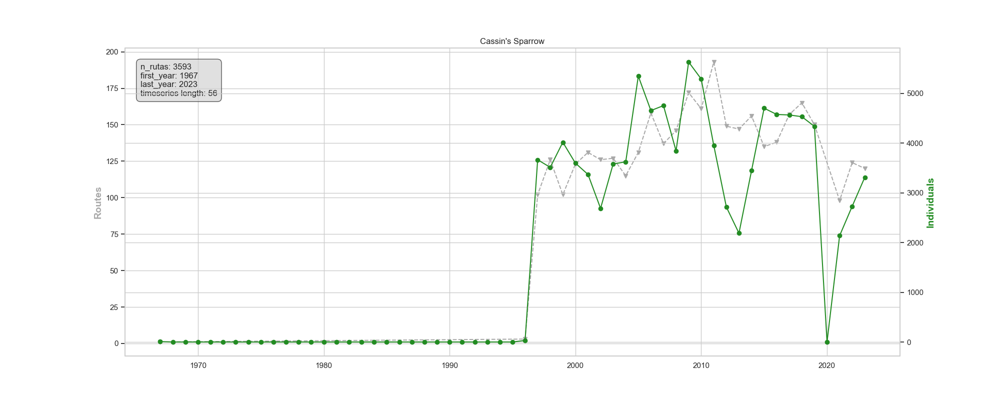{.thumbnail full-src="figs/5780_routes+tts.png"}
  532          5790    111       1998         2023        25                  Rufous-winged Sparrow                                 Bruant à épaulettes                                  Passeriformes       Passerellidae       Peucaea                   carpalis                                       {.thumbnail full-src="https://placehold.co/600x400/cccccc/000000?text=No+Image+Available"}
  533          5800    1543      1996         2023        27                  Rufous-crowned Sparrow                                Tohi à calotte fauve                                 Passeriformes       Passerellidae       Aimophila                 ruficeps                                       {.thumbnail full-src="https://placehold.co/600x400/cccccc/000000?text=No+Image+Available"}
  534          5810    42697     1968         2023        55                  Song Sparrow                                          Bruant chanteur                                      Passeriformes       Passerellidae       Melospiza                 melodia                                        {.thumbnail full-src="figs/5810_routes+tts.png"}
  535          5830    9401      1982         2023        41                  Lincoln\'s Sparrow                                    Bruant de Lincoln                                    Passeriformes       Passerellidae       Melospiza                 lincolnii                                      {.thumbnail full-src="https://placehold.co/600x400/cccccc/000000?text=No+Image+Available"}
  536          5840    9304      1987         2023        36                  Swamp Sparrow                                         Bruant des marais                                    Passeriformes       Passerellidae       Melospiza                 georgiana                                      {.thumbnail full-src="https://placehold.co/600x400/cccccc/000000?text=No+Image+Available"}
  537          5850    6469      1982         2023        41                  Fox Sparrow                                           Bruant fauve                                         Passeriformes       Passerellidae       Passerella                iliaca                                         {.thumbnail full-src="https://placehold.co/600x400/cccccc/000000?text=No+Image+Available"}
  538          5860    510       1997         2023        26                  Olive Sparrow                                         Tohi olive                                           Passeriformes       Passerellidae       Arremonops                rufivirgatus                                   {.thumbnail full-src="https://placehold.co/600x400/cccccc/000000?text=No+Image+Available"}
  539          5870    27956     1968         2023        55                  Eastern Towhee                                        Tohi à flancs roux                                   Passeriformes       Passerellidae       Pipilo                    erythrophthalmus                               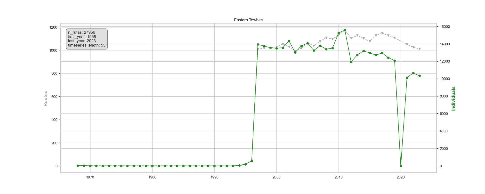{.thumbnail full-src="figs/5870_routes+tts.png"}
  540          5871    70        1972         2023        51                  unid. Spotted Towhee / Eastern Towhee                 unid Tohi tacheté / Tohi à flancs roux               Passeriformes       Passerellidae       Pipilo                    maculatus / erythrophthalmus                   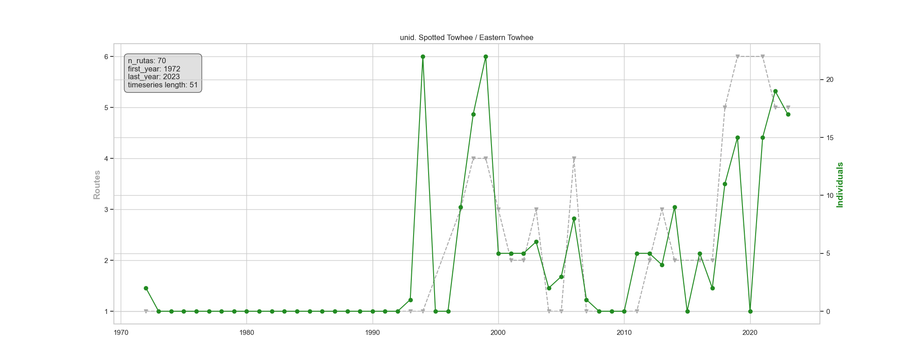{.thumbnail full-src="figs/5871_routes+tts.png"}
  541          5880    11187     1968         2023        55                  Spotted Towhee                                        Tohi tacheté                                         Passeriformes       Passerellidae       Pipilo                    maculatus                                      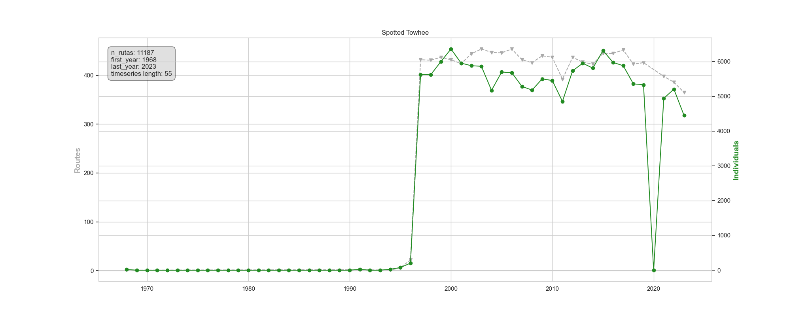{.thumbnail full-src="figs/5880_routes+tts.png"}
  542          5900    5153      1996         2023        27                  Green-tailed Towhee                                   Tohi à queue verte                                   Passeriformes       Passerellidae       Pipilo                    chlorurus                                      {.thumbnail full-src="https://placehold.co/600x400/cccccc/000000?text=No+Image+Available"}
  543          5910    1887      1997         2023        26                  Canyon Towhee                                         Tohi des canyons                                     Passeriformes       Passerellidae       Melozone                  fusca                                          {.thumbnail full-src="https://placehold.co/600x400/cccccc/000000?text=No+Image+Available"}
  544          5911    1575      1968         2023        55                  California Towhee                                     Tohi de Californie                                   Passeriformes       Passerellidae       Melozone                  crissalis                                      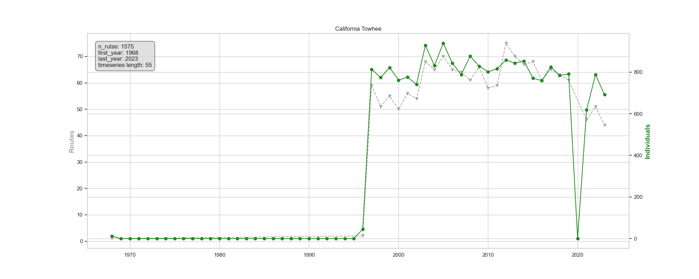{.thumbnail full-src="figs/5911_routes+tts.png"}
  545          5920    533       1997         2023        26                  Abert\'s Towhee                                       Tohi d\'Abert                                        Passeriformes       Passerellidae       Melozone                  aberti                                         {.thumbnail full-src="https://placehold.co/600x400/cccccc/000000?text=No+Image+Available"}
  546          5930    39718     1967         2023        56                  Northern Cardinal                                     Cardinal rouge                                       Passeriformes       Cardinalidae        Cardinalis                cardinalis                                     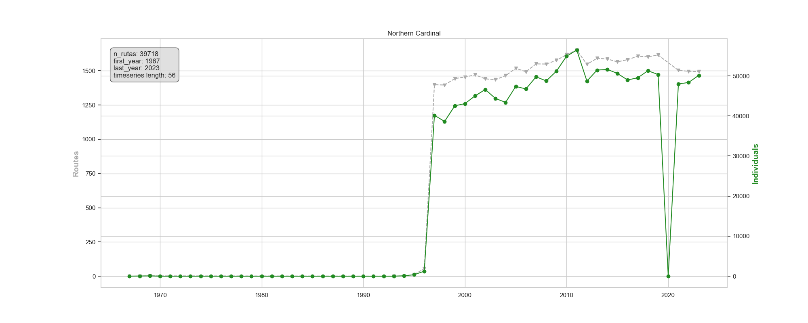{.thumbnail full-src="figs/5930_routes+tts.png"}
  547          5935    78        1997         2023        26                  unid. Northern Cardinal / Pyrrhuloxia                 unid Cardinal rouge / Cardinal pyrrhuloxia           Passeriformes       Cardinalidae        Cardinalis                cardinalis / sinuatus                          {.thumbnail full-src="https://placehold.co/600x400/cccccc/000000?text=No+Image+Available"}
  548          5940    1696      1996         2023        27                  Pyrrhuloxia                                           Cardinal pyrrhuloxia                                 Passeriformes       Cardinalidae        Cardinalis                sinuatus                                       {.thumbnail full-src="https://placehold.co/600x400/cccccc/000000?text=No+Image+Available"}
  549          5950    17322     1968         2023        55                  Rose-breasted Grosbeak                                Cardinal à poitrine rose                             Passeriformes       Cardinalidae        Pheucticus                ludovicianus                                   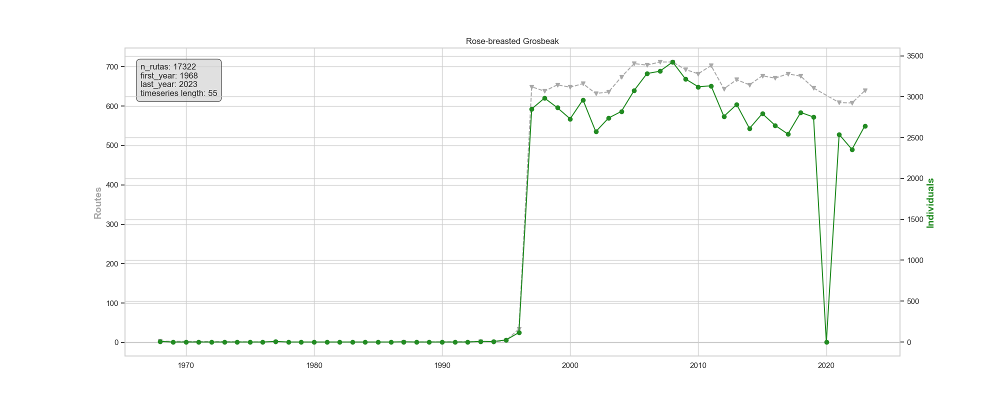{.thumbnail full-src="figs/5950_routes+tts.png"}
  550          5960    10782     1968         2023        55                  Black-headed Grosbeak                                 Cardinal à tête noire                                Passeriformes       Cardinalidae        Pheucticus                melanocephalus                                 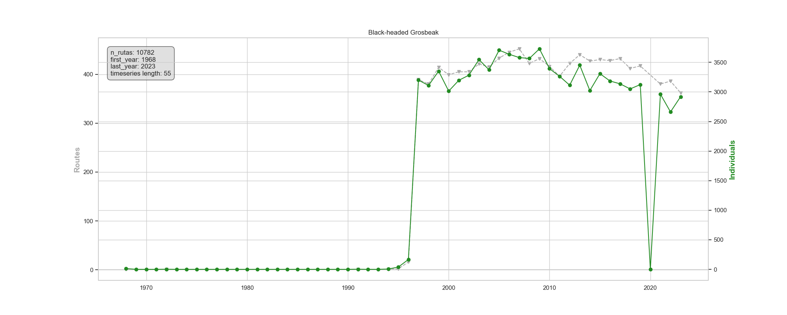{.thumbnail full-src="figs/5960_routes+tts.png"}
  551          5970    21487     1967         2023        56                  Blue Grosbeak                                         Guiraca bleu                                         Passeriformes       Cardinalidae        Passerina                 caerulea                                       {.thumbnail full-src="figs/5970_routes+tts.png"}
  552          5980    35950     1968         2023        55                  Indigo Bunting                                        Passerin indigo                                      Passeriformes       Cardinalidae        Passerina                 cyanea                                         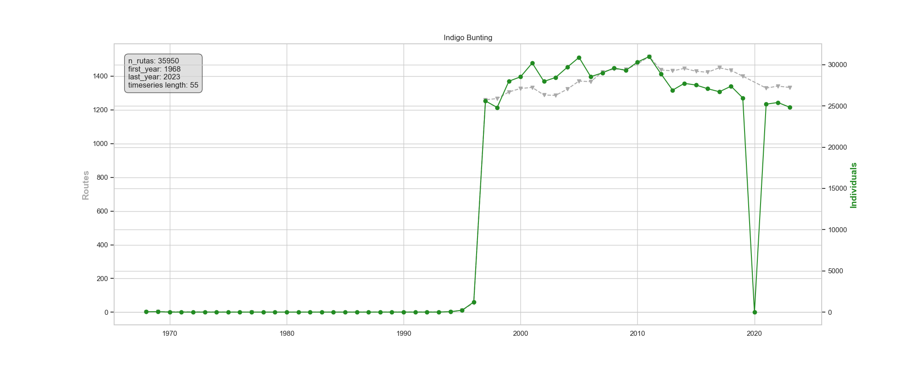{.thumbnail full-src="figs/5980_routes+tts.png"}
  553          5986    4         2009         2022        13                  hybrid Lazuli Bunting x Indigo Bunting                hybride Passerin azuré x Passerin indigo             Passeriformes       Cardinalidae        Passerina                 amoena x cyanea                                {.thumbnail full-src="https://placehold.co/600x400/cccccc/000000?text=No+Image+Available"}
  554          5990    6691      1968         2023        55                  Lazuli Bunting                                        Passerin azuré                                       Passeriformes       Cardinalidae        Passerina                 amoena                                         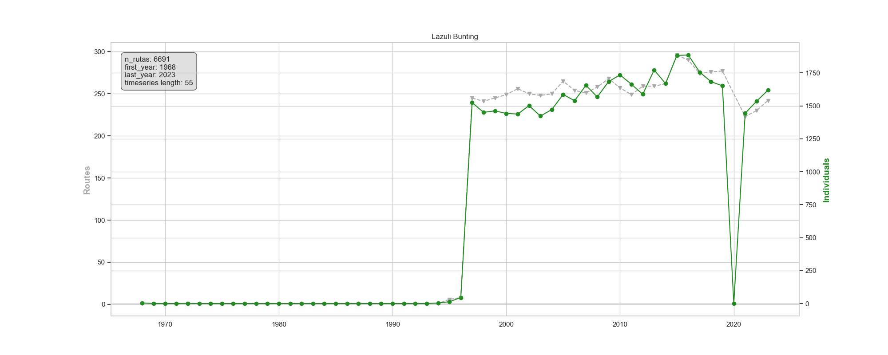{.thumbnail full-src="figs/5990_routes+tts.png"}
  555          6000    210       1997         2023        26                  Varied Bunting                                        Passerin varié                                       Passeriformes       Cardinalidae        Passerina                 versicolor                                     {.thumbnail full-src="https://placehold.co/600x400/cccccc/000000?text=No+Image+Available"}
  556          6010    5292      1967         2023        56                  Painted Bunting                                       Passerin nonpareil                                   Passeriformes       Cardinalidae        Passerina                 ciris                                          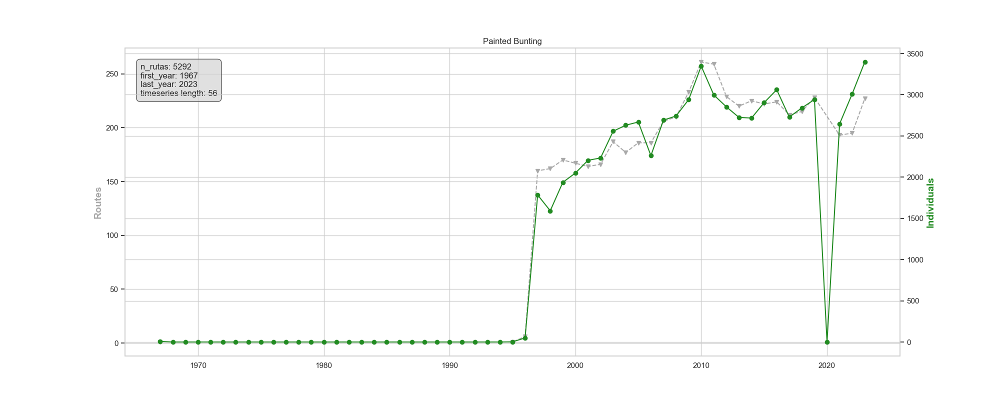{.thumbnail full-src="figs/6010_routes+tts.png"}
  557          6040    14868     1967         2023        56                  Dickcissel                                            Dickcissel d\'Amérique                               Passeriformes       Cardinalidae        Spiza                     americana                                      {.thumbnail full-src="figs/6040_routes+tts.png"}
  558          6050    3912      1991         2023        32                  Lark Bunting                                          Bruant noir et blanc                                 Passeriformes       Passerellidae       Calamospiza               melanocorys                                    {.thumbnail full-src="https://placehold.co/600x400/cccccc/000000?text=No+Image+Available"}
  559          6070    12010     1968         2023        55                  Western Tanager                                       Piranga à tête rouge                                 Passeriformes       Cardinalidae        Piranga                   ludoviciana                                    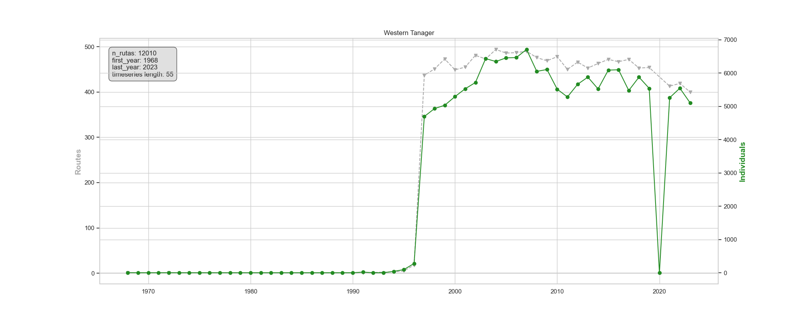{.thumbnail full-src="figs/6070_routes+tts.png"}
  560          6080    17476     1968         2023        55                  Scarlet Tanager                                       Piranga écarlate                                     Passeriformes       Cardinalidae        Piranga                   olivacea                                       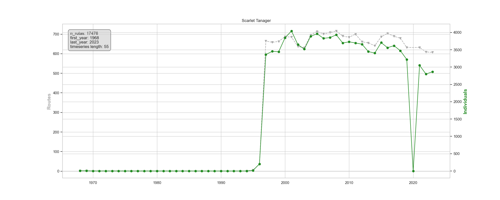{.thumbnail full-src="figs/6080_routes+tts.png"}
  561          6090    739       1997         2023        26                  Hepatic Tanager                                       Piranga orangé                                       Passeriformes       Cardinalidae        Piranga                   flava                                          {.thumbnail full-src="https://placehold.co/600x400/cccccc/000000?text=No+Image+Available"}
  562          6100    16132     1994         2023        29                  Summer Tanager                                        Piranga vermillon                                    Passeriformes       Cardinalidae        Piranga                   rubra                                          {.thumbnail full-src="https://placehold.co/600x400/cccccc/000000?text=No+Image+Available"}
  563          6110    21047     1969         2023        54                  Purple Martin                                         Hirondelle noire                                     Passeriformes       Hirundinidae        Progne                    subis                                          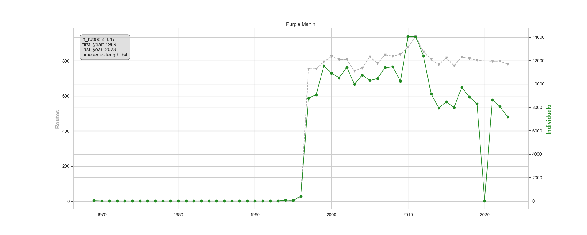{.thumbnail full-src="figs/6110_routes+tts.png"}
  564          6120    26849     1968         2023        55                  Cliff Swallow                                         Hirondelle à front blanc                             Passeriformes       Hirundinidae        Petrochelidon             pyrrhonota                                     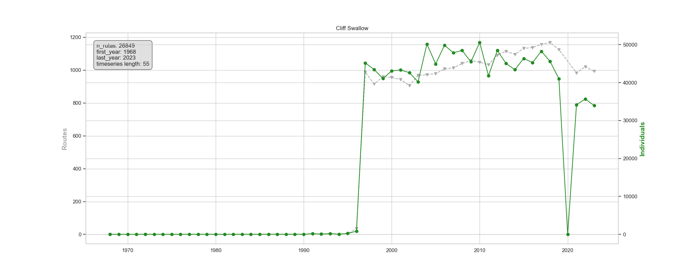{.thumbnail full-src="figs/6120_routes+tts.png"}
  565          6121    1060      1996         2023        27                  Cave Swallow                                          Hirondelle à front brun                              Passeriformes       Hirundinidae        Petrochelidon             fulva                                          {.thumbnail full-src="https://placehold.co/600x400/cccccc/000000?text=No+Image+Available"}
  566          6122    181       1998         2023        25                  unid. Cave Swallow / Cliff Swallow                    unid Hirondelle à front blanc / à front brun         Passeriformes       Hirundinidae        Petrochelidon             pyrrhonota / fulva                             {.thumbnail full-src="https://placehold.co/600x400/cccccc/000000?text=No+Image+Available"}
  567          6130    56035     1968         2023        55                  Barn Swallow                                          Hirondelle rustique                                  Passeriformes       Hirundinidae        Hirundo                   rustica                                        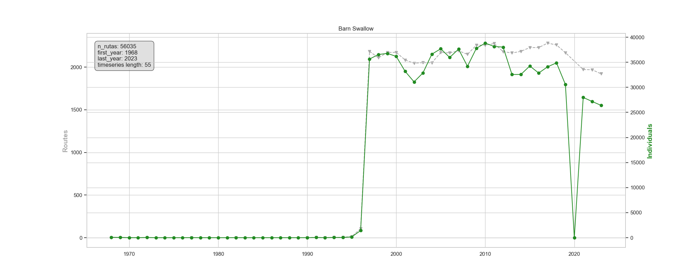{.thumbnail full-src="figs/6130_routes+tts.png"}
  568          6140    32284     1968         2023        55                  Tree Swallow                                          Hirondelle bicolore                                  Passeriformes       Hirundinidae        Tachycineta               bicolor                                        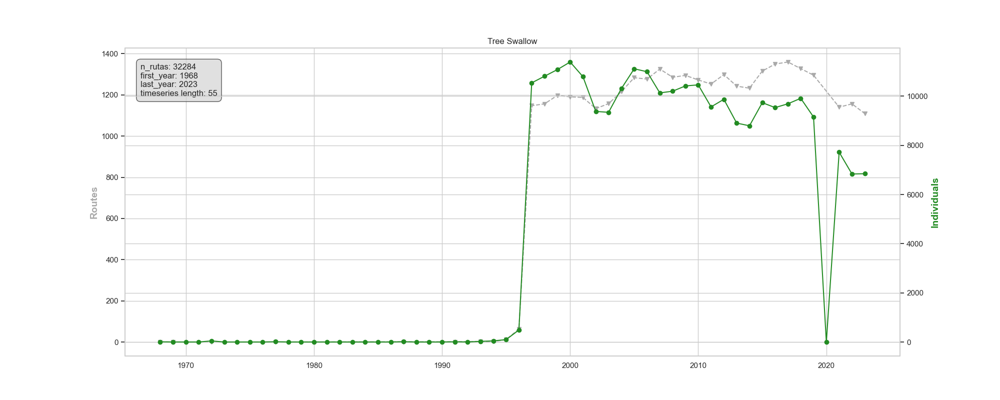{.thumbnail full-src="figs/6140_routes+tts.png"}
  569          6150    10111     1968         2023        55                  Violet-green Swallow                                  Hirondelle à face blanche                            Passeriformes       Hirundinidae        Tachycineta               thalassina                                     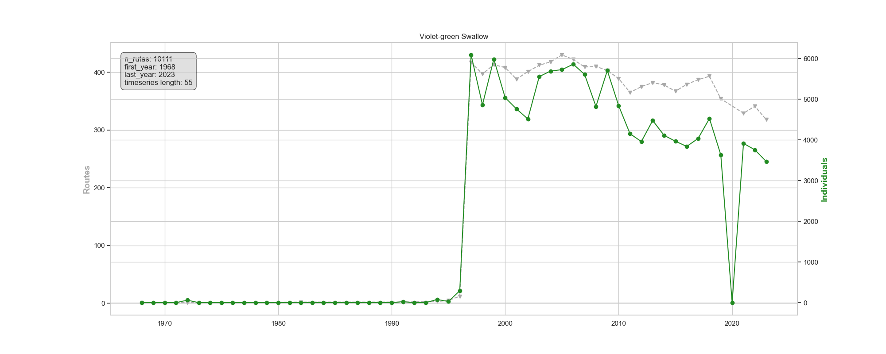{.thumbnail full-src="figs/6150_routes+tts.png"}
  570          6160    7093      1968         2023        55                  Bank Swallow                                          Hirondelle de rivage                                 Passeriformes       Hirundinidae        Riparia                   riparia                                        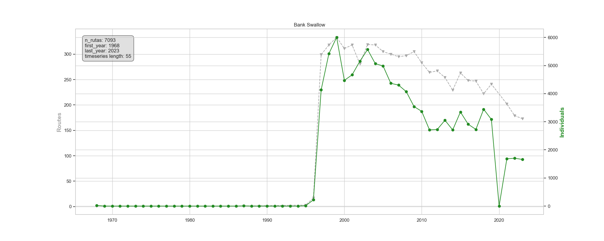{.thumbnail full-src="figs/6160_routes+tts.png"}
  571          6170    20447     1991         2023        32                  Northern Rough-winged Swallow                         Hirondelle à ailes hérissées                         Passeriformes       Hirundinidae        Stelgidopteryx            serripennis                                    {.thumbnail full-src="https://placehold.co/600x400/cccccc/000000?text=No+Image+Available"}
  572          6180    674       1997         2023        26                  Bohemian Waxwing                                      Jaseur boréal                                        Passeriformes       Bombycillidae       Bombycilla                garrulus                                       {.thumbnail full-src="https://placehold.co/600x400/cccccc/000000?text=No+Image+Available"}
  573          6185    8         2004         2023        19                  unid. Cedar Waxwing / Bohemian Waxwing                unid Jaseur sp.                                      Passeriformes       Bombycillidae       Bombycilla                garrulus / cedrorum                            {.thumbnail full-src="https://placehold.co/600x400/cccccc/000000?text=No+Image+Available"}
  574          6190    28842     1968         2023        55                  Cedar Waxwing                                         Jaseur d\'Amérique                                   Passeriformes       Bombycillidae       Bombycilla                cedrorum                                       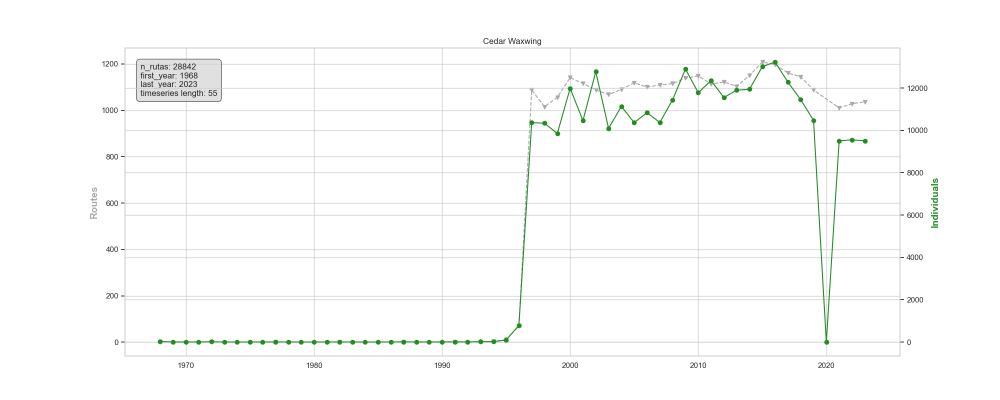{.thumbnail full-src="figs/6190_routes+tts.png"}
  575          6200    1621      1996         2023        27                  Phainopepla                                           Phénopèple luisant                                   Passeriformes       Ptiliogonatidae     Phainopepla               nitens                                         {.thumbnail full-src="https://placehold.co/600x400/cccccc/000000?text=No+Image+Available"}
  576          6210    70        1997         2023        26                  Northern Shrike                                       Pie-grièche boréale                                  Passeriformes       Laniidae            Lanius                    borealis                                       {.thumbnail full-src="https://placehold.co/600x400/cccccc/000000?text=No+Image+Available"}
  577          6220    12991     1967         2023        56                  Loggerhead Shrike                                     Pie-grièche migratrice                               Passeriformes       Laniidae            Lanius                    ludovicianus                                   {.thumbnail full-src="figs/6220_routes+tts.png"}
  578          6230    86        1997         2021        24                  Black-whiskered Vireo                                 Viréo à moustaches                                   Passeriformes       Vireonidae          Vireo                     altiloquus                                     {.thumbnail full-src="https://placehold.co/600x400/cccccc/000000?text=No+Image+Available"}
  579          6240    39825     1968         2023        55                  Red-eyed Vireo                                        Viréo aux yeux rouges                                Passeriformes       Vireonidae          Vireo                     olivaceus                                      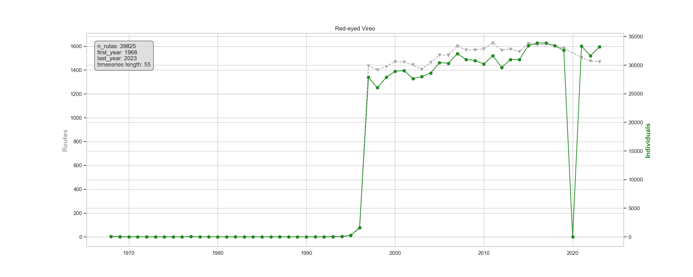{.thumbnail full-src="figs/6240_routes+tts.png"}
  580          6260    1734      1993         2023        30                  Philadelphia Vireo                                    Viréo de Philadelphie                                Passeriformes       Vireonidae          Vireo                     philadelphicus                                 {.thumbnail full-src="https://placehold.co/600x400/cccccc/000000?text=No+Image+Available"}
  581          6270    30823     1968         2023        55                  Warbling Vireo                                        Viréo mélodieux                                      Passeriformes       Vireonidae          Vireo                     gilvus                                         {.thumbnail full-src="figs/6270_routes+tts.png"}
  582          6280    16790     1968         2023        55                  Yellow-throated Vireo                                 Viréo à gorge jaune                                  Passeriformes       Vireonidae          Vireo                     flavifrons                                     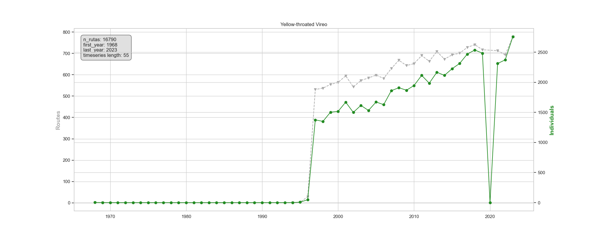{.thumbnail full-src="figs/6280_routes+tts.png"}
  583          6290    9694      1977         2023        46                  Blue-headed Vireo                                     Viréo à tête bleue                                   Passeriformes       Vireonidae          Vireo                     solitarius                                     {.thumbnail full-src="https://placehold.co/600x400/cccccc/000000?text=No+Image+Available"}
  584          6291    4816      1968         2023        55                  Cassin\'s Vireo                                       Viréo de Cassin                                      Passeriformes       Vireonidae          Vireo                     cassinii                                       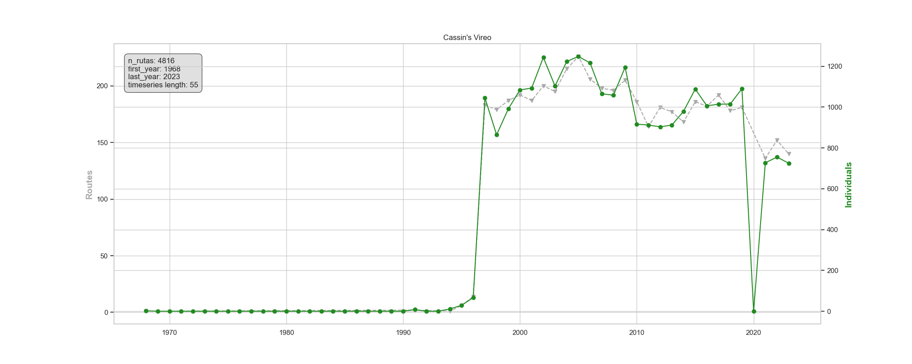{.thumbnail full-src="figs/6291_routes+tts.png"}
  585          6292    2869      1997         2023        26                  Plumbeous Vireo                                       Viréo plombé                                         Passeriformes       Vireonidae          Vireo                     plumbeus                                       {.thumbnail full-src="https://placehold.co/600x400/cccccc/000000?text=No+Image+Available"}
  586          6295    20        1968         2023        55                  unid. Cassin\'s Vireo / Blue-headed Vireo             unid Viréo de Cassin / Viréo à tête bleue            Passeriformes       Vireonidae          Vireo                     cassinii / solitarius                          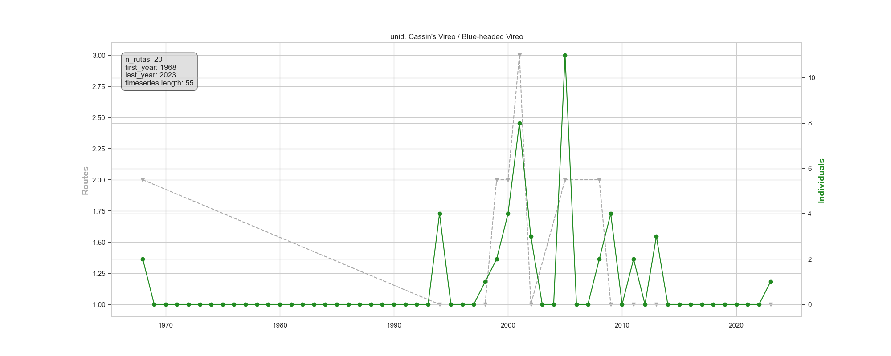{.thumbnail full-src="figs/6295_routes+tts.png"}
  587          6296    6         1997         2023        26                  unid. Plumbeous Vireo / Cassin\'s Vireo               unid Viréo plombé / Viréo de Cassin                  Passeriformes       Vireonidae          Vireo                     plumbeus / cassinii                            {.thumbnail full-src="https://placehold.co/600x400/cccccc/000000?text=No+Image+Available"}
  588          6300    144       1997         2023        26                  Black-capped Vireo                                    Viréo à tête noire                                   Passeriformes       Vireonidae          Vireo                     atricapilla                                    {.thumbnail full-src="https://placehold.co/600x400/cccccc/000000?text=No+Image+Available"}
  589          6310    18921     1969         2023        54                  White-eyed Vireo                                      Viréo aux yeux blancs                                Passeriformes       Vireonidae          Vireo                     griseus                                        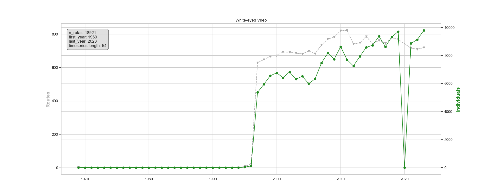{.thumbnail full-src="figs/6310_routes+tts.png"}
  590          6320    2116      1968         2023        55                  Hutton\'s Vireo                                       Viréo de Hutton                                      Passeriformes       Vireonidae          Vireo                     huttoni                                        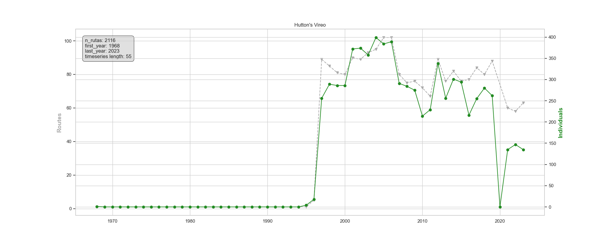{.thumbnail full-src="figs/6320_routes+tts.png"}
  591          6330    3934      1996         2023        27                  Bell\'s Vireo                                         Viréo de Bell                                        Passeriformes       Vireonidae          Vireo                     bellii                                         {.thumbnail full-src="https://placehold.co/600x400/cccccc/000000?text=No+Image+Available"}
  592          6340    858       1997         2023        26                  Gray Vireo                                            Viréo gris                                           Passeriformes       Vireonidae          Vireo                     vicinior                                       {.thumbnail full-src="https://placehold.co/600x400/cccccc/000000?text=No+Image+Available"}
  593          6360    14749     1977         2023        46                  Black-and-white Warbler                               Paruline noir et blanc                               Passeriformes       Parulidae           Mniotilta                 varia                                          {.thumbnail full-src="https://placehold.co/600x400/cccccc/000000?text=No+Image+Available"}
  594          6370    5727      1995         2023        28                  Prothonotary Warbler                                  Paruline orangée                                     Passeriformes       Parulidae           Protonotaria              citrea                                         {.thumbnail full-src="https://placehold.co/600x400/cccccc/000000?text=No+Image+Available"}
  595          6380    1942      1995         2023        28                  Swainson\'s Warbler                                   Paruline de Swainson                                 Passeriformes       Parulidae           Limnothlypis              swainsonii                                     {.thumbnail full-src="https://placehold.co/600x400/cccccc/000000?text=No+Image+Available"}
  596          6390    4496      1995         2023        28                  Worm-eating Warbler                                   Paruline vermivore                                   Passeriformes       Parulidae           Helmitheros               vermivorum                                     {.thumbnail full-src="https://placehold.co/600x400/cccccc/000000?text=No+Image+Available"}
  597          6410    3692      1995         2023        28                  Blue-winged Warbler                                   Paruline à ailes bleues                              Passeriformes       Parulidae           Vermivora                 cyanoptera                                     {.thumbnail full-src="https://placehold.co/600x400/cccccc/000000?text=No+Image+Available"}
  598          6412    9         1998         2014        16                  Brewster\'s Warbler (Golden-winged x Blue-winged)     Paruline de Brewster                                 Passeriformes       Parulidae           Vermivora                 cyanoptera x chrysoptera                       {.thumbnail full-src="https://placehold.co/600x400/cccccc/000000?text=No+Image+Available"}
  599          6413    2         2001         2023        22                  Lawrence\'s Warbler (Golden-winged x Blue-winged)     Paruline de Lawrence                                 Passeriformes       Parulidae           Vermivora                 chrysoptera x cyanoptera                       {.thumbnail full-src="https://placehold.co/600x400/cccccc/000000?text=No+Image+Available"}
  600          6420    1240      1997         2023        26                  Golden-winged Warbler                                 Paruline à ailes dorées                              Passeriformes       Parulidae           Vermivora                 chrysoptera                                    {.thumbnail full-src="https://placehold.co/600x400/cccccc/000000?text=No+Image+Available"}
  601          6430    1082      1996         2023        27                  Lucy\'s Warbler                                       Paruline de Lucy                                     Passeriformes       Parulidae           Leiothlypis               luciae                                         {.thumbnail full-src="https://placehold.co/600x400/cccccc/000000?text=No+Image+Available"}
  602          6440    1575      1997         2023        26                  Virginia\'s Warbler                                   Paruline de Virginia                                 Passeriformes       Parulidae           Leiothlypis               virginiae                                      {.thumbnail full-src="https://placehold.co/600x400/cccccc/000000?text=No+Image+Available"}
  603          6450    8749      1977         2023        46                  Nashville Warbler                                     Paruline à joues grises                              Passeriformes       Parulidae           Leiothlypis               ruficapilla                                    {.thumbnail full-src="https://placehold.co/600x400/cccccc/000000?text=No+Image+Available"}
  604          6460    10088     1968         2023        55                  Orange-crowned Warbler                                Paruline verdâtre                                    Passeriformes       Parulidae           Leiothlypis               celata                                         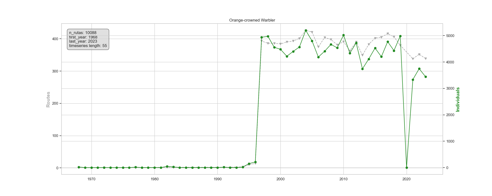{.thumbnail full-src="figs/6460_routes+tts.png"}
  605          6470    3498      1968         2023        55                  Tennessee Warbler                                     Paruline obscure                                     Passeriformes       Parulidae           Leiothlypis               peregrina                                      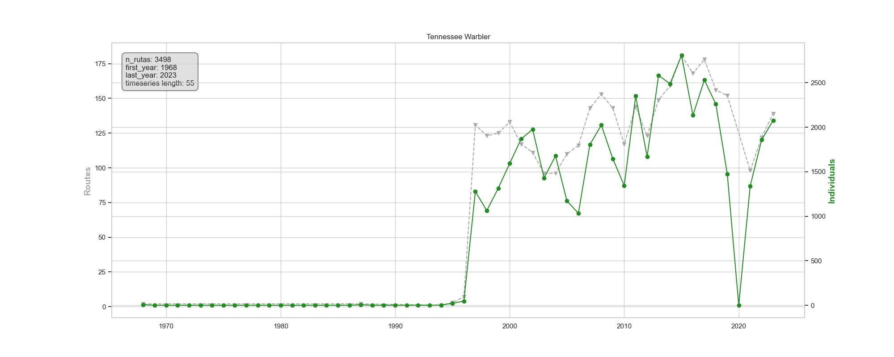{.thumbnail full-src="figs/6470_routes+tts.png"}
  606          6480    18343     1968         2023        55                  Northern Parula                                       Paruline à collier                                   Passeriformes       Parulidae           Setophaga                 americana                                      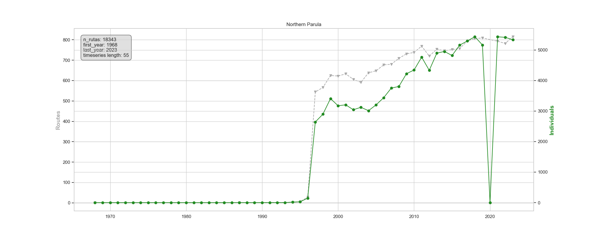{.thumbnail full-src="figs/6480_routes+tts.png"}
  607          6490    9         1997         2019        22                  Tropical Parula                                       Paruline à joues noires                              Passeriformes       Parulidae           Setophaga                 pitiayumi                                      {.thumbnail full-src="https://placehold.co/600x400/cccccc/000000?text=No+Image+Available"}
  608          6500    1544      1996         2023        27                  Cape May Warbler                                      Paruline tigrée                                      Passeriformes       Parulidae           Setophaga                 tigrina                                        {.thumbnail full-src="https://placehold.co/600x400/cccccc/000000?text=No+Image+Available"}
  609          6510    232       1997         2023        26                  Olive Warbler                                         Fauvine des pins                                     Passeriformes       Peucedramidae       Peucedramus               taeniatus                                      {.thumbnail full-src="https://placehold.co/600x400/cccccc/000000?text=No+Image+Available"}
  610          6520    37700     1968         2023        55                  Yellow Warbler                                        Paruline jaune                                       Passeriformes       Parulidae           Setophaga                 petechia                                       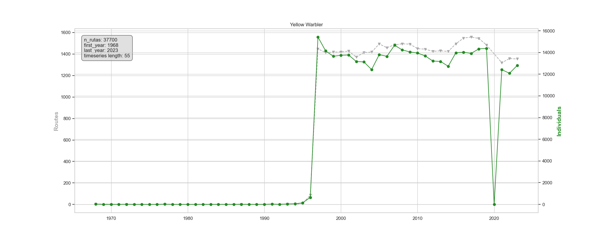{.thumbnail full-src="figs/6520_routes+tts.png"}
  611          6540    5384      1994         2023        29                  Black-throated Blue Warbler                           Paruline bleue                                       Passeriformes       Parulidae           Setophaga                 caerulescens                                   {.thumbnail full-src="https://placehold.co/600x400/cccccc/000000?text=No+Image+Available"}
  612          6550    10948     1968         2023        55                  (Myrtle Warbler) Yellow-rumped Warbler                Paruline à croupion jaune (groupe coronata)          Passeriformes       Parulidae           Setophaga                 coronata coronata                              {.thumbnail full-src="figs/6550_routes+tts.png"}
  613          6556    699       1982         2023        41                  (unid. Myrtle / Audubon\'s) Yellow-rumped Warbler     Par. à croupion jaune (sous-espèce non identifié)    Passeriformes       Parulidae           Setophaga                 coronata                                       {.thumbnail full-src="https://placehold.co/600x400/cccccc/000000?text=No+Image+Available"}
  614          6560    9032      1972         2023        51                  (Audubon\'s Warbler) Yellow-rumped Warbler            Paruline à croupion jaune (groupe auduboni)          Passeriformes       Parulidae           Setophaga                 coronata audoboni                              {.thumbnail full-src="figs/6560_routes+tts.png"}
  615          6570    7293      1968         2023        55                  Magnolia Warbler                                      Paruline à tête cendrée                              Passeriformes       Parulidae           Setophaga                 magnolia                                       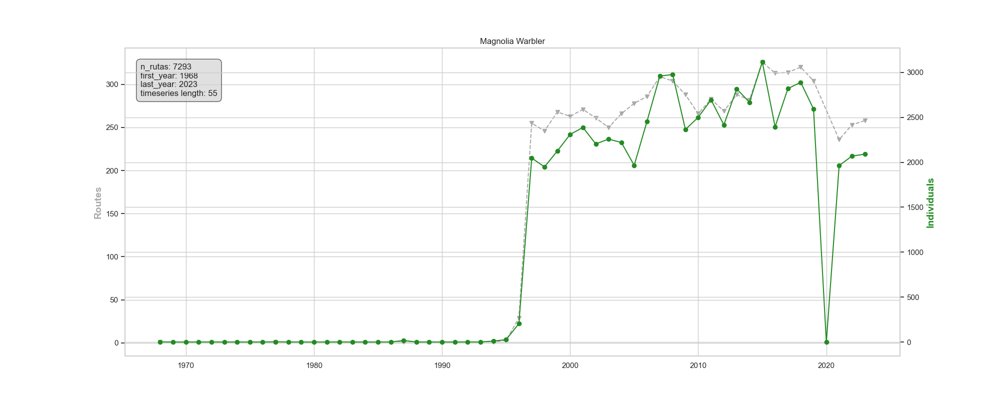{.thumbnail full-src="figs/6570_routes+tts.png"}
  616          6580    1739      1996         2023        27                  Cerulean Warbler                                      Paruline azurée                                      Passeriformes       Parulidae           Setophaga                 cerulea                                        {.thumbnail full-src="https://placehold.co/600x400/cccccc/000000?text=No+Image+Available"}
  617          6590    11765     1968         2023        55                  Chestnut-sided Warbler                                Paruline à flancs marron                             Passeriformes       Parulidae           Setophaga                 pensylvanica                                   {.thumbnail full-src="figs/6590_routes+tts.png"}
  618          6600    1328      1977         2023        46                  Bay-breasted Warbler                                  Paruline à poitrine baie                             Passeriformes       Parulidae           Setophaga                 castanea                                       {.thumbnail full-src="https://placehold.co/600x400/cccccc/000000?text=No+Image+Available"}
  619          6610    2302      1987         2023        36                  Blackpoll Warbler                                     Paruline rayée                                       Passeriformes       Parulidae           Setophaga                 striata                                        {.thumbnail full-src="https://placehold.co/600x400/cccccc/000000?text=No+Image+Available"}
  620          6620    6077      1977         2023        46                  Blackburnian Warbler                                  Paruline à gorge orangée                             Passeriformes       Parulidae           Setophaga                 fusca                                          {.thumbnail full-src="https://placehold.co/600x400/cccccc/000000?text=No+Image+Available"}
  621          6630    6602      1995         2023        28                  Yellow-throated Warbler                               Paruline à gorge jaune                               Passeriformes       Parulidae           Setophaga                 dominica                                       {.thumbnail full-src="https://placehold.co/600x400/cccccc/000000?text=No+Image+Available"}
  622          6640    959       1997         2023        26                  Grace\'s Warbler                                      Paruline de Grace                                    Passeriformes       Parulidae           Setophaga                 graciae                                        {.thumbnail full-src="https://placehold.co/600x400/cccccc/000000?text=No+Image+Available"}
  623          6650    3841      1968         2023        55                  Black-throated Gray Warbler                           Paruline grise                                       Passeriformes       Parulidae           Setophaga                 nigrescens                                     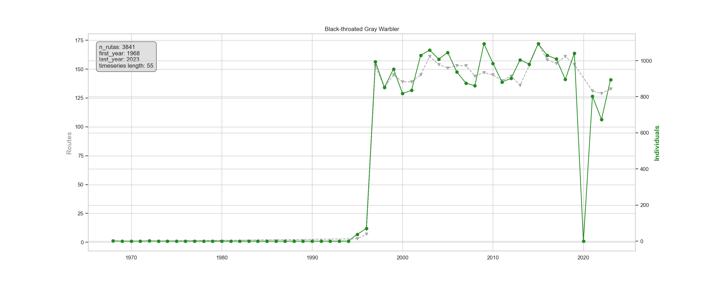{.thumbnail full-src="figs/6650_routes+tts.png"}
  624          6660    60        1997         2023        26                  Golden-cheeked Warbler                                Paruline à dos noir                                  Passeriformes       Parulidae           Setophaga                 chrysoparia                                    {.thumbnail full-src="https://placehold.co/600x400/cccccc/000000?text=No+Image+Available"}
  625          6670    9602      1977         2023        46                  Black-throated Green Warbler                          Paruline à gorge noire                               Passeriformes       Parulidae           Setophaga                 virens                                         {.thumbnail full-src="https://placehold.co/600x400/cccccc/000000?text=No+Image+Available"}
  626          6680    3841      1991         2023        32                  Townsend\'s Warbler                                   Paruline de Townsend                                 Passeriformes       Parulidae           Setophaga                 townsendi                                      {.thumbnail full-src="https://placehold.co/600x400/cccccc/000000?text=No+Image+Available"}
  627          6685    66        1997         2023        26                  unid. Townsend\'s Warbler / Hermit Warbler            unid Paruline de Townsend / Paruline à tête jaune    Passeriformes       Parulidae           Setophaga                 townsendi / occidentalis                       {.thumbnail full-src="https://placehold.co/600x400/cccccc/000000?text=No+Image+Available"}
  628          6686    5         2013         2017        4                   hybrid Townsend\'s Warbler x Hermit Warbler           hybride Paruline de Townsend x à tête jaune          Passeriformes       Parulidae           Setophaga                 townsendi x occidentalis                       {.thumbnail full-src="https://placehold.co/600x400/cccccc/000000?text=No+Image+Available"}
  629          6690    1814      1995         2023        28                  Hermit Warbler                                        Paruline à tête jaune                                Passeriformes       Parulidae           Setophaga                 occidentalis                                   {.thumbnail full-src="https://placehold.co/600x400/cccccc/000000?text=No+Image+Available"}
  630          6700    45        2000         2023        23                  Kirtland\'s Warbler                                   Paruline de Kirtland                                 Passeriformes       Parulidae           Setophaga                 kirtlandii                                     {.thumbnail full-src="https://placehold.co/600x400/cccccc/000000?text=No+Image+Available"}
  631          6710    17611     1968         2023        55                  Pine Warbler                                          Paruline des pins                                    Passeriformes       Parulidae           Setophaga                 pinus                                          {.thumbnail full-src="figs/6710_routes+tts.png"}
  632          6720    1040      1977         2023        46                  Palm Warbler                                          Paruline à couronne rousse                           Passeriformes       Parulidae           Setophaga                 palmarum                                       {.thumbnail full-src="https://placehold.co/600x400/cccccc/000000?text=No+Image+Available"}
  633          6730    10086     1968         2023        55                  Prairie Warbler                                       Paruline des prés                                    Passeriformes       Parulidae           Setophaga                 discolor                                       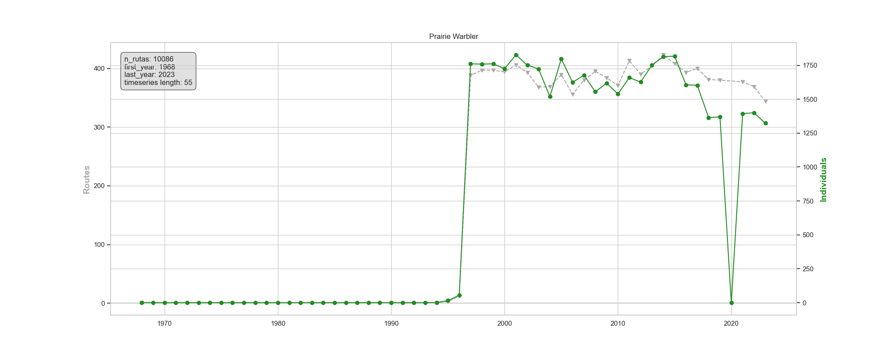{.thumbnail full-src="figs/6730_routes+tts.png"}
  634          6740    22802     1968         2023        55                  Ovenbird                                              Paruline couronnée                                   Passeriformes       Parulidae           Seiurus                   aurocapilla                                    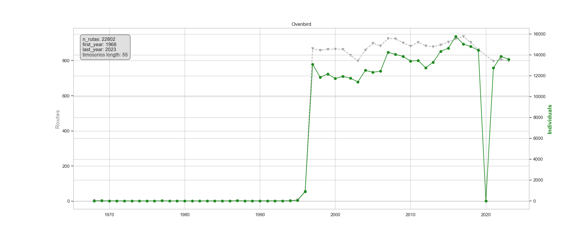{.thumbnail full-src="figs/6740_routes+tts.png"}
  635          6750    8039      1968         2023        55                  Northern Waterthrush                                  Paruline des ruisseaux                               Passeriformes       Parulidae           Parkesia                  noveboracensis                                 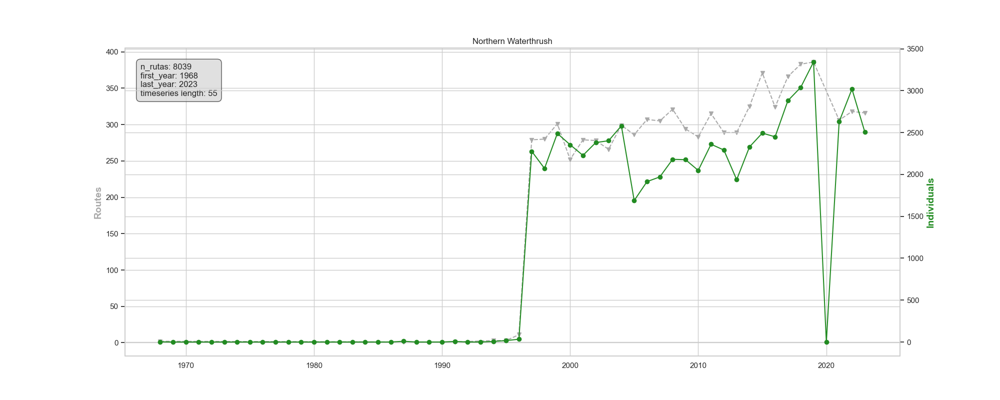{.thumbnail full-src="figs/6750_routes+tts.png"}
  636          6760    5897      1969         2023        54                  Louisiana Waterthrush                                 Paruline hochequeue                                  Passeriformes       Parulidae           Parkesia                  motacilla                                      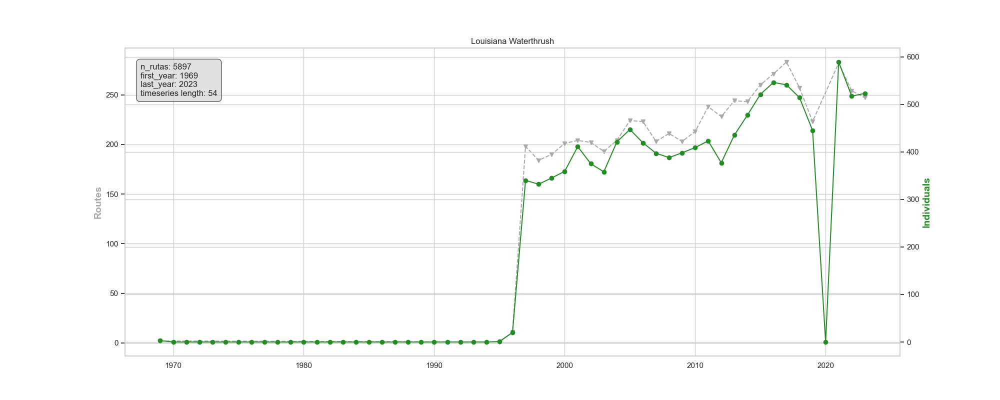{.thumbnail full-src="figs/6760_routes+tts.png"}
  637          6770    8425      1968         2023        55                  Kentucky Warbler                                      Paruline du Kentucky                                 Passeriformes       Parulidae           Geothlypis                formosa                                        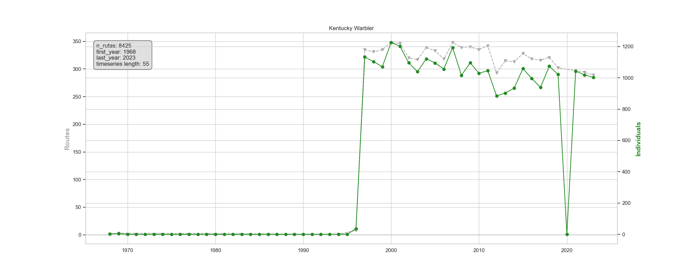{.thumbnail full-src="figs/6770_routes+tts.png"}
  638          6780    869       1977         2023        46                  Connecticut Warbler                                   Paruline à gorge grise                               Passeriformes       Parulidae           Oporornis                 agilis                                         {.thumbnail full-src="https://placehold.co/600x400/cccccc/000000?text=No+Image+Available"}
  639          6790    5951      1968         2023        55                  Mourning Warbler                                      Paruline triste                                      Passeriformes       Parulidae           Geothlypis                philadelphia                                   {.thumbnail full-src="figs/6790_routes+tts.png"}
  640          6800    7468      1972         2023        51                  MacGillivray\'s Warbler                               Paruline des buissons                                Passeriformes       Parulidae           Geothlypis                tolmiei                                        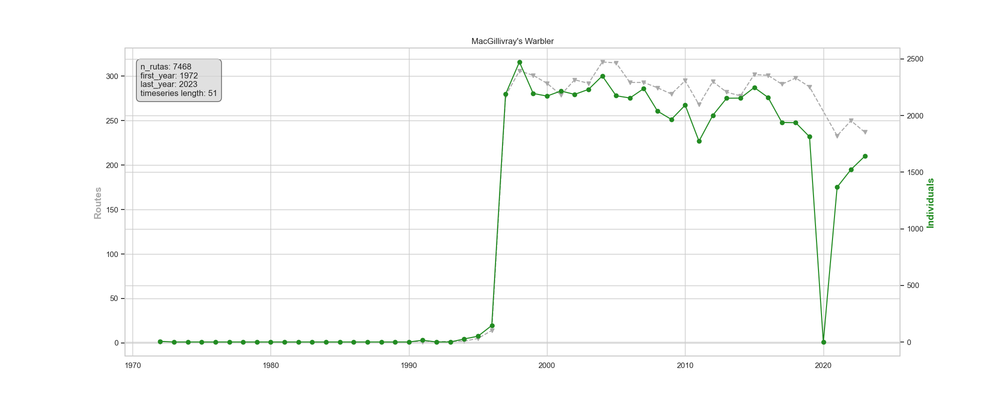{.thumbnail full-src="figs/6800_routes+tts.png"}
  641          6810    49429     1968         2023        55                  Common Yellowthroat                                   Paruline masquée                                     Passeriformes       Parulidae           Geothlypis                trichas                                        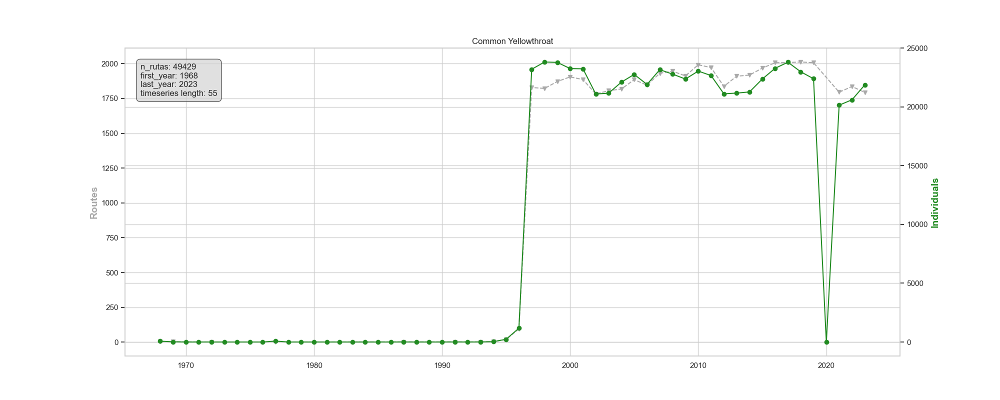{.thumbnail full-src="figs/6810_routes+tts.png"}
  642          6830    21044     1968         2023        55                  Yellow-breasted Chat                                  Ictérie polyglotte                                   Passeriformes       Icteriidae          Icteria                   virens                                         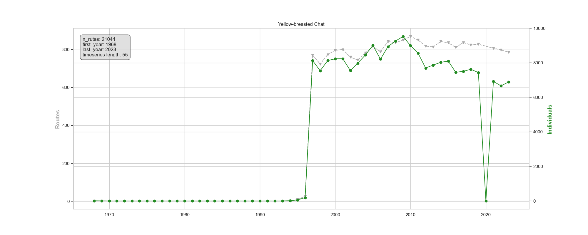{.thumbnail full-src="figs/6830_routes+tts.png"}
  643          6840    11463     1968         2023        55                  Hooded Warbler                                        Paruline à capuchon                                  Passeriformes       Parulidae           Setophaga                 citrina                                        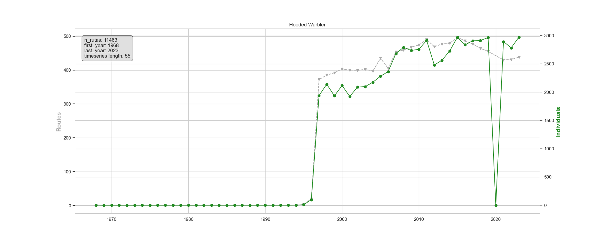{.thumbnail full-src="figs/6840_routes+tts.png"}
  644          6850    8586      1972         2023        51                  Wilson\'s Warbler                                     Paruline à calotte noire                             Passeriformes       Parulidae           Cardellina                pusilla                                        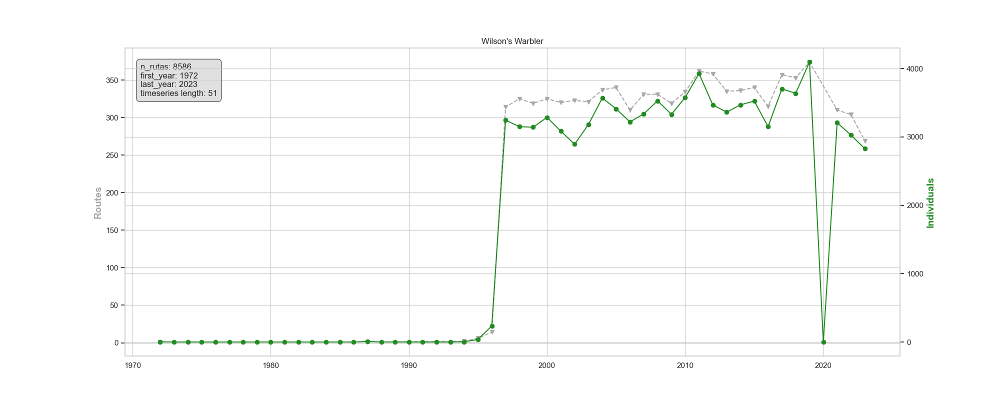{.thumbnail full-src="figs/6850_routes+tts.png"}
  645          6860    3213      1994         2023        29                  Canada Warbler                                        Paruline du Canada                                   Passeriformes       Parulidae           Cardellina                canadensis                                     {.thumbnail full-src="https://placehold.co/600x400/cccccc/000000?text=No+Image+Available"}
  646          6870    19011     1968         2023        55                  American Redstart                                     Paruline flamboyante                                 Passeriformes       Parulidae           Setophaga                 ruticilla                                      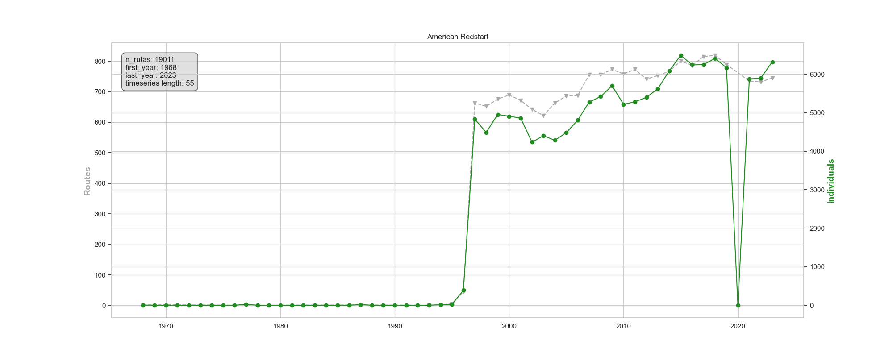{.thumbnail full-src="figs/6870_routes+tts.png"}
  647          6880    258       1997         2023        26                  Painted Redstart                                      Paruline à ailes blanches                            Passeriformes       Parulidae           Myioborus                 pictus                                         {.thumbnail full-src="https://placehold.co/600x400/cccccc/000000?text=No+Image+Available"}
  648          6882    45305     1967         2023        56                  House Sparrow                                         Moineau domestique                                   Passeriformes       Passeridae          Passer                    domesticus                                     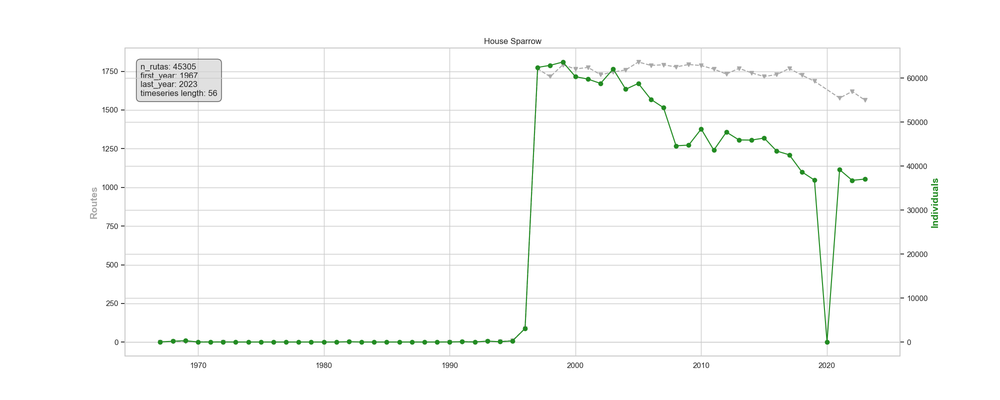{.thumbnail full-src="figs/6882_routes+tts.png"}
  649          6883    672       1997         2023        26                  Eurasian Tree Sparrow                                 Moineau friquet                                      Passeriformes       Passeridae          Passer                    montanus                                       {.thumbnail full-src="https://placehold.co/600x400/cccccc/000000?text=No+Image+Available"}
  650          6900    300       1997         2023        26                  Red-faced Warbler                                     Paruline à face rouge                                Passeriformes       Parulidae           Cardellina                rubrifrons                                     {.thumbnail full-src="https://placehold.co/600x400/cccccc/000000?text=No+Image+Available"}
  651          6960    217       1997         2023        26                  Eastern Yellow Wagtail                                Bergeronnette de Béringie                            Passeriformes       Motacillidae        Motacilla                 tschutschensis                                 {.thumbnail full-src="https://placehold.co/600x400/cccccc/000000?text=No+Image+Available"}
  652          6970    279       1997         2023        26                  American Pipit                                        Pipit d\'Amérique                                    Passeriformes       Motacillidae        Anthus                    rubescens                                      {.thumbnail full-src="https://placehold.co/600x400/cccccc/000000?text=No+Image+Available"}
  653          6990    3         2006         2008        2                   Red-throated Pipit                                    Pipit à gorge rousse                                 Passeriformes       Motacillidae        Anthus                    cervinus                                       {.thumbnail full-src="https://placehold.co/600x400/cccccc/000000?text=No+Image+Available"}
  654          7000    1412      1982         2023        41                  Sprague\'s Pipit                                      Pipit de Sprague                                     Passeriformes       Motacillidae        Anthus                    spragueii                                      {.thumbnail full-src="https://placehold.co/600x400/cccccc/000000?text=No+Image+Available"}
  655          7010    918       1996         2023        27                  American Dipper                                       Cincle d\'Amérique                                   Passeriformes       Cinclidae           Cinclus                   mexicanus                                      {.thumbnail full-src="https://placehold.co/600x400/cccccc/000000?text=No+Image+Available"}
  656          7020    4496      1991         2023        32                  Sage Thrasher                                         Moqueur des armoises                                 Passeriformes       Mimidae             Oreoscoptes               montanus                                       {.thumbnail full-src="https://placehold.co/600x400/cccccc/000000?text=No+Image+Available"}
  657          7030    34477     1967         2023        56                  Northern Mockingbird                                  Moqueur polyglotte                                   Passeriformes       Mimidae             Mimus                     polyglottos                                    {.thumbnail full-src="figs/7030_routes+tts.png"}
  658          7031    1         2002         2002        0                   Bahama Mockingbird                                    Moqueur des Bahamas                                  Passeriformes       Mimidae             Mimus                     gundlachii                                     {.thumbnail full-src="https://placehold.co/600x400/cccccc/000000?text=No+Image+Available"}
  659          7040    33054     1968         2023        55                  Gray Catbird                                          Moqueur chat                                         Passeriformes       Mimidae             Dumetella                 carolinensis                                   {.thumbnail full-src="figs/7040_routes+tts.png"}
  660          7050    32441     1968         2023        55                  Brown Thrasher                                        Moqueur roux                                         Passeriformes       Mimidae             Toxostoma                 rufum                                          {.thumbnail full-src="figs/7050_routes+tts.png"}
  661          7060    372       1996         2023        27                  Long-billed Thrasher                                  Moqueur à long bec                                   Passeriformes       Mimidae             Toxostoma                 longirostre                                    {.thumbnail full-src="https://placehold.co/600x400/cccccc/000000?text=No+Image+Available"}
  662          7070    2300      1996         2023        27                  Curve-billed Thrasher                                 Moqueur à bec courbe                                 Passeriformes       Mimidae             Toxostoma                 curvirostre                                    {.thumbnail full-src="https://placehold.co/600x400/cccccc/000000?text=No+Image+Available"}
  663          7080    345       1997         2023        26                  Bendire\'s Thrasher                                   Moqueur de Bendire                                   Passeriformes       Mimidae             Toxostoma                 bendirei                                       {.thumbnail full-src="https://placehold.co/600x400/cccccc/000000?text=No+Image+Available"}
  664          7100    660       1968         2023        55                  California Thrasher                                   Moqueur de Californie                                Passeriformes       Mimidae             Toxostoma                 redivivum                                      {.thumbnail full-src="figs/7100_routes+tts.png"}
  665          7110    171       1997         2023        26                  LeConte\'s Thrasher                                   Moqueur de LeConte                                   Passeriformes       Mimidae             Toxostoma                 lecontei                                       {.thumbnail full-src="https://placehold.co/600x400/cccccc/000000?text=No+Image+Available"}
  666          7120    603       1997         2023        26                  Crissal Thrasher                                      Moqueur cul-roux                                     Passeriformes       Mimidae             Toxostoma                 crissale                                       {.thumbnail full-src="https://placehold.co/600x400/cccccc/000000?text=No+Image+Available"}
  667          7130    2929      1996         2023        27                  Cactus Wren                                           Troglodyte des cactus                                Passeriformes       Troglodytidae       Campylorhynchus           brunneicapillus                                {.thumbnail full-src="https://placehold.co/600x400/cccccc/000000?text=No+Image+Available"}
  668          7150    7830      1994         2023        29                  Rock Wren                                             Troglodyte des rochers                               Passeriformes       Troglodytidae       Salpinctes                obsoletus                                      {.thumbnail full-src="https://placehold.co/600x400/cccccc/000000?text=No+Image+Available"}
  669          7170    1885      1994         2023        29                  Canyon Wren                                           Troglodyte des canyons                               Passeriformes       Troglodytidae       Catherpes                 mexicanus                                      {.thumbnail full-src="https://placehold.co/600x400/cccccc/000000?text=No+Image+Available"}
  670          7180    26741     1968         2023        55                  Carolina Wren                                         Troglodyte de Caroline                               Passeriformes       Troglodytidae       Thryothorus               ludovicianus                                   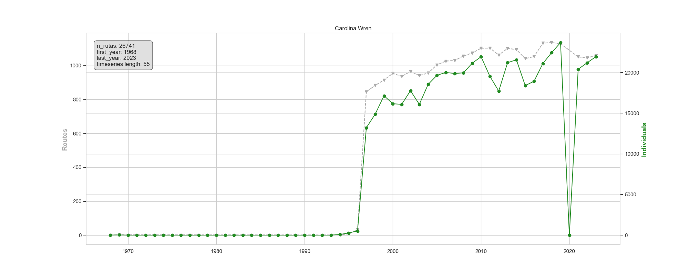{.thumbnail full-src="figs/7180_routes+tts.png"}
  671          7190    7153      1968         2023        55                  Bewick\'s Wren                                        Troglodyte de Bewick                                 Passeriformes       Troglodytidae       Thryomanes                bewickii                                       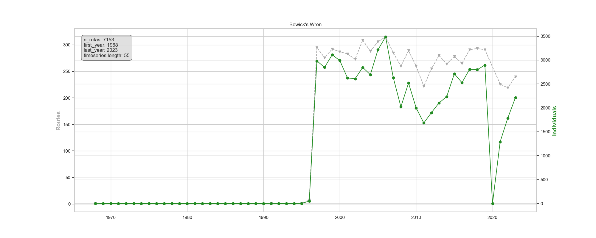{.thumbnail full-src="figs/7190_routes+tts.png"}
  672          7210    36031     1968         2023        55                  House Wren                                            Troglodyte familier                                  Passeriformes       Troglodytidae       Troglodytes               aedon                                          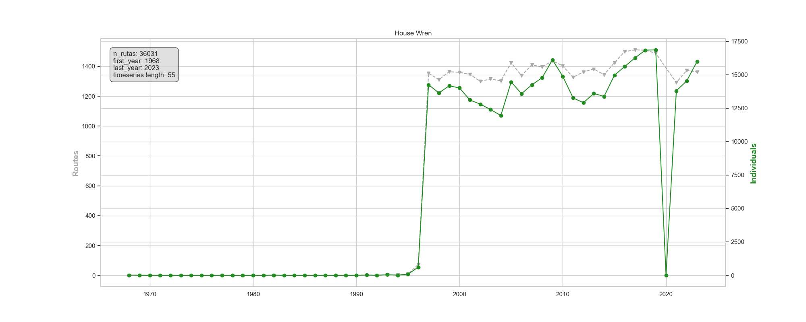{.thumbnail full-src="figs/7210_routes+tts.png"}
  673          7220    29        1997         2023        26                  unid. Pacific Wren / Winter Wren                      unid Troglodyte des forêts / Troglodyte de Baird     Passeriformes       Troglodytidae       Troglodytes               pacificus / hiemalis                           {.thumbnail full-src="https://placehold.co/600x400/cccccc/000000?text=No+Image+Available"}
  674          7221    4294      1972         2023        51                  Pacific Wren                                          Troglodyte de Baird                                  Passeriformes       Troglodytidae       Troglodytes               pacificus                                      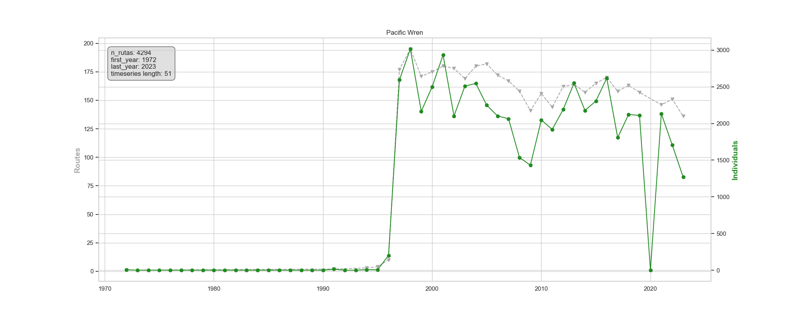{.thumbnail full-src="figs/7221_routes+tts.png"}
  675          7222    6531      1994         2023        29                  Winter Wren                                           Troglodyte des forêts                                Passeriformes       Troglodytidae       Troglodytes               hiemalis                                       {.thumbnail full-src="https://placehold.co/600x400/cccccc/000000?text=No+Image+Available"}
  676          7240    4283      1991         2023        32                  Sedge Wren                                            Troglodyte à bec court                               Passeriformes       Troglodytidae       Cistothorus               stellaris                                      {.thumbnail full-src="https://placehold.co/600x400/cccccc/000000?text=No+Image+Available"}
  677          7250    4128      1993         2023        30                  Marsh Wren                                            Troglodyte des marais                                Passeriformes       Troglodytidae       Cistothorus               palustris                                      {.thumbnail full-src="https://placehold.co/600x400/cccccc/000000?text=No+Image+Available"}
  678          7260    6785      1995         2023        28                  Brown Creeper                                         Grimpereau brun                                      Passeriformes       Certhiidae          Certhia                   americana                                      {.thumbnail full-src="https://placehold.co/600x400/cccccc/000000?text=No+Image+Available"}
  679          7270    27684     1968         2023        55                  White-breasted Nuthatch                               Sittelle à poitrine blanche                          Passeriformes       Sittidae            Sitta                     carolinensis                                   {.thumbnail full-src="figs/7270_routes+tts.png"}
  680          7280    16424     1987         2023        36                  Red-breasted Nuthatch                                 Sittelle à poitrine rousse                           Passeriformes       Sittidae            Sitta                     canadensis                                     {.thumbnail full-src="https://placehold.co/600x400/cccccc/000000?text=No+Image+Available"}
  681          7290    5395      1994         2023        29                  Brown-headed Nuthatch                                 Sittelle à tête brune                                Passeriformes       Sittidae            Sitta                     pusilla                                        {.thumbnail full-src="https://placehold.co/600x400/cccccc/000000?text=No+Image+Available"}
  682          7300    2000      1995         2023        28                  Pygmy Nuthatch                                        Sittelle pygmée                                      Passeriformes       Sittidae            Sitta                     pygmaea                                        {.thumbnail full-src="https://placehold.co/600x400/cccccc/000000?text=No+Image+Available"}
  683          7310    30790     1968         2023        55                  Tufted Titmouse                                       Mésange bicolore                                     Passeriformes       Paridae             Baeolophus                bicolor                                        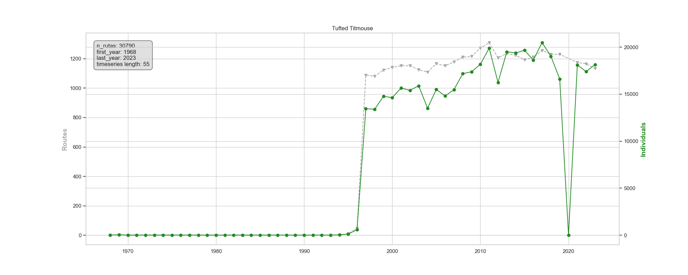{.thumbnail full-src="figs/7310_routes+tts.png"}
  684          7315    74        1997         2023        26                  unid. Tufted Titmouse / Black-crested Titmouse        unid Mésange bicolore / Mésange à plumet noir        Passeriformes       Paridae             Baeolophus                bicolor / atricristatus                        {.thumbnail full-src="https://placehold.co/600x400/cccccc/000000?text=No+Image+Available"}
  685          7320    1098      1996         2023        27                  Black-crested Titmouse                                Mésange à plumet noir                                Passeriformes       Paridae             Baeolophus                atricristatus                                  {.thumbnail full-src="https://placehold.co/600x400/cccccc/000000?text=No+Image+Available"}
  686          7330    1355      1968         2023        55                  Oak Titmouse                                          Mésange unicolore                                    Passeriformes       Paridae             Baeolophus                inornatus                                      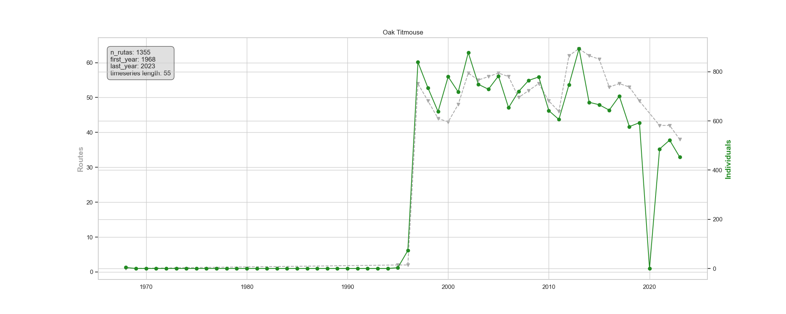{.thumbnail full-src="figs/7330_routes+tts.png"}
  687          7331    1526      1997         2023        26                  Juniper Titmouse                                      Mésange des genévriers                               Passeriformes       Paridae             Baeolophus                ridgwayi                                       {.thumbnail full-src="https://placehold.co/600x400/cccccc/000000?text=No+Image+Available"}
  688          7332    8         1997         2012        15                  unid. Oak Titmouse / Juniper Titmouse                 unid unid Mésange unicolore / Mésange des genévrie   Passeriformes       Paridae             Baeolophus                inornatus / ridgwayi                           {.thumbnail full-src="https://placehold.co/600x400/cccccc/000000?text=No+Image+Available"}
  689          7340    321       1997         2023        26                  Bridled Titmouse                                      Mésange arlequin                                     Passeriformes       Paridae             Baeolophus                wollweberi                                     {.thumbnail full-src="https://placehold.co/600x400/cccccc/000000?text=No+Image+Available"}
  690          7350    27438     1968         2023        55                  Black-capped Chickadee                                Mésange à tête noire                                 Passeriformes       Paridae             Poecile                   atricapillus                                   {.thumbnail full-src="figs/7350_routes+tts.png"}
  691          7351    146       1997         2023        26                  unid. western chickadee species                       unid Mésange sp. de l\'Ouest                         Passeriformes       Paridae             Poecile                   sp.                                            {.thumbnail full-src="https://placehold.co/600x400/cccccc/000000?text=No+Image+Available"}
  692          7352    71        1997         2023        26                  unid. Carolina Chickadee / Black-capped Chickadee     unid Mésange de Caroline / Mésange à tête noire      Passeriformes       Paridae             Poecile                   carolinensis / atricapillus                    {.thumbnail full-src="https://placehold.co/600x400/cccccc/000000?text=No+Image+Available"}
  693          7353    26        1998         2022        24                  unid. Black-capped Chickadee / Mountain Chickadee     unid Mésange à tête noire / Mésange de Gambel        Passeriformes       Paridae             Poecile                   atricapillus / gambeli                         {.thumbnail full-src="https://placehold.co/600x400/cccccc/000000?text=No+Image+Available"}
  694          7354    5         1998         2019        21                  unid. Black-capped Chickadee / Boreal Chickadee       unid Mésange à tête noire / Mésange à tête brune     Passeriformes       Paridae             Poecile                   atricapillus / hudsonicus                      {.thumbnail full-src="https://placehold.co/600x400/cccccc/000000?text=No+Image+Available"}
  695          7360    20148     1968         2023        55                  Carolina Chickadee                                    Mésange de Caroline                                  Passeriformes       Paridae             Poecile                   carolinensis                                   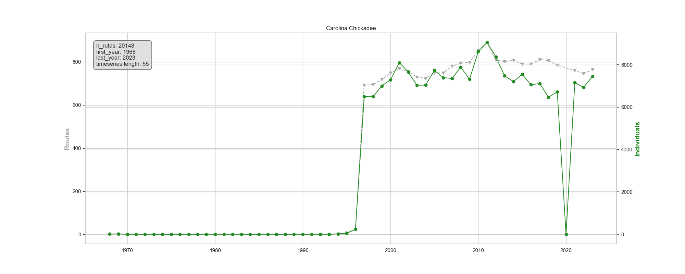{.thumbnail full-src="figs/7360_routes+tts.png"}
  696          7370    25        1997         2023        26                  Mexican Chickadee                                     Mésange grise                                        Passeriformes       Paridae             Poecile                   sclateri                                       {.thumbnail full-src="https://placehold.co/600x400/cccccc/000000?text=No+Image+Available"}
  697          7380    7113      1991         2023        32                  Mountain Chickadee                                    Mésange de Gambel                                    Passeriformes       Paridae             Poecile                   gambeli                                        {.thumbnail full-src="https://placehold.co/600x400/cccccc/000000?text=No+Image+Available"}
  698          7400    2819      1977         2023        46                  Boreal Chickadee                                      Mésange à tête brune                                 Passeriformes       Paridae             Poecile                   hudsonicus                                     {.thumbnail full-src="https://placehold.co/600x400/cccccc/000000?text=No+Image+Available"}
  699          7410    3350      1968         2023        55                  Chestnut-backed Chickadee                             Mésange à dos marron                                 Passeriformes       Paridae             Poecile                   rufescens                                      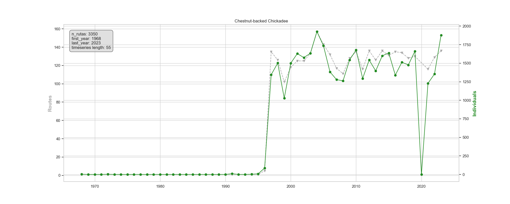{.thumbnail full-src="figs/7410_routes+tts.png"}
  700          7420    1724      1968         2023        55                  Wrentit                                               Cama brune                                           Passeriformes       Sylviidae           Chamaea                   fasciata                                       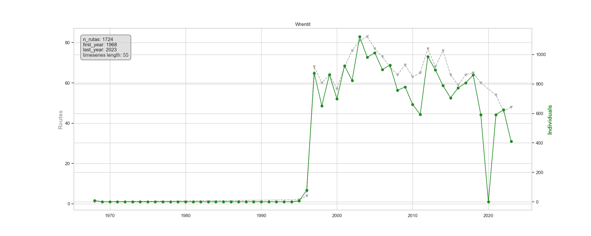{.thumbnail full-src="figs/7420_routes+tts.png"}
  701          7421    3         2021         2023        2                   Swinhoe's White-eye                                   Zostérops de Swinhoe                                 Passeriformes       Zosteropidae        Zosterops                 simplex                                        {.thumbnail full-src="https://placehold.co/600x400/cccccc/000000?text=No+Image+Available"}
  702          7430    3161      1968         2023        55                  Bushtit                                               Orite buissonnière                                   Passeriformes       Aegithalidae        Psaltriparus              minimus                                        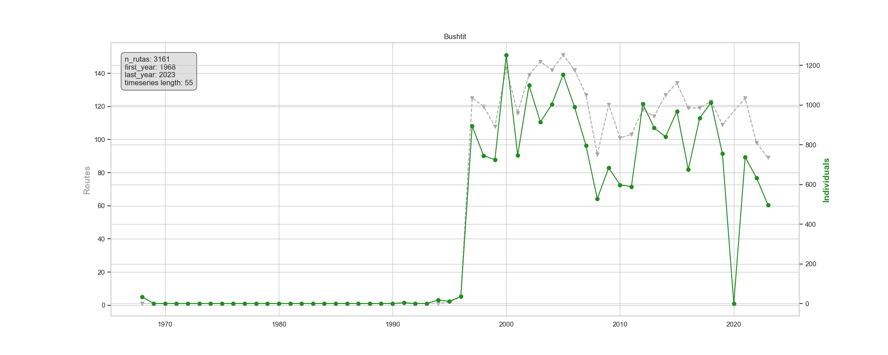{.thumbnail full-src="figs/7430_routes+tts.png"}
  703          7460    2370      1996         2023        27                  Verdin                                                Auripare verdin                                      Passeriformes       Remizidae           Auriparus                 flaviceps                                      {.thumbnail full-src="https://placehold.co/600x400/cccccc/000000?text=No+Image+Available"}
  704          7470    458       1997         2023        26                  Arctic Warbler                                        Pouillot boréal                                      Passeriformes       Phylloscopidae      Phylloscopus              borealis                                       {.thumbnail full-src="https://placehold.co/600x400/cccccc/000000?text=No+Image+Available"}
  705          7480    8994      1972         2023        51                  Golden-crowned Kinglet                                Roitelet à couronne dorée                            Passeriformes       Regulidae           Regulus                   satrapa                                        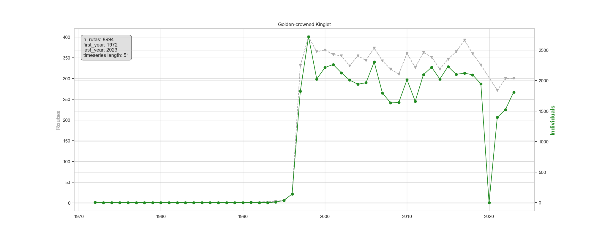{.thumbnail full-src="figs/7480_routes+tts.png"}
  706          7490    11913     1968         2023        55                  Ruby-crowned Kinglet                                  Roitelet à couronne rubis                            Passeriformes       Regulidae           Corthylio                 calendula                                      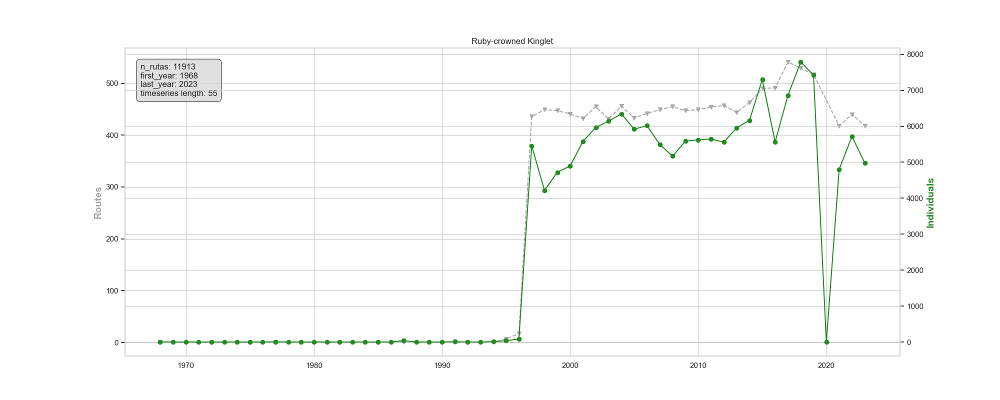{.thumbnail full-src="figs/7490_routes+tts.png"}
  707          7510    24758     1969         2023        54                  Blue-gray Gnatcatcher                                 Gobemoucheron gris-bleu                              Passeriformes       Polioptilidae       Polioptila                caerulea                                       {.thumbnail full-src="figs/7510_routes+tts.png"}
  708          7520    1348      1996         2023        27                  Black-tailed Gnatcatcher                              Gobemoucheron à queue noire                          Passeriformes       Polioptilidae       Polioptila                melanura                                       {.thumbnail full-src="https://placehold.co/600x400/cccccc/000000?text=No+Image+Available"}
  709          7530    12        2003         2022        19                  California Gnatcatcher                                Gobemoucheron de Californie                          Passeriformes       Polioptilidae       Polioptila                californica                                    {.thumbnail full-src="https://placehold.co/600x400/cccccc/000000?text=No+Image+Available"}
  710          7539    1         1997         1997        0                   unid. Blue-gray / Black-tailed Gnatcatcher            unid Gobemoucheron gris-bleu / à queue noire         Passeriformes       Polioptilidae       Polioptila                caerulea / melanura                            {.thumbnail full-src="https://placehold.co/600x400/cccccc/000000?text=No+Image+Available"}
  711          7540    4324      1991         2023        32                  Townsend\'s Solitaire                                 Solitaire de Townsend                                Passeriformes       Turdidae            Myadestes                 townsendi                                      {.thumbnail full-src="https://placehold.co/600x400/cccccc/000000?text=No+Image+Available"}
  712          7550    26710     1968         2023        55                  Wood Thrush                                           Grive des bois                                       Passeriformes       Turdidae            Hylocichla                mustelina                                      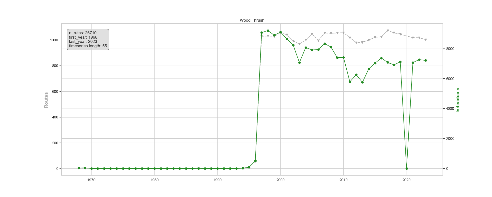{.thumbnail full-src="figs/7550_routes+tts.png"}
  713          7560    14093     1968         2023        55                  Veery                                                 Grive fauve                                          Passeriformes       Turdidae            Catharus                  fuscescens                                     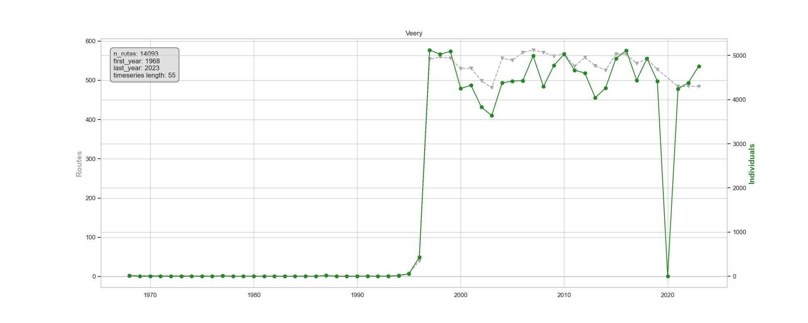{.thumbnail full-src="figs/7560_routes+tts.png"}
  714          7570    1674      1983         2023        40                  Gray-cheeked Thrush                                   Grive à joues grises                                 Passeriformes       Turdidae            Catharus                  minimus                                        {.thumbnail full-src="https://placehold.co/600x400/cccccc/000000?text=No+Image+Available"}
  715          7571    11        1997         2011        14                  Bicknell\'s Thrush                                    Grive de Bicknell                                    Passeriformes       Turdidae            Catharus                  bicknelli                                      {.thumbnail full-src="https://placehold.co/600x400/cccccc/000000?text=No+Image+Available"}
  716          7580    13933     1968         2023        55                  Swainson\'s Thrush                                    Grive à dos olive                                    Passeriformes       Turdidae            Catharus                  ustulatus                                      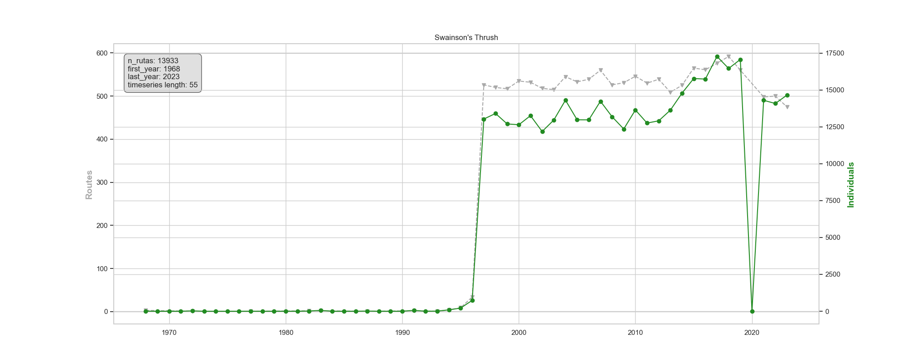{.thumbnail full-src="figs/7580_routes+tts.png"}
  717          7590    18579     1968         2023        55                  Hermit Thrush                                         Grive solitaire                                      Passeriformes       Turdidae            Catharus                  guttatus                                       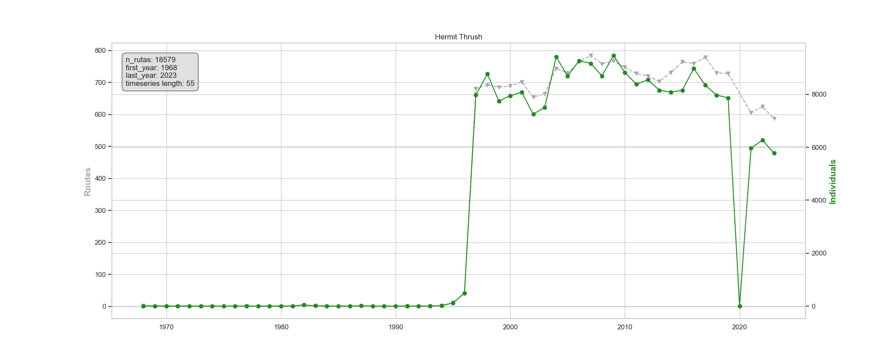{.thumbnail full-src="figs/7590_routes+tts.png"}
  718          7610    63383     1968         2023        55                  American Robin                                        Merle d\'Amérique                                    Passeriformes       Turdidae            Turdus                    migratorius                                    {.thumbnail full-src="figs/7610_routes+tts.png"}
  719          7621    2         2021         2023        2                   Clay-colored Thrush                                   Merle fauve                                          Passeriformes       Turdidae            Turdus                    grayi                                          {.thumbnail full-src="https://placehold.co/600x400/cccccc/000000?text=No+Image+Available"}
  720          7630    5208      1972         2023        51                  Varied Thrush                                         Grive à collier                                      Passeriformes       Turdidae            Ixoreus                   naevius                                        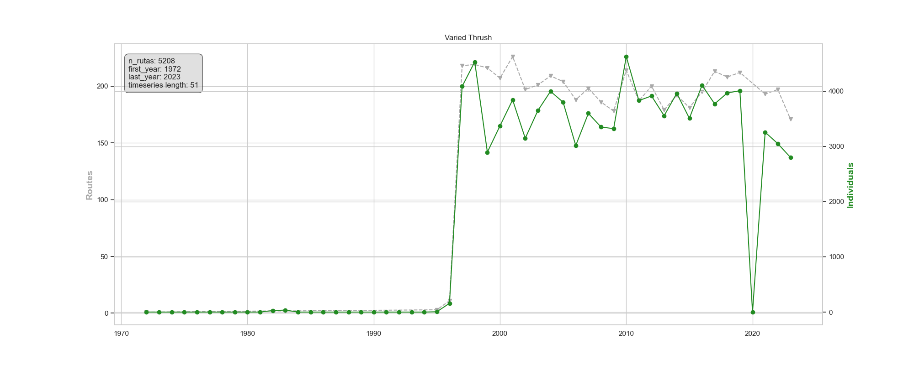{.thumbnail full-src="figs/7630_routes+tts.png"}
  721          7640    69        1997         2023        26                  Bluethroat                                            Gorgebleue à miroir                                  Passeriformes       Muscicapidae        Cyanecula                 svecica                                        {.thumbnail full-src="https://placehold.co/600x400/cccccc/000000?text=No+Image+Available"}
  722          7650    48        1997         2015        18                  Northern Wheatear                                     Traquet motteux                                      Passeriformes       Muscicapidae        Oenanthe                  oenanthe                                       {.thumbnail full-src="https://placehold.co/600x400/cccccc/000000?text=No+Image+Available"}
  723          7660    32721     1968         2023        55                  Eastern Bluebird                                      Merlebleu de l\'Est                                  Passeriformes       Turdidae            Sialia                    sialis                                         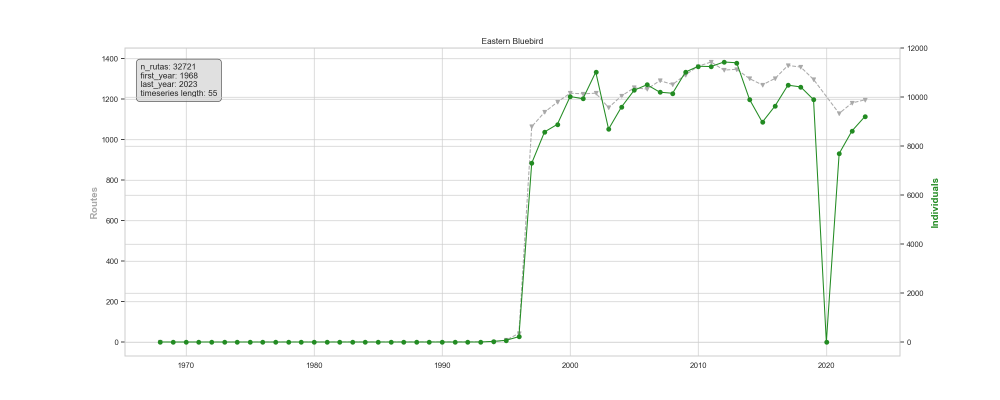{.thumbnail full-src="figs/7660_routes+tts.png"}
  724          7670    3876      1968         2023        55                  Western Bluebird                                      Merlebleu de l\'Ouest                                Passeriformes       Turdidae            Sialia                    mexicana                                       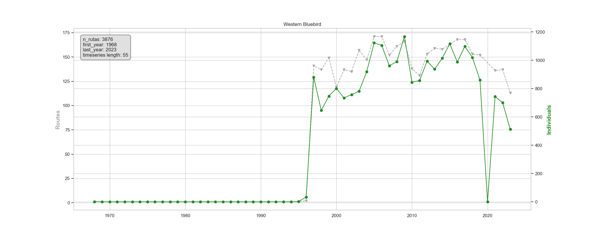{.thumbnail full-src="figs/7670_routes+tts.png"}
  725          7680    7921      1991         2023        32                  Mountain Bluebird                                     Merlebleu azuré                                      Passeriformes       Turdidae            Sialia                    currucoides                                    {.thumbnail full-src="https://placehold.co/600x400/cccccc/000000?text=No+Image+Available"}
  726          8110    7         2016         2023        7                   Scaly-breasted Munia                                  Capucin damier                                       Passeriformes       Estrildidae         Lonchura                  punctulata                                     {.thumbnail full-src="https://placehold.co/600x400/cccccc/000000?text=No+Image+Available"}
  727          10210   49        2009         2023        14                  Muscovy Duck                                          Canard musqué                                        Anseriformes        Anatidae            Cairina                   moschata                                       {.thumbnail full-src="https://placehold.co/600x400/cccccc/000000?text=No+Image+Available"}
  728          16600   2         2009         2009        0                   Sinaloa Wren                                          Troglodyte du Sinaloa                                Passeriformes       Troglodytidae       Thryophilus               sinaloa                                        {.thumbnail full-src="https://placehold.co/600x400/cccccc/000000?text=No+Image+Available"}
  729          19510   3         2019         2023        4                   Pin-tailed Whydah                                     Veuve dominicaine                                    Passeriformes       Viduidae            Vidua                     macroura                                       {.thumbnail full-src="https://placehold.co/600x400/cccccc/000000?text=No+Image+Available"}
  730          20630   2         2018         2019        1                   Egyptian Goose                                        Ouette d\'Égypte                                     Anseriformes        Anatidae            Alopochen                 aegyptiaca                                     {.thumbnail full-src="https://placehold.co/600x400/cccccc/000000?text=No+Image+Available"}
  731          21930   1         2010         2010        0                   Purple Swamphen                                       Talève sultane                                       Gruiformes          Rallidae            Porphyrio                 porphyrio                                      {.thumbnail full-src="https://placehold.co/600x400/cccccc/000000?text=No+Image+Available"}
  732          22860   14951     1997         2023        26                  Eurasian Collared-Dove                                Tourterelle turque                                   Columbiformes       Columbidae          Streptopelia              decaocto                                       {.thumbnail full-src="https://placehold.co/600x400/cccccc/000000?text=No+Image+Available"}
  733          51830   5         2017         2022        5                   Nanday Parakeet                                       Conure nanday                                        Psittaciformes      Psittacidae         Aratinga                  nenday                                         {.thumbnail full-src="https://placehold.co/600x400/cccccc/000000?text=No+Image+Available"}
  734          52021   2         2005         2006        1                   Yellow-chevroned Parakeet                             Toui à ailes jaunes                                  Psittaciformes      Psittacidae         Brotogeris                chiriri                                        {.thumbnail full-src="https://placehold.co/600x400/cccccc/000000?text=No+Image+Available"}

::: {#imageModal .modal}
[×]{.modal-close}
:::
